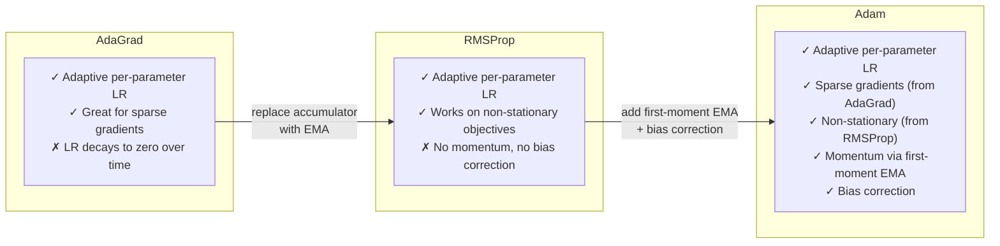

# Section 1: Introduction

> **Paper reference:** Section 1, pages 1–2

## What this section covers

The introduction frames the problem: SGD works but has a universal learning rate for all parameters, which is suboptimal. Two recent methods -- AdaGrad and RMSProp -- each solve *part* of the problem. Adam combines them. But to understand *why*, you need three concepts the paper assumes you know: exponential moving averages, statistical moments, and adaptive learning rates.

---

## Background you need: Exponential moving averages (EMA)

An EMA is a way to track a running average that forgets old values gradually. You've seen simple averages -- EMA is different because it weights recent values more heavily.

### The recurrence

```
s_t = β · s_{t-1} + (1 - β) · x_t
```

- `x_t` is the new observation at time t
- `s_t` is the running average after seeing `x_t`
- `β ∈ [0, 1)` is the **decay rate** -- how much weight the old average keeps
- `(1 - β)` is how much weight the new observation gets

### Intuition: β controls memory length

Think of β as a "forgetting factor." A higher β means the average has a longer memory:

```
β = 0.9   → effectively averages over ~10 recent values
β = 0.99  → effectively averages over ~100 recent values
β = 0.999 → effectively averages over ~1000 recent values

Rule of thumb: memory ≈ 1/(1-β) values
```

### Worked example

Suppose we're tracking gradients with β = 0.9, starting from s₀ = 0:

```
Step 1: gradient = 4.0
  s₁ = 0.9 × 0   + 0.1 × 4.0 = 0.4     (too low -- biased toward 0)

Step 2: gradient = 3.0
  s₂ = 0.9 × 0.4 + 0.1 × 3.0 = 0.66    (still too low)

Step 3: gradient = 5.0
  s₃ = 0.9 × 0.66 + 0.1 × 5.0 = 1.094  (still far from the true mean ~4.0)

...

Step 10: (after many steps)
  s₁₀ ≈ 3.5                              (converging to the true mean)
```

Notice the early estimates are way too small because we initialized at 0. This is the **initialization bias** problem that Section 3 of the paper will fix. For now, just note that it exists.

### Unrolling the recurrence

If you expand the recursion, you can see that the EMA is really a weighted sum of *all* past observations:

```
s_t = (1-β) · x_t  +  (1-β)·β · x_{t-1}  +  (1-β)·β² · x_{t-2}  +  ...

    = (1-β) · Σ β^(t-i) · x_i     for i = 1 to t
```

The weight on observation `x_i` is `(1-β) · β^(t-i)` -- it decays exponentially as the observation gets older. That's where the name comes from.

```python
import numpy as np

def ema_manual(values, beta):
    """Show that the recurrence and the weighted sum give the same result."""
    # Method 1: recurrence
    s = 0.0
    for x in values:
        s = beta * s + (1 - beta) * x

    # Method 2: weighted sum (unrolled)
    t = len(values)
    weights = [(1 - beta) * beta**(t - 1 - i) for i in range(t)]
    s_unrolled = sum(w * x for w, x in zip(weights, values))

    return s, s_unrolled  # these are equal (up to float precision)

values = [4.0, 3.0, 5.0, 2.0, 6.0]
print(ema_manual(values, beta=0.9))
# (1.4914, 1.4914000000000003)
```

### Why EMA and not a simple running mean?

A simple mean `(1/t) · Σ x_i` gives equal weight to all past observations. That's fine if the distribution is stationary (never changes). But in deep learning, the gradient distribution shifts constantly as the model trains. EMA naturally downweights stale gradients, adapting to the current state of training.

---

## Background you need: Statistical moments

A **moment** of a distribution is a summary statistic computed by raising values to a power and averaging.

### First moment (the mean)

```
E[X]  =  average of X  =  the center of the distribution
```

This tells you the *direction* of the gradient on average: "which way is downhill?"

### Second raw moment (uncentered variance)

```
E[X²]  =  average of X²  =  the mean of the squared values
```

This is different from variance. **Variance** = E[X²] - (E[X])², which measures spread *around* the mean. The **raw** (uncentered) second moment E[X²] measures something simpler: the average *magnitude squared*, including both the spread and the offset from zero.

### Why does Adam use the raw second moment instead of variance?

This is a design choice. The raw second moment E[g²] captures the typical *scale* of the gradient -- both its mean and its variance contribute to it. If gradients for some parameter are consistently large (large mean) *or* wildly fluctuating (large variance), E[g²] will be large either way, and Adam will use a smaller learning rate for that parameter. This is the right behavior: big or noisy gradients need smaller steps.

```python
import numpy as np

gradients = np.array([3.0, -2.0, 4.0, -1.0, 5.0])

first_moment = np.mean(gradients)          # E[g]  = 1.8
second_raw_moment = np.mean(gradients**2)  # E[g²] = 11.0
variance = np.var(gradients)               # Var(g) = 6.76

# Note: E[g²] = Var(g) + (E[g])²
#        11.0 = 6.76   + (1.8)²  = 6.76 + 3.24 = 11.0  ✓
```

### Adam's moment estimates

Adam maintains two EMAs -- one for each moment:

```
m_t  = EMA of gradients        ≈  E[g]    (first moment)
v_t  = EMA of squared gradients ≈  E[g²]   (second raw moment)
```

The name **Adam** = **Ada**ptive **M**oment estimation. Now you know what the "moments" are.

---

## Background you need: Adaptive learning rates

You know SGD: `θ = θ - α · g`, where α is the learning rate. The problem: **one α for all parameters**. But different parameters need different learning rates.

### Why one learning rate doesn't fit all

Consider a neural network with an embedding layer and a dense layer:

```
Embedding weights: updated rarely (most gradients are 0 for a given word)
                   → needs LARGE learning rate to make progress when it IS updated

Dense weights:     updated every step with non-zero gradients
                   → needs SMALLER learning rate to avoid overshooting
```

A single α can't serve both. You either underfit the embeddings or overshoot the dense layer.

### AdaGrad: accumulate all past squared gradients

AdaGrad (Duchi et al., 2011) was the first major adaptive method. The idea: track how much each parameter has been updated, and slow down parameters that have seen lots of gradient signal.

```
# AdaGrad update (per parameter i)
accumulator_i += g_i²                         # sum of ALL past squared gradients
θ_i = θ_i - α · g_i / (√accumulator_i + ε)   # scale by inverse sqrt
```

```python
def adagrad_step(params, grads, accumulators, lr=0.01, eps=1e-8):
    for i in range(len(params)):
        accumulators[i] += grads[i] ** 2
        params[i] -= lr * grads[i] / (np.sqrt(accumulators[i]) + eps)
    return params, accumulators
```

**The key insight:** the denominator `√accumulator_i` is large for frequently-updated parameters (small effective step) and small for rarely-updated parameters (large effective step). This is perfect for sparse gradients (like word embeddings).

**The fatal flaw:** the accumulator only grows. It never shrinks. Over a long training run, the accumulated sum of squared gradients becomes huge, and the effective learning rate approaches zero. Training effectively stops. This is fine for convex problems (which converge to a single optimum) but terrible for deep learning where you need to keep making progress.

> **Paper ref:** "Adam is designed to combine the advantages of two recently popular methods: AdaGrad (Duchi et al., 2011), which works well with sparse gradients, and RMSProp (Tieleman & Hinton, 2012), which works well in on-line and non-stationary settings" (Section 1, page 1)

### RMSProp: use an EMA instead of accumulating forever

RMSProp (Hinton, 2012 -- introduced in a Coursera lecture, never formally published!) fixes AdaGrad's flaw with a simple change: instead of summing all past squared gradients, use an **exponential moving average** of them.

```
# RMSProp update (per parameter i)
v_i = β₂ · v_i + (1 - β₂) · g_i²            # EMA of squared gradients
θ_i = θ_i - α · g_i / (√v_i + ε)             # scale by inverse sqrt of EMA
```

```python
def rmsprop_step(params, grads, v, lr=0.001, beta2=0.999, eps=1e-8):
    for i in range(len(params)):
        v[i] = beta2 * v[i] + (1 - beta2) * grads[i] ** 2
        params[i] -= lr * grads[i] / (np.sqrt(v[i]) + eps)
    return params, v
```

Because the EMA forgets old squared gradients, the effective learning rate **doesn't decay to zero**. RMSProp can keep training indefinitely, adapting to the current scale of gradients at each parameter.

**RMSProp's weakness:** it has no momentum (no EMA of the gradient itself, only of the squared gradient). You can bolt momentum on, but it's ad hoc. And it has no bias correction -- the EMA starts at zero, which makes early steps unreliable.

### The gap Adam fills



---

## What the paper proposes (high-level)

Adam maintains **two** EMAs:

| EMA | Tracks | Approximates | Purpose |
|-----|--------|-------------|---------|
| m_t | gradients | E[g] (first moment) | Direction of the update (like momentum) |
| v_t | squared gradients | E[g²] (second raw moment) | Scale of the update (like RMSProp) |

The update divides the first by the square root of the second:

```
θ = θ - α · m̂_t / (√v̂_t + ε)
          ───────   ──────────
          direction    scale
```

where m̂_t and v̂_t are **bias-corrected** versions (Section 3 will explain why).

### Key properties claimed in the introduction

The paper lists these advantages of Adam:

1. **Magnitudes of updates are invariant to gradient rescaling** -- if you multiply all gradients by a constant c, the update doesn't change (c cancels in numerator/denominator)
2. **Stepsizes are approximately bounded by α** -- the effective step size |Δ_t| ≈ α, making α easy to tune
3. **Works with non-stationary objectives** -- because the EMAs forget old information
4. **Works with sparse gradients** -- like AdaGrad, rarely-updated parameters get larger steps
5. **Naturally performs step size annealing** -- as the model approaches an optimum, the signal-to-noise ratio of gradients decreases, and Adam automatically takes smaller steps

---

## Paper roadmap

The introduction previews the structure:

| Section | What it covers |
|---------|---------------|
| 2 | The full algorithm + update rule properties |
| 3 | Why the EMAs are biased at initialization, and how to fix it |
| 4 | Convergence proof: Adam achieves O(√T) regret |
| 5 | How Adam relates to AdaGrad and RMSProp precisely |
| 6 | Experiments: logistic regression, MLPs, CNNs, VAEs |
| 7 | Extensions: AdaMax (infinity-norm variant) |

---

*Next: [Section 2 -- Algorithm](section_2_algorithm.md)* -- we'll walk through the pseudocode line by line and understand why the update rule has the properties claimed above.
