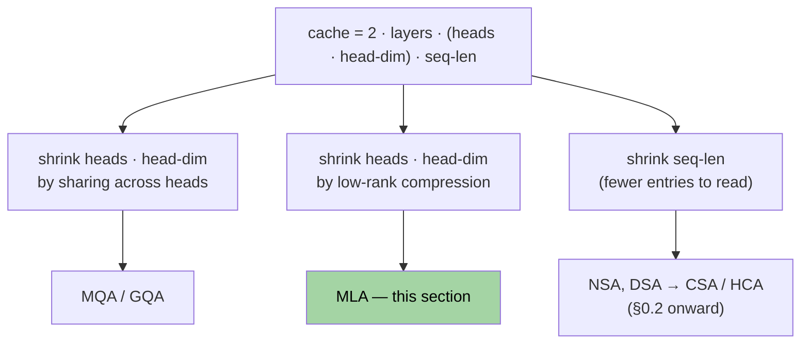
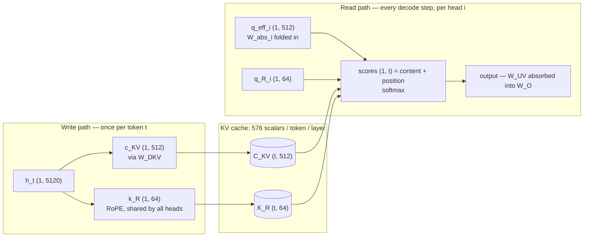

# Section 0.1 — Prerequisite: MLA (Multi-head Latent Attention)

> **Lineage position:** This is the *root* of CSA's family tree. MLA (DeepSeek-V2, 2024)
> introduced the idea that the KV cache should be a **compressed latent**, not raw keys
> and values. CSA inherits MLA's query/KV down-projection wholesale — the $c^Q_t$ latent
> in CSA eq. 13 is literally MLA's query compression. Read this first.

## What this section covers

- **The KV cache** — why it exists, and why *it* (not compute) is the long-context
  bottleneck. You asked for detail here.
- **MQA/GQA** — one-paragraph refresher, just to place them in the lineage.
- **MLA** — latent compression, the **weight-absorption** trick, and the decoupled-RoPE
  fix, all in shape-commented code.
- Worked memory numbers from DeepSeek-V2.

## Dimensions used in every snippet

```python
# DeepSeek-V2 values (where MLA shipped)
d    = 5120    # model hidden dim
n_h  = 128     # attention heads
d_h  = 128     # dim per head
d_c  = 512     # MLA's KV latent dim
d_R  = 64      # decoupled-RoPE dim
T    = ...     # sequence length
```

---

## Background: the KV cache is the bottleneck

### Why a cache exists

Autoregressive decoding produces one token per step. Here is what one attention layer
does per step if you implement it naively:

```python
# --- decode WITHOUT a cache: recompute the whole prefix every step ---
for t in range(1, T + 1):
    h = forward_to_this_layer(ids[:t])   # (t, d)    re-run the WHOLE prefix
    q = h @ W_Q                          # (t, d_h)
    k = h @ W_K                          # (t, d_h)  rows 0..t-2 identical to last step
    v = h @ W_V                          # (t, d_h)
    S = q @ k.T                          # (t, t)    <-- O(t^2), paid EVERY step
    o = softmax(S / sqrt(d_h)) @ v       # (t, d_h)  only o[-1] is ever used
```

You can't shortcut to "just the last row of `S`": `k` at this layer is built from `h`,
and each `h[s]` depends on the whole prefix one layer down — the recompute cascades
through every layer.

The fact that rescues this is **causality**: `h[s]` only sees tokens `<= s`, so `k[s]`
and `v[s]` computed at step `s` are final — identical at every later step. So store
them:

```python
# --- decode WITH a KV cache: one new row per step ---
K = V = empty(0, d_h)                    # the cache — grows one row per step
for t in range(1, T + 1):
    q_t = h_t @ W_Q                      # (1, d_h)  new token only
    K   = cat([K, h_t @ W_K])            # (t, d_h)  append; never recompute
    V   = cat([V, h_t @ W_V])            # (t, d_h)
    s   = q_t @ K.T                      # (1, t)    <-- one row, O(t)
    o_t = softmax(s / sqrt(d_h)) @ V     # (1, d_h)
```

Per step the cost drops $O(t^2) \to O(t)$; over a full $T$-token generation,
$\sum_t O(t^2) = O(T^3) \to \sum_t O(t) = O(T^2)$. Attention is still quadratic *in
total* — each step computes one new row of the triangular score matrix, so every causal
pair is computed exactly once. The cache eliminates *re*-computation; shrinking the
surviving $O(T^2)$ is the sparse-attention sections' job (§0.2 onward).

### Why the cache dominates

Count what the cached version stores, across layers:

```python
cache_scalars = 2 * n_layers * (n_h * d_h) * T * batch   # 2 = K and V
# n_layers=60, T=131_072 (128K), batch=1:
#   2 * 60 * 16_384 * 131_072 ≈ 258e9 scalars
#   x 2 bytes (bf16)          ≈ 515 GB   — for ONE sequence
```

Two facts make this *the* cost that matters:

1. **Linear in $T$.** At DeepSeek-V4's 1M-token target the cache dwarfs the weights.
2. **Decoding is memory-bandwidth-bound.** Each generated token does almost no
   arithmetic but must stream the entire cache through the GPU memory bus. Cache size
   directly sets tokens/sec and batch size — halve it, roughly double throughput.

Every technique in this reading path shrinks one factor of `cache_scalars`. This is the
map for the entire folder:



---

## Refresher: MQA and GQA

You're familiar with these, so only the placement matters: they shrink the `n_h` factor
by sharing K/V across query heads, trading per-head expressiveness for memory.

```python
# cached per token, per layer:
# MHA:  K (n_h, d_h) + V (n_h, d_h)   = 2*128*128 = 32_768 scalars
# GQA:  K (g,   d_h) + V (g,   d_h)   = 2*8*128   =  2_048   (g=8 groups; Llama/Mistral)
# MQA:  K (1,   d_h) + V (1,   d_h)   = 2*128     =    256   (quality suffers)
```

MLA's claim is that you can get an MQA-sized cache *without* making that trade.

---

## MLA: cache one latent per token

MLA's bet: the `(n_h, d_h)` keys and values are highly redundant — they can be
regenerated from a single 512-dim latent per token. Store only the latent.

### The compression

For the paper-anchored notation: $c^{KV}_t = h_t W^{DKV}$ and $c^Q_t = h_t W^{DQ}$ —
that $c^Q_t$ is the latent CSA reuses in eq. 13. In code:

```python
# weights (fixed after training)
W_DKV : (d, d_c)         # 5120 -> 512     KV down-projection
W_UK  : (d_c, n_h, d_h)  # 512 -> per-head keys      (up)
W_UV  : (d_c, n_h, d_h)  # 512 -> per-head values    (up)
W_DQ  : (d, 1536)        # queries get the same low-rank treatment
W_UQ  : (1536, n_h, d_h)

c_KV = h_t @ W_DKV       # (1, 512)   <-- the ONLY thing cached
c_Q  = h_t @ W_DQ        # (1, 1536)  query latent — reappears verbatim in CSA eq. 13

# conceptually, head i's K/V are reconstructed on read:
k_i = c_KV @ W_UK[:, i]  # (1, d_h)
v_i = c_KV @ W_UV[:, i]  # (1, d_h)
# ...but absorption (next) means these two lines never actually run.
```

### The key trick: weight absorption

Write head $i$'s attention score and regroup the parentheses:

$$q_{t,i}\, k_{s,i}^\top = \big(c^Q_t W^{UQ}_i\big)\big(c^{KV}_s W^{UK}_i\big)^\top = c^Q_t \big(W^{UQ}_i W^{UK\top}_i\big)\, c^{KV\top}_s$$

The middle product is fixed — so precompute it, and attention runs **directly on the
cached latents**:

```python
# load time, once per head:
W_abs_i = W_UQ_i @ W_UK_i.T        # (1536, 512)  fixed forever — precompute

# decode time, per head:
q_eff_i = c_Q @ W_abs_i            # (1, 512)  effective query, lives in latent space
scores  = q_eff_i @ C_KV.T         # (1, t)    C_KV is the cache itself: (t, 512)
# keys are NEVER materialized; W_UV folds into the output projection W_O the same way
```

The reframe worth remembering: **at inference, MLA *is* MQA whose shared key is the
latent itself** — every head reads the same `(t, 512)` cache, but each head applies its
*own* `W_abs_i`, so heads still attend with genuinely different functions. MQA's cache,
MHA's expressiveness.

### The RoPE wrinkle

Absorption needs $W^{UQ}_i$ and $W^{UK}_i$ adjacent so they can be premultiplied. RoPE
inserts a position-dependent rotation between them:

$$q_{t,i}\, k_{s,i}^\top = c^Q_t\, W^{UQ}_i\, \underbrace{R_t R_s^\top}_{=\,R_{t-s}\ \text{varies with } (t,s)} W^{UK\top}_i\, c^{KV\top}_s$$

No fixed matrix to precompute. MLA's fix — **decoupled RoPE** — moves position onto a
small separate slice and leaves the content slice NoPE:

```python
# a small extra slice that carries position ONLY
q_R = rope(c_Q @ W_QR, pos=t)      # (n_h, 64)  per-head rotated queries
k_R = rope(h_t @ W_KR, pos=t)      # (1, 64)    ONE key shared by all heads — cached

# cache per token per layer:  c_KV (512) + k_R (64)  =  576 scalars
scores_i = q_eff_i @ C_KV.T + q_R[i] @ K_R.T   # (1, t)  content + position
o_i      = softmax(scores_i / sqrt(d_h + d_R)) @ ...    # then W_UV absorbed into W_O
```

> Hold onto "RoPE on a small slice of dims, NoPE on the rest" — DeepSeek-V4 keeps exactly
> this idea under the name *partial RoPE* (§2.3.3).

### The whole machine in one picture



Nothing in the read path ever has shape `(t, n_h, d_h)` — keys and values exist only
implicitly.

---

## Worked example: the memory win (DeepSeek-V2 numbers)

KV cache per token, per layer, in scalars:

| Scheme | Per-token-per-layer cache | Relative |
|---|---|---|
| MHA | $2\, n_h d_h = 2 \cdot 128 \cdot 128 = 32768$ | 1× |
| GQA (8 groups) | $2\, g\, d_h = 2 \cdot 8 \cdot 128 = 2048$ | 16× smaller |
| **MLA** | $d_c + d_R = 512 + 64 = 576$ | **~57× smaller** |

MLA beats even aggressive GQA *and* keeps per-head expressiveness via absorption rather
than collapsing heads. Small cache **and** strong quality is why it became the DeepSeek
house style and the foundation everything in this folder builds on.

---

## Key takeaways

- The KV cache turns each decode step from $O(t^2)$ recompute into an $O(t)$ append +
  one-row attention — valid because causality makes `k[s], v[s]` final at step `s`.
  Total attention stays $O(T^2)$; the cache removes *re*-computation.
- The cache grows linearly with context, and decoding is **memory-bandwidth-bound** —
  streaming the cache *is* the bottleneck, so cache size sets throughput.
- **MQA/GQA** shrink the cache by sharing K/V across heads — trading expressiveness.
- **MLA** caches one `(1, 512)` latent per token. **Weight absorption**
  (`W_abs_i = W_UQ_i @ W_UK_i.T`, precomputed) lets attention run directly on the cached
  latents: MQA's cache size, but each head keeps its own absorbed projection.
- RoPE can't be absorbed, so MLA adds a tiny **decoupled RoPE** slice — per-head 64-dim
  queries, one shared 64-dim key in the cache — the direct ancestor of DeepSeek-V4's
  *partial RoPE*.
- The query latent `c_Q` ($c^Q_t$) is **reused verbatim in CSA** (eq. 13), shared between
  the sparse-selection indexer and the main attention.
- MQA/GQA cut the head axis; MLA cuts the rank axis. The remaining axis is **sequence
  length** — that's NSA, next.

---

← Previous: [Reading path & overview](paper_info.md) · Next: [§0.2 — NSA (Native Sparse Attention)](section_0_2_nsa.md) →
