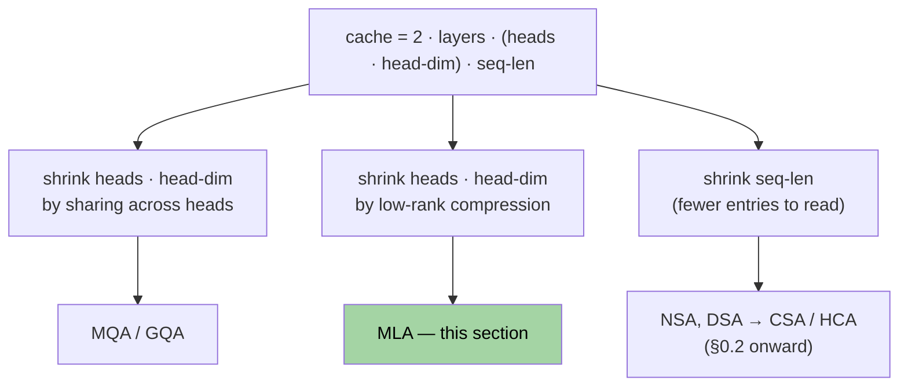
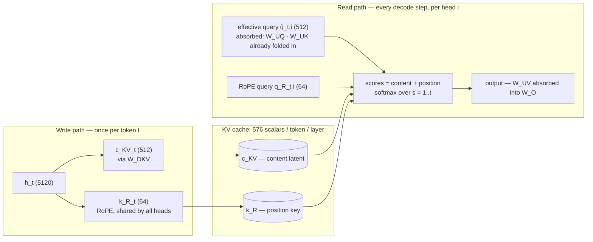

# Section 0.1 — Prerequisite: MLA (Multi-head Latent Attention)

> **Lineage position:** This is the *root* of CSA's family tree. MLA (DeepSeek-V2, 2024)
> introduced the idea that the KV cache should be a **compressed latent**, not raw keys
> and values. CSA inherits MLA's query/KV down-projection wholesale — the $c^Q_t$ latent
> in CSA eq. 13 is literally MLA's query compression. Read this first.

## What this section covers

- **The KV cache** — why it exists, and why *it* (not compute) is the long-context
  bottleneck. You asked for detail here.
- **MQA/GQA** — one-paragraph refresher, just to place them in the lineage.
- **MLA** — latent compression, the **weight-absorption** trick that makes it work, and
  the decoupled-RoPE fix. Full depth.
- A worked memory example with real DeepSeek-V2 numbers.

## Notation

All formulas in this folder use these symbols (values are DeepSeek-V2's, since that's
where MLA shipped):

| Symbol | Meaning | DeepSeek-V2 value |
|---|---|---|
| $d$ | model hidden dimension | 5120 |
| $n_h$ | number of attention heads | 128 |
| $d_h$ | dimension per head | 128 |
| $d_c$ | MLA's KV latent dimension | 512 |
| $d^R_h$ | decoupled-RoPE dimension per head | 64 |
| $L$ | sequence length | — |

---

## Background: the KV cache is the bottleneck

### Why a cache exists

Decode step $t$ has to produce one thing — the newest token's attention output (per
head; mask and output projection implicit):

$$o_t = \mathrm{softmax}\!\left(\frac{q_t K_{1:t}^\top}{\sqrt{d_h}}\right) V_{1:t}, \qquad K_{1:t} = \begin{bmatrix} k_1 \\ \vdots \\ k_t \end{bmatrix},\quad V_{1:t} = \begin{bmatrix} v_1 \\ \vdots \\ v_t \end{bmatrix}$$

If $K_{1:t}, V_{1:t}$ were just *available*, this is one row: $t$ dot products and a
weighted sum — $O(t \cdot d_h)$.

**Without a cache they aren't available** — the input is token IDs. Each key lives at a
layer $\ell$, and its hidden state depends on the entire prefix below it:

$$k^{(\ell)}_s = h^{(\ell)}_s W^K, \qquad h^{(\ell)}_s = f\big(h^{(\ell-1)}_1, \dots, h^{(\ell-1)}_s\big)$$

Unroll that dependency over layers and you are forced to compute attention for **every**
prefix token, i.e. the full triangular score matrix
$\mathrm{tril}\big(Q_{1:t} K_{1:t}^\top\big)$ with $\sim t^2/2$ entries:

$$\text{cost of step } t \text{, no cache: } O(t^2)$$

**The identity that makes a cache valid** is causality. The dependency above runs only
backwards, so for any $s \le t' < t$:

$$h^{(\ell)}_s \text{ computed at step } t' \;=\; h^{(\ell)}_s \text{ computed at step } t \quad\Longrightarrow\quad k^{(\ell)}_s,\, v^{(\ell)}_s \text{ never change after step } s$$

Step $t$'s $O(t^2)$ of work is therefore step $t-1$'s work plus one new row — so compute
each token's $k_s, v_s$ **once**, at step $s$, and store them. A decode step shrinks to:

$$\underbrace{q_t,\, k_t,\, v_t \;=\; h_t W^Q,\; h_t W^K,\; h_t W^V}_{O(d^2),\ \text{new token only}} \qquad \underbrace{o_t = \mathrm{softmax}\!\big(q_t K_{1:t}^\top\big)\, V_{1:t}}_{O(t \cdot d_h),\ \text{one row}}$$

— and the wall-clock of that row is dominated by *reading* $K_{1:t}, V_{1:t}$ out of GPU
memory, not the arithmetic (next subsection).

**Totals** over generating a $T$-token sequence:

$$\text{no cache: } \sum_{t=1}^{T} O(t^2) = O(T^3) \qquad\qquad \text{with cache: } \sum_{t=1}^{T} O(t) = O(T^2)$$

The cache does **not** beat the quadratic — the per-step rows tile the triangular matrix
exactly once:

$$\bigcup_{t=1}^{T} \big\{\, q_t k_s^\top : s \le t \,\big\} \;=\; \text{all } \tfrac{T(T+1)}{2} \text{ causal pairs, each computed once}$$

It eliminates *re*-computation, not computation. Shrinking the surviving $O(T^2)$ is the
sparse-attention lineage's job (§0.2 onward).

### Why it dominates

Count the scalars stored:

$$\text{cache size} = \underbrace{2}_{K\text{ and }V} \cdot n_{\text{layers}} \cdot \underbrace{n_h \cdot d_h}_{\text{per-token width}} \cdot L \cdot \text{batch}$$

Two facts make this the cost that matters:

1. **It grows linearly with $L$.** At DeepSeek-V4's 1M-token target, the cache dwarfs the
   model weights.
2. **Decoding is memory-bandwidth-bound.** Generating one token does almost no
   arithmetic, but must stream the *entire cache* through the GPU's memory bus. Cache
   size directly sets tokens/sec and how many requests fit in a batch — halve the cache
   and you roughly double throughput.

> **Worked number.** $n_{\text{layers}} = 60$, $n_h = 128$, $d_h = 128$, bf16 (2 bytes),
> $L = 131072$ (128K), batch 1:
> $2 \cdot 60 \cdot 128 \cdot 128 \cdot 131072 \cdot 2 \text{ bytes} \approx \mathbf{515\ GB}$ —
> for *one* sequence. The whole field of efficient attention exists because of this number.

Every technique in this reading path shrinks one factor of that product. This is the map
for the entire folder:

---

## Refresher: MQA and GQA

You're familiar with these, so only the framing matters. The cache stores a separate K
and V **per head** — MQA/GQA attack the $n_h$ factor directly. **MQA:** all query heads
share one K/V head ($n_h \to 1$, up to $128\times$ smaller, but quality suffers).
**GQA:** $g$ groups of query heads each share one K/V head ($n_h \to g$, e.g. 8 — the
Llama/Mistral standard). The trade is explicit: heads lose their *distinct* keys and
values, so you buy memory with expressiveness. MLA's claim is that you don't have to
make that trade.

---

## MLA: cache one latent per token

MLA's bet: the $n_h \cdot d_h = 16384$ scalars of per-token keys (and another 16384 of
values) are highly redundant — they can be regenerated from a single **512-dim latent**.
Store only the latent; reconstruct K and V on demand. A small extra matmul at read time
for a $\sim 57\times$ smaller cache is exactly the right trade when you're
bandwidth-bound, and the absorption trick below makes even that matmul disappear.

### The compression

Down-project each token's hidden state to the latent; that latent is **the only thing
cached**:

$$c^{KV}_t = h_t W^{DKV} \in \mathbb{R}^{d_c} \qquad (5120 \to 512)$$

Per-head keys and values are up-projected from it when needed — for head $i$:

$$k_{t,i} = c^{KV}_t W^{UK}_i, \qquad v_{t,i} = c^{KV}_t W^{UV}_i \qquad (512 \to 128)$$

Queries get the same low-rank treatment (it saves activation memory in training, and —
the reason we care — **this exact latent reappears in CSA eq. 13**):

$$c^Q_t = h_t W^{DQ}, \qquad q_{t,i} = c^Q_t W^{UQ}_i$$

### The key trick: weight absorption

Reconstructing K per head sounds like extra work per decode step. The trick is that you
never do it. Write out the attention score for head $i$ between query $t$ and a cached
token $s$ (row-vector convention, scaling omitted):

$$q_{t,i}\, k_{s,i}^\top = \big(c^Q_t W^{UQ}_i\big)\big(c^{KV}_s W^{UK}_i\big)^\top = c^Q_t \underbrace{\big(W^{UQ}_i W^{UK\top}_i\big)}_{\text{fixed: precompute once}} c^{KV\top}_s$$

The bracketed product doesn't depend on $t$ or $s$, so fold it into the query path and
define an **effective query** per head:

$$\tilde q_{t,i} = c^Q_t \big(W^{UQ}_i W^{UK\top}_i\big) \in \mathbb{R}^{d_c} \qquad \Rightarrow \qquad \text{score} = \tilde q_{t,i}\, c^{KV\top}_s$$

Attention now runs **directly against the cached latents** — keys are never
materialized. The same absorption folds $W^{UV}$ into the output projection $W^O$, so
values aren't materialized either.

Here is the reframe worth remembering: **at inference, MLA *is* MQA with a 512-dim
shared key — the latent itself.** Every head reads the same cached vector, like MQA. But
unlike MQA, each head applies its *own* absorbed matrix $W^{UQ}_i W^{UK\top}_i$, so each
head still attends with a genuinely different function. MQA's cache size, MHA's
per-head expressiveness.

### The RoPE wrinkle

Absorption needs the two weight matrices to sit *adjacent* in the score so they can be
premultiplied. RoPE breaks that: it inserts a position-dependent rotation $R_t$ after
each projection, and the score becomes

$$q_{t,i}\, k_{s,i}^\top = c^Q_t\, W^{UQ}_i\, \underbrace{R_t R_s^\top}_{=\,R_{t-s}} W^{UK\top}_i\, c^{KV\top}_s$$

The rotation between the weights changes with relative position $t-s$, so there's no
fixed matrix to precompute. MLA's fix is **decoupled RoPE**: split each head's score
into two slices that are summed before the softmax —

$$\text{score}(t, s, i) = \underbrace{\tilde q_{t,i}\, c^{KV\top}_s}_{\text{content slice: NoPE, absorbed, latent space}} + \underbrace{q^R_{t,i}\, k^{R\top}_s}_{\text{position slice: RoPE, tiny}}$$

- The **content slice** is everything above — no positional encoding, absorption works.
- The **position slice** is small ($d^R_h = 64$ dims): per-head RoPE queries $q^R_{t,i}$,
  and a single RoPE key $k^R_t$ **shared by all heads** (MQA-style), cached alongside
  the latent.

So the full cache per token per layer is $d_c + d^R_h = 512 + 64 = 576$ scalars.

> Hold onto "RoPE on a small slice of dims, NoPE on the rest" — DeepSeek-V4 keeps exactly
> this idea under the name *partial RoPE* (§2.3.3).

### The whole machine in one picture

Keys and values exist only implicitly — nothing in the read path ever has shape
$n_h \times d_h$ per cached token.

---

## Worked example: the memory win (DeepSeek-V2 numbers)

KV cache per token, per layer, in scalars:

| Scheme | Per-token-per-layer cache | Relative |
|---|---|---|
| MHA | $2\, n_h d_h = 2 \cdot 128 \cdot 128 = 32768$ | 1× |
| GQA (8 groups) | $2\, g\, d_h = 2 \cdot 8 \cdot 128 = 2048$ | 16× smaller |
| **MLA** | $d_c + d^R_h = 512 + 64 = 576$ | **~57× smaller** |

MLA beats even aggressive GQA *and* keeps per-head expressiveness via absorption rather
than collapsing heads. Small cache **and** strong quality is why it became the DeepSeek
house style and the foundation everything in this folder builds on.

---

## Key takeaways

- The KV cache grows linearly with context, and decoding is **memory-bandwidth-bound**:
  streaming the cache *is* the bottleneck, so cache size sets throughput.
- **MQA/GQA** shrink the cache by sharing K/V across heads — trading expressiveness for
  memory.
- **MLA** caches one low-rank latent $c^{KV}_t$ per token. **Weight absorption** lets
  attention run directly on the cached latents: at inference it behaves like MQA with the
  latent as the shared key, but each head keeps its own absorbed projection — no
  expressiveness trade.
- RoPE can't be absorbed, so MLA splits each score into a NoPE content slice plus a tiny
  **decoupled RoPE** slice ($+64$ dims, shared key) — the direct ancestor of
  DeepSeek-V4's *partial RoPE*.
- The query latent $c^Q_t$ is **reused verbatim in CSA** (eq. 13), shared between the
  sparse-selection indexer and the main attention.
- MQA/GQA cut the head axis; MLA cuts the rank axis. The remaining axis is **sequence
  length** — that's NSA, next.

---

← Previous: [Reading path & overview](paper_info.md) · Next: [§0.2 — NSA (Native Sparse Attention)](section_0_2_nsa.md) →
