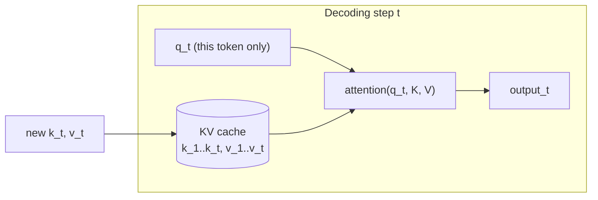
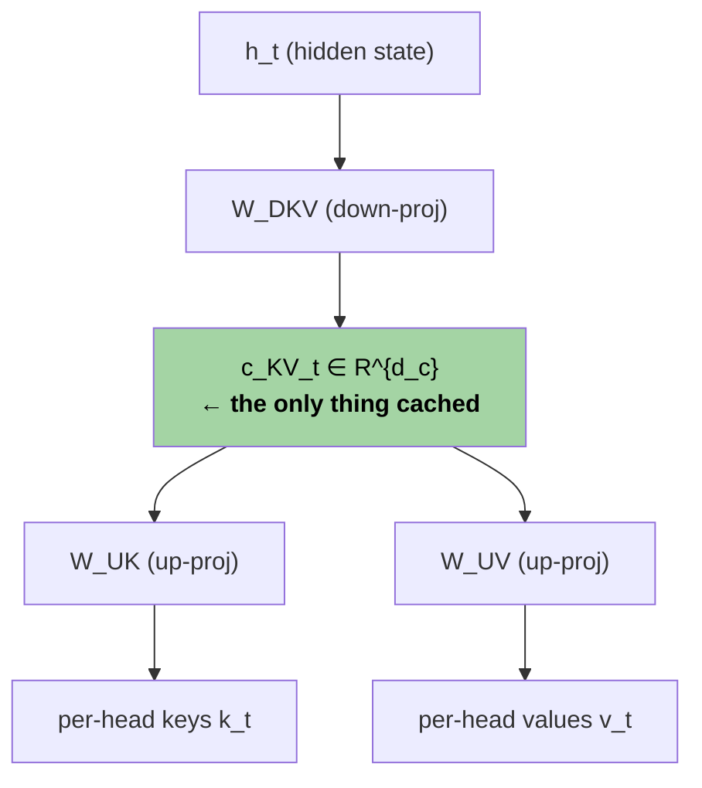

# Section 0.1 — Prerequisite: MLA (Multi-head Latent Attention)

> **Lineage position:** This is the *root* of CSA's family tree. MLA (DeepSeek-V2, 2024)
> introduced the idea that the KV cache should be a **compressed latent**, not raw keys
> and values. CSA inherits MLA's query/KV down-projection wholesale — the `c^Q_t` latent
> in CSA eq. 13 is literally MLA's query compression. Read this first.

## What this section covers

- **Background (you asked for detail here):** how the KV cache actually works and why it,
  not the matmuls, is what makes long-context inference expensive.
- **Quick refresher:** MQA/GQA — the first-generation fix.
- **The main event:** MLA — compress K and V into one small latent vector per token,
  cache only that, and reconstruct on the fly. Plus the RoPE complication MLA had to solve.
- A worked memory-footprint example with real DeepSeek-V2 numbers.

---

## Background: the KV cache, in detail

You're solid on multi-head attention, so the recap is one line: each head computes
$\text{softmax}(QK^\top/\sqrt{d})V$, and for $n_h$ heads we project the input
$h_t\in\mathbb{R}^{d}$ into per-head queries, keys, and values of dimension $d_h$ each.

The part that matters for everything downstream is **what happens at inference time**,
token by token (autoregressive decoding).

### Why a cache exists at all

When you generate token $t$, its query $q_t$ must attend to the keys and values of
**all** previous tokens $1\dots t$. Those keys/values don't change when new tokens
arrive — token 5's key is the same whether the sequence is 6 tokens long or 6000. So
recomputing $K$ and $V$ for the whole prefix at every step would be pure waste.

The **KV cache** is the optimization: compute each token's $k$ and $v$ once, store them,
and at step $t$ just append $k_t,v_t$ and read back the whole cache. This turns
per-step attention from $O(t^2)$ recompute into $O(t)$ read.

### The catch: the cache is enormous

The cache trades compute for **memory**, and at long context the memory bill is brutal.
Size of the KV cache, in number of scalars:

$$\text{KV cache} = \underbrace{2}_{K\text{ and }V}\times\, n_{\text{layers}}\times n_h\times d_h\times \text{seq\_len}\times \text{batch}$$

Two properties make this the dominant cost:

1. **It grows linearly with sequence length.** At 1M tokens (DeepSeek-V4's target) the
   cache dwarfs the model weights themselves.
2. **Decoding is memory-bandwidth-bound, not compute-bound.** Generating one token does a
   tiny amount of arithmetic but must *stream the entire KV cache through the GPU* to do
   it. So the cache's size directly sets your tokens/sec and how many requests you can
   batch. Halve the cache and you roughly double throughput.

This is the lever every technique in this reading path pulls on. MQA/GQA, MLA, NSA, DSA,
and finally CSA/HCA are all answers to one question: **how do we make the KV cache
smaller (or cheaper to read) without hurting quality?**

> **Worked number.** A 7B-ish model with $n_{\text{layers}}=60$, $n_h=128$, $d_h=128$, in
> bf16 (2 bytes), at seq_len = 128K, batch = 1:
> $2\times 60\times 128\times 128\times 131072\times 2\text{ bytes} \approx \mathbf{515\ GB}$.
> That does not fit on one GPU. The whole field of efficient attention exists because of
> this number.

---

## Refresher: MQA and GQA (the first fix)

You're familiar with these, so just the framing relative to the formula above.

The expensive factor is $n_h$ (the cache stores a separate K and V *per head*). MQA and
GQA attack exactly that factor:

- **MQA (Multi-Query Attention):** all query heads share **one** K and one V head.
  Replaces $n_h$ with $1$ → up to $n_h\times$ smaller cache. Cheap, but the aggressive
  sharing can cost quality.
- **GQA (Grouped-Query Attention):** a middle ground — $g$ groups of query heads, each
  group sharing one KV head. Replaces $n_h$ with $g$ (e.g. 8). The standard choice in
  Llama-2/3, Mistral, etc.

Keep this mental model: **MQA/GQA shrink the cache by cutting the *head* dimension.** MLA,
next, shrinks it along a *different* axis — and CSA later shrinks it along yet another
(the *sequence* axis). That's the punchline of the whole lineage.

---

## MLA: cache a latent, not the keys and values

MLA's insight: instead of sharing K/V across heads, **store a single low-rank latent
vector per token** and regenerate the per-head keys and values from it on demand. You pay
a tiny extra matmul at read time to save a large amount of cache memory — exactly the
right trade when you're memory-bound.

### The compression

For each token's hidden state $h_t\in\mathbb{R}^{d}$, MLA computes a **compressed KV
latent** by a down-projection to a small dimension $d_c$ (e.g. 512, vs. a full
$n_h d_h$ of 16384):

$$c^{KV}_t = h_t W^{DKV},\qquad c^{KV}_t\in\mathbb{R}^{d_c}$$

**This latent $c^{KV}_t$ is the only thing cached.** The per-head keys and values are
reconstructed when needed via up-projections:

$$k^{C}_t = c^{KV}_t W^{UK},\qquad v^{C}_t = c^{KV}_t W^{UV}$$

Queries get the same low-rank treatment (this reduces activation memory during training,
and — importantly for us — **this exact `c^Q` latent reappears in CSA**):

$$c^{Q}_t = h_t W^{DQ},\qquad q^{C}_t = c^{Q}_t W^{UQ}$$

### Why this is more than "GQA with extra steps"

The clever part is **weight absorption** at inference. Because $k^C_t = c^{KV}_t W^{UK}$,
the query–key score is

$$q^{C\top}_t k^C_s = (c^Q_t W^{UQ})^\top (c^{KV}_s W^{UK}) = c^{Q\top}_t \big(W^{UQ\top}W^{UK}\big)\, c^{KV}_s.$$

The bracketed term is a fixed matrix product you can **precompute once** and fold into the
query projection. So you never actually materialize the full keys — you run attention
*directly in the $d_c$-dim latent space*. Same trick absorbs $W^{UV}$ into the output
projection $W^O$. The result: MLA gets MHA-level expressiveness (every head still has its
own effective K/V) while caching only a GQA-or-better-sized latent.

### The RoPE complication (the one wrinkle to remember)

There's a conflict. RoPE (covered in §2.3.3) rotates keys/queries by a
**position-dependent** matrix $R_t$. That rotation sits *between* $W^{UQ}$ and $W^{UK}$ in
the score, so it **can't be absorbed** — the nice precompute above breaks, because the
matrix is now different for every $(t,s)$ pair.

MLA's fix is **decoupled RoPE**: split the representation into two parts.

- A **compressed, NoPE part** that carries content and uses the absorption trick.
- A small **decoupled RoPE part** ($q^R_t$, $k^R_t$, each $d^R_h$ dims, e.g. 64) that
  carries *only* position. The key half $k^R_t$ is **shared across all heads** (like MQA)
  and cached alongside the latent.

The two parts are concatenated before the softmax. So the MLA cache per token is:

$$\underbrace{d_c}_{\text{content latent}} + \underbrace{d^R_h}_{\text{shared RoPE key}}\quad(\text{e.g. }512 + 64 = 576)$$

> Hold onto "decoupled / partial RoPE on a slice of dimensions" — DeepSeek-V4 keeps exactly
> this idea and calls it *partial RoPE* (RoPE on the last 64 dims), in §2.3.3.

---

## Worked example: the memory win (DeepSeek-V2 numbers)

DeepSeek-V2: $d=5120$, $n_h=128$, $d_h=128$, $d_c=512$, $d^R_h=64$, $n_{\text{layers}}=60$.

**KV cache per token, per layer** (in scalars):

| Scheme | Per-token-per-layer cache | Relative |
|---|---|---|
| MHA | $2\,n_h d_h = 2\cdot128\cdot128 = 32768$ | 1× |
| GQA (8 groups) | $2\,g\,d_h = 2\cdot8\cdot128 = 2048$ | 16× smaller |
| **MLA** | $d_c + d^R_h = 512 + 64 = 576$ | **~57× smaller** |

MLA beats even aggressive GQA, *and* (via absorption) keeps full per-head expressiveness
rather than collapsing heads. That combination — small cache **and** strong quality — is
why it became the DeepSeek house style and the foundation everything else builds on.

---

## Key takeaways

- The KV cache grows linearly with context and **dominates long-context inference because
  decoding is memory-bandwidth-bound** — streaming the cache *is* the bottleneck. Every
  technique in this reading path shrinks or cheapens that cache.
- **MQA/GQA** shrink the cache along the **head** axis (share K/V across heads).
- **MLA** shrinks it along a **rank** axis: cache one low-rank latent $c^{KV}_t$ per token,
  regenerate per-head K/V on read, and use **weight absorption** to run attention in latent
  space with full per-head expressiveness.
- RoPE can't be absorbed, so MLA uses **decoupled RoPE** on a small extra slice of dims —
  the direct ancestor of DeepSeek-V4's *partial RoPE*.
- The query latent $c^Q_t$ MLA introduced is **reused verbatim in CSA** (eq. 13), shared
  between the sparse-selection indexer and the main attention.
- Next axis to be exploited: the **sequence** axis. That's where NSA comes in.

---

← Previous: [Reading path & overview](paper_info.md) · Next: [§0.2 — NSA (Native Sparse Attention)](section_0_2_nsa.md) →
