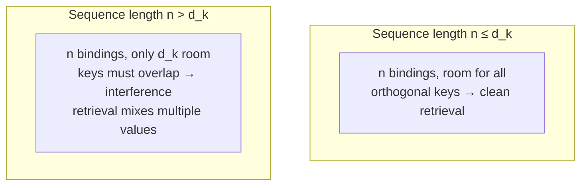
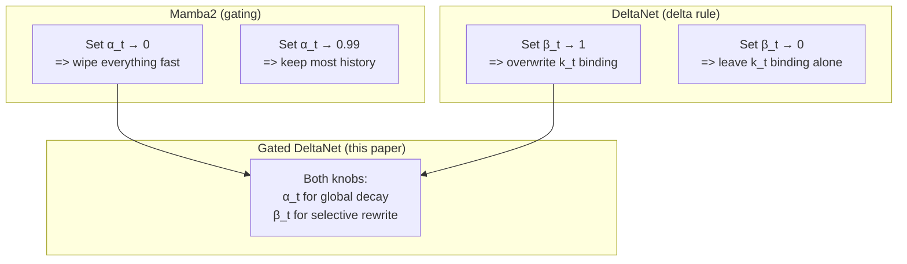

# Section 1: Introduction

> **Paper reference:** Section 1, pages 1–2

## What this section covers

The introduction sets up a clean story:

1. Standard Transformers work great but their attention is O(n²) in sequence length -- expensive for both training and inference.
2. **Linear Transformers** drop the softmax, which lets you reformulate attention as a *linear RNN with a matrix-valued state*. This makes inference O(1) in sequence length but introduces a different problem: the matrix state has bounded capacity, so long sequences cause "memory collisions" that hurt retrieval.
3. Two recent fixes for this each solve *part* of the problem:
   - **Mamba2** adds a *gate* that uniformly shrinks the state before each update -- great for forgetting old context, but coarse (forgets everything at once).
   - **DeltaNet** uses the *delta rule* to selectively replace old key-value bindings -- great for precise updates, but has no mechanism to clear stale memory in bulk.
4. The paper introduces the **gated delta rule**, which combines both. Plus a hardware-efficient training algorithm and hybrid architectures.

Since you marked linear attention, Mamba2, the delta rule, and online-learning interpretations as "new", we'll spend most of this section building the linear-attention foundation. The deeper math for Mamba2 and DeltaNet lives in Section 2.

---

## Background you need: Linear attention as a linear RNN

Linear attention is the bedrock for everything else in this paper. It's a small algebraic trick that turns a quadratic operation into a linear-recurrent one.

### Quick refresher: what softmax attention computes

You've got this solid, but let's nail the notation we'll reuse throughout. For a single query token at position `t`:

```
softmax attention output at position t:

         t
o_t  =   Σ  α_{t,i} · v_i
        i=1

where  α_{t,i} = softmax over i of  (q_t · k_i) / √d_k
```

So `o_t` is a weighted sum of value vectors `v_i` where the weights `α_{t,i}` come from a softmax over inner products. Softmax is what makes this nonlinear -- the weight on token `i` depends on *all* the other tokens through the normalization.

Cost: for every query `t` we touch every key/value pair, so total work is O(n²·d).

### Drop the softmax: pure linear attention

What if we just removed the softmax (and the √d_k) and used the raw inner product as the "weight"?

```
linear attention output at position t:

         t
o_t  =   Σ  (q_t · k_i) · v_i              ← linear in q_t·k_i, not softmax-normalized
        i=1
```

This is what Katharopoulos et al. (2020) call linear attention. (In practice you replace `q_t · k_i` with `φ(q_t) · φ(k_i)` for some feature map `φ`, e.g. ELU+1, but the algebra below works for any φ -- we'll just write `q,k` to mean "after the feature map, if any".)

This is still a sum over all past tokens, so on its face it's still O(n²). But here's the trick.

### The trick: reorder the sum into an outer-product accumulator

The inner product `q_t · k_i` is a *scalar*. So `(q_t · k_i) · v_i` is a vector scaled by a scalar. Now:

```
o_t  =  Σ_i  v_i · (k_i^T q_t)                 ← scalar = scalar, just rewriting
     =  Σ_i  (v_i k_i^T) q_t                   ← v_i (k_i^T q_t) = (v_i k_i^T) q_t
     =  ( Σ_i  v_i k_i^T ) q_t                 ← q_t doesn't depend on i, pull out
     =  S_t · q_t                              ← define S_t := Σ_i v_i k_i^T

where  S_t ∈ ℝ^{d_v × d_k}  is a matrix
```

The key step is `v_i (k_i^T q_t) = (v_i k_i^T) q_t`. Both are equal because the first is a scalar times a vector and the second is a `d_v×d_k` outer-product matrix times a `d_k` vector -- the resulting `d_v` vector is the same either way.

That's the whole magic. We turned a sum-over-the-sequence into a matrix `S_t` that can be updated incrementally:

```
S_t  =  S_{t-1}  +  v_t k_t^T            ← rank-1 outer-product update
o_t  =  S_t q_t                           ← read with q_t
```

Each step is O(d²) regardless of `t`. Inference becomes O(n·d²) total -- linear in sequence length. And the model only ever needs to store the matrix `S` (size `d_v × d_k`), not the full key/value cache.

### Worked numerical example

Let's actually compute this with `d_k = d_v = 2` so we can see every number:

```python
import numpy as np

# 3 tokens, d_k = d_v = 2
k = np.array([[1.0, 0.0],
              [0.0, 1.0],
              [1.0, 1.0]])          # 3 keys
v = np.array([[10.0, 0.0],
              [ 0.0, 5.0],
              [ 1.0, 1.0]])         # 3 values
q = np.array([0.5, 0.5])            # query at t=3

# --- Method A: the sum form (slow but obvious) ---
o_sum = sum((q @ k_i) * v_i for k_i, v_i in zip(k, v))
# = (0.5)(10,0) + (0.5)(0,5) + (1.0)(1,1)
# = (5,0) + (0,2.5) + (1,1)
# = (6, 3.5)

# --- Method B: the outer-product accumulator (fast) ---
S = np.zeros((2, 2))                # state, d_v × d_k
for k_i, v_i in zip(k, v):
    S = S + np.outer(v_i, k_i)      # rank-1 update
# After step 1: S = [[10,0],[0,0]]
# After step 2: S = [[10,0],[0,5]]
# After step 3: S = [[11,1],[1,6]]
o_state = S @ q
# = [[11,1],[1,6]] @ [0.5,0.5]
# = (6, 3.5)                        ✓ same answer
```

Both methods give `(6, 3.5)`. Method B is the linear-RNN view: maintain a running matrix `S` and read it with the current query.

### What does the matrix S represent?

`S = Σ v_i k_i^T` is a sum of outer products. Each `v_i k_i^T` is a rank-1 matrix that, when right-multiplied by some vector `x`, produces:

```
(v_i k_i^T) x  =  v_i (k_i^T x)  =  v_i · ⟨k_i, x⟩
```

So this rank-1 matrix is a "soft lookup" that returns `v_i` scaled by how much `x` looks like `k_i`. Adding many such matrices builds up an **associative memory**: each pair `(k_i, v_i)` is a stored binding, and querying with `q` gives back `v_i` weighted by `⟨k_i, q⟩`.

This is exactly the structure called a **tensor product representation** in the cognitive-science literature (Smolensky 1990) and a **fast weight memory** in the recurrent-net literature (Schlag et al. 2021, Schmidhuber's group going back further). The paper calls all three of these the same thing.

```mermaid
flowchart LR
    subgraph "Softmax attention"
        A1["For each t:<br/>look at all keys k_1...k_t<br/>softmax-weight values<br/>O(n) per token, O(n²) total"]
    end
    subgraph "Linear attention"
        A2["Maintain state S<br/>S ← S + v_t k_t^T<br/>o_t = S q_t<br/>O(d²) per token, O(n·d²) total"]
    end
    A1 -.->|"drop softmax,<br/>reorder sum"| A2
```



### One more form: the parallel "matrix" form for training

At training time we want to compute *all* outputs `o_1...o_L` in parallel (not one at a time). Stacking the queries, keys, values into matrices `Q, K, V ∈ ℝ^{L×d}`, you get:

```
O = (Q K^T  ⊙  M) V                  ⊙ = elementwise multiply
```

where `M` is the `L×L` causal mask (`M_ij = 1` if `i ≥ j`, else `0`). This is the parallel form -- very matmul-heavy and GPU-friendly. The recurrent and parallel forms compute the same thing; you pick whichever is cheaper for your use case (training → parallel; inference → recurrent).

> **Paper ref:** "the linear transformer can be formulated as the following linear recurrence... we can express it in both vector form (left) and matrix form (right)" (Section 2.1, page 2, Eq. unnumbered after Eq. 0)

### Why "linear" attention?

Two reasons the name fits:

1. The recurrence `S_t = S_{t-1} + v_t k_t^T` is *linear* in the state `S` (no nonlinearity like softmax sandwiched between updates).
2. Inference cost is *linear* in sequence length, not quadratic.

---

## Background you need: Memory collisions

Now to the *problem* with linear attention -- the one this whole paper is trying to fix.

### The capacity bound

The state `S = Σ v_i k_i^T` has shape `d_v × d_k`. In rank/capacity terms, it can store at most `d_k` linearly-independent key-value bindings cleanly. Specifically, if you have `n` keys `k_1...k_n` that are pairwise orthogonal, you can recover each `v_i` exactly by querying with `k_i`:

```
S k_j  =  Σ_i v_i (k_i^T k_j)  =  v_j · ‖k_j‖²    when keys are orthogonal
                                                  (cross-terms zero)
```

But you can't have more than `d_k` mutually orthogonal vectors in `d_k`-dim space. Once `n > d_k`, some keys must overlap (`k_i^T k_j ≠ 0` for some `i ≠ j`), and querying gives a mix:

```
S k_j  =  v_j ‖k_j‖²  +  Σ_{i≠j} v_i (k_i^T k_j)
                       ─────────────────────────
                       interference terms ≠ 0
```

This is what Schlag et al. (2021) and the paper call **memory collisions** -- different stored items start to interfere because the basis isn't big enough to keep them separate.



### Why softmax attention doesn't have this problem

Softmax attention re-reads every past key at every step. There's no compressed "state" -- the model literally looks at all of history. So it doesn't have a fixed-size memory bottleneck. The cost is the O(n²) work and the O(n) KV cache that grows forever.

This is the fundamental tradeoff:

| | Memory bottleneck | Compute cost | KV cache |
|---|---|---|---|
| Softmax attention | None (reads all) | O(n²) | O(n) per layer |
| Linear attention | Fixed `d_k × d_v` matrix | O(n·d²) | O(d²) per layer |

Linear attention is constant-memory, but pays for it with retrieval interference once the sequence outgrows its state. That's the gap recent linear-RNN architectures try to close.

> **Paper ref:** "the number of orthogonal key-value pairs they can store is bounded by the model's dimensionality. When the sequence length exceeds this dimension, 'memory collisions' become inevitable" (page 1, paragraph 3)

---

## Background you need: Two memory-management strategies

If your state is finite-capacity, you have to *manage* it -- decide what to keep, what to overwrite, what to forget. Two strategies have emerged. The paper explains them at a high level here; we'll dive into the math in Section 2.

### Strategy 1: Gating -- shrink the whole state, then add (Mamba2)

Mamba2's update rule is a one-line modification of linear attention:

```
S_t  =  α_t · S_{t-1}  +  v_t k_t^T              0 < α_t < 1
        ─────────────                            ↑
        scale ALL old bindings                   data-dependent
        by the same factor α_t                   from the input
```

The key new idea: `α_t` is **data-dependent** -- it's a small scalar produced by a tiny network from the current input `x_t`. So the model can choose, at each step, how much of the past to keep. If `α_t = 0`, wipe everything. If `α_t = 1`, keep all (back to vanilla linear attention).

**Strength:** Can clear the state quickly when context shifts (e.g. between paragraphs).

**Weakness:** It's *uniform* -- every binding in `S` is shrunk by the same `α_t`. If you only want to forget *one specific* key-value pair (because its key was overwritten with a new value), you can't; you'd have to dim everything.

### Strategy 2: Delta rule -- selectively replace bindings (DeltaNet)

DeltaNet uses a different update inspired by the Widrow-Hoff "delta rule" from 1960. Conceptually:

```
1. Read what's currently bound to key k_t :     v_old = S_{t-1} k_t
2. Erase that binding:                          remove (v_old k_t^T) from S
3. Write the new binding:                       add (v_t k_t^T) to S
```

Algebraically this collapses to:

```
S_t  =  S_{t-1} (I − β_t k_t k_t^T)  +  β_t v_t k_t^T

           ────────────────────       ──────────
           erases the OLD binding     writes NEW
           at key direction k_t        binding
```

`β_t` (also data-dependent) is the "writing strength" -- how aggressively to overwrite.

**Strength:** Surgical. It only touches the part of the state at direction `k_t`; everything orthogonal to `k_t` is untouched. Great for in-context retrieval where you need to overwrite specific keys without disturbing others.

**Weakness:** It only ever modifies one key-direction per step. If the entire context just shifted (think: the model finished reading one document and started another), DeltaNet has no way to clear the slate quickly. It would need many steps to overwrite each old binding.

### The two are complementary



The whole motivation of the paper is: *why not have both knobs?* Set `α_t → 0` to clear, `α_t → 1` and use `β_t` to selectively edit. This is the **gated delta rule**:

```
S_t  =  S_{t-1} · α_t (I − β_t k_t k_t^T)  +  β_t v_t k_t^T          ← Eq. 10
        ────────────────────────────────       ──────────
        global decay × delta-rule erasure      delta-rule write
```

Section 3.1 will derive this and show it gracefully degrades to plain Mamba2 (when `β_t = 0`) or plain DeltaNet (when `α_t = 1`).

> **Paper ref:** "we propose the gated delta rule, a simple and intuitive mechanism that combines both approaches. This unified rule enables flexible memory control: it can promptly clear memory by setting α_t → 0, while selectively updating specific content without affecting other information by setting α_t → 1" (page 2, paragraph 5)

---

## What the paper proposes (high-level)

Four contributions, in order:

| Contribution | Why it's needed | Section |
|------|------|------|
| **The gated delta rule** | Unifies gating (Mamba2) and delta-rule updates (DeltaNet) into one recurrence with both knobs | 3.1 |
| **Hardware-efficient chunkwise algorithm** | The gated rule is harder to parallelize because of the `(I − β_t k_t k_t^T)` Householder factors. They extend the WY representation to handle the new `α_t` term. | 3.3, App A |
| **Gated DeltaNet block + hybrid models** | Standalone GDN block (Llama-style) and two hybrids: H1 = GDN + sliding window attention; H2 = Mamba2 + GDN + SWA | 3.4 |
| **Empirical evaluation** | 1.3B params, 100B tokens. Beats Mamba2 + DeltaNet on language modeling, common-sense reasoning, S-NIAH, real-world retrieval, length extrapolation, LongBench. | 4 |

### The headline numbers (from Section 4)

```
On 1.3B-param recurrent models trained on 100B FineWeb-Edu tokens:

  Wikitext PPL ↓        Mamba2: 16.56   DeltaNet: 17.71   Gated DeltaNet: 16.42  ← best
  Avg common-sense acc  Mamba2: 54.89   DeltaNet: 52.14   Gated DeltaNet: 55.32  ← best
  Avg long-context (LB) Mamba2: 13.5    DeltaNet: 13.6    Gated DeltaNet: 16.6   ← +3 pts
  Avg recall (real)     Mamba2: 29.8    DeltaNet: 26.2    Gated DeltaNet: 30.6   ← best

Hybrid GDN-H2 (Mamba2 + GDN + SWA stacked) further beats Transformer++ on retrieval.
```

The improvement is bigger on retrieval-style tasks than on perplexity, exactly as the design predicts: the gating fix and the delta rule are both about memory management, which is what retrieval stresses.

---

## Paper roadmap

| Section | What it covers |
|---|---|
| **2** | The math you need: full Mamba2 derivation (gated linear recurrence + chunkwise form) and full DeltaNet derivation (delta rule + WY representation + chunkwise form) |
| **3** | The contribution: gated delta rule (3.1), why both halves matter (3.2 case study on S-NIAH), the new chunkwise algorithm (3.3), and the architecture/hybrids (3.4) |
| **4** | Experiments: language modeling, common-sense reasoning, retrieval, length extrapolation, LongBench, throughput |
| **5** | Related work on linear RNNs, delta-rule extensions, hybrid models |
| **App A** | Inductive proof that the extended WY representation is correct |
| **App B** | Evaluation details + ablations on block design (head dim, normalization, output gate) |

---

## Key takeaways from the introduction

1. **Linear attention** = drop softmax + reorder the sum, giving a linear RNN with a matrix-valued state `S_t = Σ v_i k_i^T` -- O(1) memory at inference but bounded retrieval capacity.
2. **Memory collisions** happen when sequence length exceeds `d_k`: keys can no longer be orthogonal, so retrieval mixes values.
3. Two complementary fixes exist: **gating** (Mamba2) erases globally and quickly, **delta rule** (DeltaNet) edits surgically.
4. The paper's key idea is to fuse them into the **gated delta rule**, which inherits both abilities. Plus a hardware-efficient training algorithm and hybrid architectures with sliding-window attention.

---

*Next: [Section 2 -- Preliminary](section_2_preliminary.md)* -- we'll work through the full math of Mamba2 and DeltaNet, including chunkwise parallel training and the WY representation. This is the heaviest section of the paper, but everything in Section 3 builds on it.
