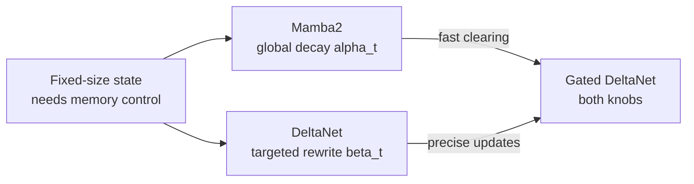
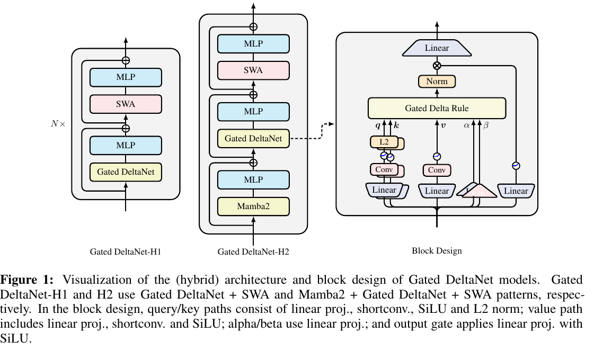

# Section 1: Introduction

> **Paper reference:** Section 1, pages 1-2

## What this section covers

The introduction is a memory-management story:

1. Standard attention is still the quality baseline for long-context retrieval, but its
   quadratic sequence cost is painful.
2. Linear Transformers make inference cheap by compressing the whole prefix into a fixed
   matrix-valued state.
3. That fixed state creates a memory-management problem: too many key-value bindings collide.
4. Mamba2 and DeltaNet each solve one side of the problem.
5. Gated DeltaNet combines their knobs: global forgetting from Mamba2 plus targeted rewrite
   from DeltaNet.

Per [paper_info.md](paper_info.md#knowledge-calibration), linear attention, Mamba2,
DeltaNet, and online-learning interpretations are new. This section gives the intuition
and leaves the full chunkwise math to [Section 2](section_2_preliminary.md).

---

## The problem: fixed-size memory has to be managed

Softmax attention does not compress the past into one state. For token `t`, it can look
back over all previous keys and values:

```python
K_past = K[:t]                             # (t, d_k)
V_past = V[:t]                             # (t, d_v)
scores = K_past @ q_t                      # (t,)
weights = torch.softmax(scores / sqrt_dk, dim=0)  # (t,)
o_t = weights @ V_past                     # (d_v,)
```

That is expensive because the work and memory grow with `t`, but it is also why
Transformers are strong at retrieval: the relevant key can still be present explicitly.

Linear attention takes the opposite bet. It folds the prefix into one matrix state:

```python
S_t = S_prev + v_t[:, None] @ k_t[None, :] # (d_v, d_k)
o_t = S_t @ q_t                            # (d_v,)
```

Now inference memory is constant in sequence length, but every fact has to share the same
`(d_v, d_k)` state. The paper frames this as an associative memory: each update writes a
key-value binding into `S`. Once the sequence has more distinct bindings than the state
can cleanly separate, reads start mixing values.

The hand-wavy lookup intuition: `S @ k_j` asks the state, "what value is associated with
this key?" If every stored key were perfectly separated, the only thing that would answer
is `v_j` itself, scaled by how strongly `k_j` matches itself. That clean answer is
`wanted`; everything extra is interference from other keys that partially resemble `k_j`.

```python
S = V.T @ K                                # (d_v, d_k)
read_j = S @ k_j                           # (d_v,)
wanted = v_j * (k_j @ k_j)                 # (d_v,)
interference = read_j - wanted             # (d_v,)
```

That `interference` term is the core pain point. Linear attention buys efficiency by
compressing history, then has to decide what to keep, what to weaken, and what to overwrite.

---

## Two partial fixes

The paper sets up Mamba2 and DeltaNet as complementary memory controllers. They both start
from a matrix state `S`, but they expose different knobs.

### Mamba2: forget globally

Mamba2 adds a data-dependent decay before the new write:

```python
S_decayed = alpha_t * S_prev               # (d_v, d_k)
write = v_t[:, None] @ k_t[None, :]        # (d_v, d_k)
S_t = S_decayed + write                    # (d_v, d_k)
```

If `alpha_t` is small, the model clears the slate quickly. If `alpha_t` is near 1, it
keeps old context. This is a useful knob for context switches: new document, new paragraph,
new topic, old memory should fade.

The weakness is that the decay is uniform. It cannot say "erase the stale binding for this
one key but keep everything else." All old bindings are multiplied by the same scalar.

### DeltaNet: rewrite one key direction

DeltaNet uses the delta rule to read what is currently stored at the incoming key, erase
that binding, and write the new value:

```python
v_old = S_prev @ k_t                       # (d_v,)
erase = beta_t * (v_old[:, None] @ k_t[None, :])  # (d_v, d_k)
write = beta_t * (v_t[:, None] @ k_t[None, :])    # (d_v, d_k)
S_t = S_prev - erase + write               # (d_v, d_k)
```

This is the right shape for associative recall: if a key's value changes, update that key
direction without dimming unrelated memory. The weakness is the mirror image of Mamba2's:
DeltaNet only edits one key direction per token. It has no fast "clear stale context"
operation when a lot of the state is no longer useful.

### The complementarity



That is the whole paper in one sentence: **use `alpha_t` to control how much old memory
survives, and `beta_t` to control how strongly the current key-value binding is rewritten.**

---

## The proposed gated delta rule

The paper's proposed recurrence appears in §3, but the introduction already gives the
reason for it. In implementation form, the update is:

```python
v_old = S_prev @ k_t                       # (d_v,)
S_decayed = alpha_t * S_prev               # (d_v, d_k)
erase = alpha_t * beta_t * (v_old[:, None] @ k_t[None, :])  # (d_v, d_k)
write = beta_t * (v_t[:, None] @ k_t[None, :])  # (d_v, d_k)
S_t = S_decayed - erase + write            # (d_v, d_k)
```

Read it as three actions:

| Step | What happens | Which ancestor contributes it |
|---|---|---|
| Decay | shrink all existing state by `alpha_t` | Mamba2 |
| Erase | remove the old value at key direction `k_t` | DeltaNet |
| Write | add the new beta-weighted binding | DeltaNet |

The important limiting cases:

| Setting | Behavior |
|---|---|
| `alpha_t` near 0 | clear most existing state before writing |
| `alpha_t = 1` | reduce to the DeltaNet-style selective rewrite |
| `beta_t` near 0 | mostly preserve the current key direction |
| `beta_t` near 1 | aggressively replace the current key's value |

This explains why the authors expect gains on retrieval-heavy tasks. Retrieval needs
precise key-value updates, but real long contexts also need filtering: not every old
binding should stay forever.

---

## The second problem: make it trainable on GPUs

The recurrence above is easy to understand one token at a time. The paper's engineering
challenge is making it efficient for training.

The obstacle is DeltaNet's erase term. It creates a product of transition matrices:

```python
A_t = I - beta_t * (k_t[:, None] @ k_t[None, :])  # (d_k, d_k)
write_t = beta_t * (v_t[:, None] @ k_t[None, :])  # (d_v, d_k)
S_t = S_prev @ A_t + write_t                      # (d_v, d_k)
```

Multiplying one such matrix per token would be a poor GPU training algorithm. The paper
therefore starts from Yang et al. (2024b)'s chunkwise DeltaNet algorithm, which uses a
WY representation to turn the products into block matmuls, then extends that machinery to
include the `alpha_t` decay terms.

That is why [Section 2](section_2_preliminary.md) spends so much time on chunkwise
training and WY / UT transforms. Without that machinery, the gated delta rule would be a
nice recurrence but not a practical architecture.

---

## Architecture preview

Figure 1 belongs to the architecture section, but it is useful to keep the destination in
view. The paper uses a standalone Gated DeltaNet block and two hybrids:

- **Gated DeltaNet-H1:** Gated DeltaNet + sliding-window attention.
- **Gated DeltaNet-H2:** Mamba2 + Gated DeltaNet + sliding-window attention.



The figure also previews one detail that matters later: query/key/value paths are not
identical, and `alpha` / `beta` are produced by their own lightweight projections. We will
come back to that in §3.4.

---

## What to carry forward

| Idea | Keep in mind for later |
|---|---|
| Linear attention state | efficient, but finite-capacity |
| Memory collisions | retrieval fails when unrelated bindings interfere |
| Mamba2 | can forget old state quickly, but only uniformly |
| DeltaNet | can rewrite one key direction, but cannot clear context quickly |
| Gated DeltaNet | combines global decay and selective rewrite |
| Chunkwise training | the recurrence only matters if it can be parallelized efficiently |

---

## Key takeaways from Section 1

1. The paper is not just "another linear attention variant"; it is about **memory
   management in a fixed-size recurrent state**.
2. Mamba2 and DeltaNet are complementary: one globally decays memory, the other selectively
   rewrites key-value bindings.
3. The gated delta rule gives the model both knobs, `alpha_t` and `beta_t`.
4. The remaining work is systems and math: preserve DeltaNet's chunkwise GPU-friendly training
   algorithm while adding the decay terms.

---

Previous: [Paper overview](paper_info.md) · Next: [Section 2 -- Preliminary](section_2_preliminary.md)
