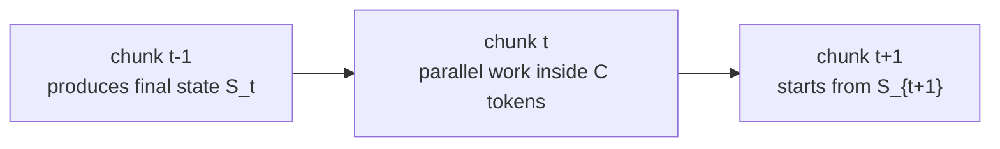

# Section 2: Preliminary

> **Paper reference:** Section 2, pages 2-4

## What this section covers

Section 2 gives the machinery that makes the paper's contribution readable:

1. **Mamba2 as linear attention with decay** - the linear-attention state from
   [Section 1](section_1_introduction.md) plus a data-dependent scalar forget gate.
2. **Chunkwise training** - how to train linear recurrences with tensor-core-friendly
   matrix multiplications instead of one token at a time.
3. **DeltaNet** - the delta rule as a selective erase-and-write operation.
4. **WY / UT representation** - the trick that turns DeltaNet's scary product of
   Householder-like matrices into chunk-level matmuls.

The calibration table marks Mamba2, DeltaNet, and WY/chunkwise training as new, so this
section goes deeper than the introduction. The goal is not to memorize every symbol; it is
to see what §3 needs to modify when it adds the Gated DeltaNet decay term.

## Dimensions used in snippets

Batch and head dimensions are omitted.

| Symbol | Shape | Meaning |
|---|---:|---|
| `L` | scalar | full sequence length |
| `C` | scalar | chunk size |
| `d_k` | scalar | query/key head dimension |
| `d_v` | scalar | value head dimension |
| `Q`, `K` | `(L, d_k)` | full-sequence queries/keys |
| `V` | `(L, d_v)` | full-sequence values |
| `Qc`, `Kc` | `(C, d_k)` | one chunk of queries/keys |
| `Vc` | `(C, d_v)` | one chunk of values |
| `S` | `(d_v, d_k)` | recurrent fast-weight / associative-memory state |

---

## 2.1 Mamba2: linear attention with decay

The paper starts from the same linear attention recurrence we built in §1:

```python
S_t = S_prev + v_t[:, None] @ k_t[None, :]  # (d_v, d_k)
o_t = S_t @ q_t                             # (d_v,)
```

This is fast at inference because state size is constant in sequence length. But vanilla
linear attention has no forgetting: every token writes into the same finite matrix forever.
Mamba2's preliminary role here is to add one scalar decay knob:

```python
S_t = alpha_t * S_prev                      # (d_v, d_k)
S_t = S_t + v_t[:, None] @ k_t[None, :]     # (d_v, d_k)
o_t = S_t @ q_t                             # (d_v,)
```

`alpha_t` is data-dependent and lies in `(0, 1)`. When `alpha_t` is near 1, the state
keeps most history. When it is near 0, the state is almost reset before the new write.

### What decay means for an old token

Suppose token `i` wrote `v_i k_i^T`, and we later read at token `t`. That old write has
been multiplied by every decay between `i` and `t`. The paper writes this with cumulative
products `gamma`.

```python
gamma = torch.cumprod(alpha, dim=0)         # (L,)
decay_i_to_t = gamma[t] / gamma[i]          # ()
score_i = k_i @ q_t                         # ()
contrib_i = decay_i_to_t * score_i * v_i    # (d_v,)
```

So Mamba2's read is still a weighted sum over values, but older values get an extra
age-and-content-dependent survival factor. The paper calls the recurrent/parallel
equivalence here **state space duality (SSD)**.

### Full parallel form

For training, you would like all positions at once. The paper's decay-aware causal mask
`Gamma` says: row `i` can read column `j` only when `i >= j`, and the weight gets
`gamma_i / gamma_j`.

```python
gamma = torch.cumprod(alpha, dim=0)         # (L,)
Gamma = torch.tril(gamma[:, None] / gamma[None, :])  # (L, L)
scores = Q @ K.T                            # (L, L)
O = (scores * Gamma) @ V                    # (L, d_v)
```

This is mathematically clean, but it materializes an `L x L` matrix. That defeats the
whole point when `L` is large. The rest of §2 is about getting the same answer with
small chunks and state handoff.

---

## Chunkwise training: split the sequence, carry the state

The recurrent form is linear memory but sequential. The full parallel form is parallel but
quadratic memory. Chunkwise training is the compromise:



Inside one chunk, there are only `C` tokens, so a `C x C` causal matrix is fine. Across
chunks, the only thing carried forward is the final state matrix `S`.

### No-decay chunk form first

If there were no decay, one chunk can be handled as two terms:

1. Every query reads the state inherited from the previous chunk.
2. Every query reads the writes earlier in the same chunk.

```python
M = torch.tril(torch.ones(C, C))            # (C, C)
S_next = S_start + Vc.T @ Kc                # (d_v, d_k)
O_from_prev = Qc @ S_start.T                # (C, d_v)
O_inside = ((Qc @ Kc.T) * M) @ Vc           # (C, d_v)
O = O_from_prev + O_inside                  # (C, d_v)
```

This is the core chunkwise pattern: one state update, one inherited-state read, one local
causal attention inside the chunk.

### Add Mamba2 decay inside the chunk

With decay, the chunk needs three adjusted objects. The paper marks these with arrows:

- left-decayed queries: decay each query back to the first position of the chunk
- right-decayed keys: decay each write forward to the last position of the chunk
- right-decayed state: decay the incoming state across the whole chunk

In code:

```python
gamma = torch.cumprod(alpha_c, dim=0)       # (C,)
Gamma = torch.tril(gamma[:, None] / gamma[None, :])  # (C, C)

Q_to_start = gamma[:, None] * Qc            # (C, d_k)
K_to_end = (gamma[-1] / gamma)[:, None] * Kc  # (C, d_k)
S_to_end = gamma[-1] * S_start              # (d_v, d_k)

S_next = S_to_end + Vc.T @ K_to_end         # (d_v, d_k)
O_from_prev = Q_to_start @ S_start.T        # (C, d_v)
O_inside = ((Qc @ Kc.T) * Gamma) @ Vc       # (C, d_v)
O = O_from_prev + O_inside                  # (C, d_v)
```

That is the paper's Eq. 1 and Eq. 2 in implementation form. The important idea is that
decay does not break chunkwise training. It just changes which queries, keys, and state
are scaled before the same matmuls.

---

## 2.2 DeltaNet: linear attention with the delta rule

Mamba2 forgets by shrinking the whole state. DeltaNet edits one key direction. The paper's
delta rule starts by reading what is currently stored at `k_t`, then replacing it with a
mixture of old and new value:

```python
v_old = S_prev @ k_t                        # (d_v,)
v_new = beta_t * v_t + (1 - beta_t) * v_old # (d_v,)
erase = v_old[:, None] @ k_t[None, :]       # (d_v, d_k)
write = v_new[:, None] @ k_t[None, :]       # (d_v, d_k)
S_t = S_prev - erase + write                # (d_v, d_k)
```

After simplifying, this becomes the compact DeltaNet recurrence:

$$
S_t = S_{t-1}(I-\beta_t k_t k_t^\top) + \beta_t v_t k_t^\top
$$

The transition matrix `I - beta_t k_t k_t^T` is the key object. It softly removes the
part of the state aligned with `k_t`, then the write term adds the new binding.

```python
I = torch.eye(d_k)                          # (d_k, d_k)
transition = I - beta_t * (k_t[:, None] @ k_t[None, :])  # (d_k, d_k)
write = beta_t * (v_t[:, None] @ k_t[None, :])  # (d_v, d_k)
S_t = S_prev @ transition + write           # (d_v, d_k)
```

The paper calls these transition matrices generalized Householder matrices. If the key is
normalized, they are projection-like erasers; with different `beta_t`, they can erase
weakly or strongly. The footnote notes that `beta_t` can even be extended to `(0, 2)` for
state-tracking behavior, but the main setup uses `(0, 1)`.

---

## Why DeltaNet chunking is harder

For Mamba2, the transition is just scalar multiplication by `alpha_t`. Scalars commute, so
the chunk math stays simple.

For DeltaNet, every token has a different matrix:

```python
A_1 = I - beta_1 * (k_1[:, None] @ k_1[None, :])  # (d_k, d_k)
A_2 = I - beta_2 * (k_2[:, None] @ k_2[None, :])  # (d_k, d_k)
A_3 = I - beta_3 * (k_3[:, None] @ k_3[None, :])  # (d_k, d_k)
P_3 = A_1 @ A_2 @ A_3                             # (d_k, d_k)
```

These matrices do not generally commute. A naive chunk algorithm would multiply a chain of
`d_k x d_k` matrices and apply each write through all later transitions. That is the
expensive thing Yang et al. (2024b) avoided, and this paper reuses their machinery.

The paper splits the unrolled DeltaNet state inside a chunk into two pieces:

- `P_r`: the cumulative product of transition matrices up to token `r`
- `H_r`: the accumulated writes after they have been pushed through later transitions

So each within-chunk state can be written as:

$$
S^r_{[t]} = S_{[t]}P^r_{[t]} + H^r_{[t]}
$$

That equation is the conceptual point of paper Eq. 3.

---

## WY representation: avoid multiplying Householder products

The WY representation says the cumulative transition product can be represented as:

$$
P_{[t]} = I - W_{[t]}^\top K_{[t]}
$$

Here `Kc` stores the chunk keys and `W` stores corrected key-like rows. Instead of
forming every product of transition matrices, compute `W` from a small causal `C x C`
system. The paper gives the row recurrence in Eq. 4, but the implementation-friendly
version is the UT transform in Eq. 6-7:

```python
I_C = torch.eye(C)                          # (C, C)
B = torch.diag(beta_c)                      # (C, C)
gram = Kc @ Kc.T                            # (C, C)
lower = torch.tril(B @ gram, diagonal=-1)   # (C, C)
T = torch.linalg.solve(I_C + lower, B)      # (C, C)

W = T @ Kc                                  # (C, d_k)
U = T @ Vc                                  # (C, d_v)
```

`T` is lower-triangular because token `r` can only depend on earlier tokens in the same
chunk. In real kernels this would be a triangular solve, not an explicit inverse.

The same trick handles the write accumulator:

$$
H_{[t]} = U_{[t]}^\top K_{[t]}
$$

The useful interpretation: `W` tells you what to erase, and `U` tells you what value
content survives after those erasures.

---

## DeltaNet chunk algorithm

Substituting `P = I - W.T @ K` and `H = U.T @ K` gives the paper's Eq. 8 and Eq. 9.
In code, the whole chunk reduces to matmuls:

```python
delta_values = U - W @ S_start.T            # (C, d_v)
S_next = S_start + delta_values.T @ Kc      # (d_v, d_k)

base = Qc @ S_start.T                       # (C, d_v)
local_scores = (Qc @ Kc.T) * M              # (C, C)
O = base + local_scores @ delta_values      # (C, d_v)
```

`delta_values` is the nice mental handle. It is not just `V`; it is the value update after
subtracting what the chunk's keys would have read from the incoming state. That is why the
state update can be written as "old state plus corrected writes."

This is the same computational shape as regular chunkwise linear attention:

| Piece | Mamba2 chunkwise | DeltaNet chunkwise |
|---|---|---|
| Local interactions | `Gamma` decay mask | `T` triangular solve |
| State update | scaled old state + `V.T @ K` | old state + `delta_values.T @ K` |
| Output | previous-state read + local weighted values | previous-state read + local weighted delta values |
| GPU shape | mostly matmuls over `(C, C)`, `(C, d_k)`, `(C, d_v)` | same |

That is why this preliminary section matters: Gated DeltaNet will combine **Mamba2's decay**
with **DeltaNet's corrected writes**. Section 3's algorithm is basically "put the alpha decay
terms into the WY/UT machinery without losing this matmul structure."

---

## Key takeaways from Section 2

1. **Mamba2 = linear attention + scalar decay.** Each old write survives by a product of
   `alpha` terms, which can be represented either recurrently or by a decay-aware causal
   mask `Gamma`.
2. **Chunkwise training** avoids both bad extremes: not token-by-token recurrent training,
   not full `L x L` parallel attention. It uses `C x C` local work plus a carried state.
3. **DeltaNet = selective erase-and-write.** It reads the old value at `k_t`, removes it,
   and writes a beta-controlled mixture of old and new value.
4. **The hard DeltaNet object is the product of transition matrices**
   `I - beta_t k_t k_t^T`. WY represents that product as `I - W.T @ K`.
5. **The UT transform computes `W` and `U` with a triangular `C x C` solve**, after which
   Eq. 8-9 become ordinary matmuls.
6. The bridge into §3: Gated DeltaNet needs to inject Mamba2-style decay into this DeltaNet
   chunk algorithm while keeping the same tensor-core-friendly structure.

---

Previous: [Section 1 -- Introduction](section_1_introduction.md) · Next: [Section 3 -- Gated Delta Networks](section_3_gated_delta_networks.md)
