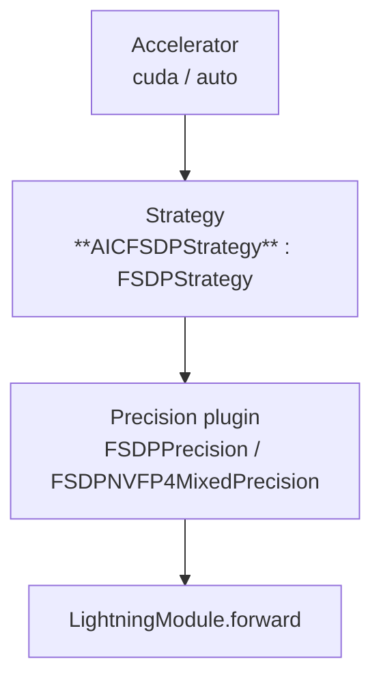
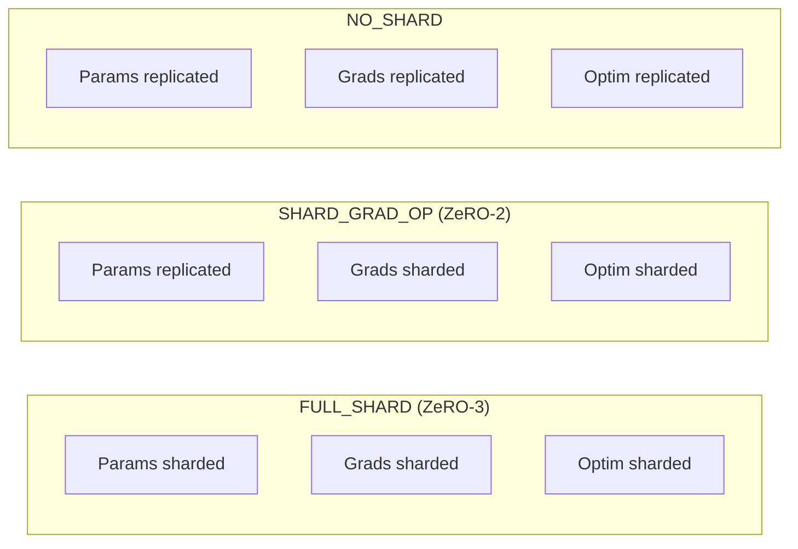
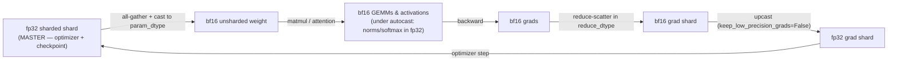

# FSDP in `aic-nuformer-research`: A Practical Guide

How **Fully Sharded Data Parallel** is actually wired in our stack — the `AICFSDPStrategy`
subclass, the `configs/fsdp/` configs, the FSDP-units audit report, and how every knob maps to
PyTorch's `FullyShardedDataParallel` (FSDP1). Grounded in the real code, not hypotheticals.

This complements the [PyTorch FSDP paper notes](../../pytorch-fsdp/) (the *why* of ZeRO-style
sharding). This guide is the *how we run it* reference.

**Sources of truth in the repo:**

| Concern | Where |
|---|---|
| Strategy | `src/aic_research/training/strategies/fsdp.py` — `AICFSDPStrategy` (+ units report) |
| Precision | `src/aic_research/training/precision/nvfp4_mixed_precision.py` — `FSDPNVFP4MixedPrecision` |
| Configs | `configs/fsdp/` — `base_bf16_mixed.yaml` + `fsdp_full_shard*.yaml` overrides |
| LightningModule | `nuformer.training.transactions.ssm_core_lightning.SSMCoreLightningModule` |
| Launch | `python src/aic_research/experiment_v2.py --config_file ...` |
| Upstream | `lightning.pytorch.strategies.FSDPStrategy` → `torch.distributed.fsdp.FullyShardedDataParallel` |

> **Version note.** We are on **torch 2.6 / FSDP1** (`FullyShardedDataParallel` with a flattened
> `FlatParameter` per unit). This is *not* FSDP2 (`fully_shard` + DTensor). Everything below is
> FSDP1 semantics.

---

## Table of contents

1. [Where the strategy sits](#section-1-where-the-strategy-sits)
2. [How we run it (configs + launch)](#section-2-how-we-run-it-configs--launch)
3. [`AICFSDPStrategy`: what we added on top](#section-3-aicfsdpstrategy-what-we-added-on-top)
4. [The FSDP-units report (`fsdp_units.json`)](#section-4-the-fsdp-units-report-fsdp_unitsjson)
5. [Sharding strategies](#section-5-sharding-strategies)
6. [Auto-wrap policy: units & granularity](#section-6-auto-wrap-policy-units--granularity)
7. [Excluding modules: `ignored_module_classes`](#section-7-excluding-modules-ignored_module_classes)
8. [Activation checkpointing (and what the paper says)](#section-8-activation-checkpointing-and-what-the-paper-says)
9. [Mixed precision: `FSDPPrecision` & NVFP4](#section-9-mixed-precision-fsdpprecision--nvfp4)
10. [Gradient clipping & optimizer under FSDP](#section-10-gradient-clipping--optimizer-under-fsdp)
11. [Checkpointing: `state_dict_type`](#section-11-checkpointing-state_dict_type)
12. [Gotchas](#section-12-gotchas)
13. [Appendix: passthrough FSDP kwargs](#appendix-passthrough-fsdp-kwargs)

---

## Section 1: Where the strategy sits

**DDP** replicates the full model, grads, and optimizer state on every GPU. Our 4B GDN model
(`base_bf16_mixed.yaml`: `d_model=2560`, `n_layers=36`) in bf16-mixed AdamW would need on the order
of ~16 bytes/param of training state — far past a single GPU at scale.

**FSDP (FULL_SHARD / ZeRO-3)** shards parameters, gradients, and optimizer state across the
data-parallel group. Each rank stores a slice; before a unit's forward it **all-gathers** the full
weight, and after backward it **reduce-scatters** gradients back to shards. Per-GPU memory drops
roughly proportional to world size (modulo activations and comm buffers).

Lightning splits the concern into three layers, and we subclass the middle one:



| Component | Owns | Our specifics |
|---|---|---|
| **Accelerator** | Device type | `accelerator: auto` (CUDA) |
| **Strategy** | Process group, model wrapping, sharding, collectives, checkpoint I/O | `AICFSDPStrategy` adds YAML `ignored_module_classes` + a units audit report |
| **Precision** | Autocast, grad dtype | `FSDPPrecision` (required by FSDP); `FSDPNVFP4MixedPrecision` for FP4 |

---

## Section 2: How we run it (configs + launch)

Our FSDP configs are **layered**: a non-FSDP base (`base_bf16_mixed.yaml`, which defines the model /
data / optimizer for the 4B GDN run) plus a thin FSDP override that swaps in `AICFSDPStrategy`.

```yaml
# configs/fsdp/fsdp_full_shard.yaml  (override on top of base_bf16_mixed.yaml)
trainer:
  strategy:
    class_path: aic_research.training.strategies.fsdp.AICFSDPStrategy
    init_args:
      sharding_strategy: FULL_SHARD
      cpu_offload: false
      activation_checkpointing_policy:
        - nuformer.modules.block.Block
        - nuformer.modules.gdn_block.GDNBlock
      auto_wrap_policy:
        - nuformer.modules.block.Block
        - nuformer.modules.gdn_block.GDNBlock
      ignored_module_classes: []      # empty = shard everything
      state_dict_type: sharded
```

The `configs/fsdp/` family:

| Config | What it is |
|---|---|
| `base_bf16_mixed.yaml` | 4B GDN model + data + Muon + `bf16-mixed`; **no** strategy (single-device base) |
| `fsdp_full_shard.yaml` | FULL_SHARD, auto-wrap **and** activation checkpointing on `Block`/`GDNBlock` |
| `fsdp_full_shard_no_act_ckpt.yaml` | Same, **activation checkpointing off**, `batch_size: 12` |
| `fsdp_full_shard_act_ckpt.yaml` | A/B counterpart: checkpointing **on** at the same `batch_size: 12` |
| `nvfp4_4b_wide_fused_glu.yaml` | NVFP4 baseline — **non-FSDP** (DDP), wide fat-GEMM arch |

### Launch

The entrypoint is `experiment_v2.py` (jsonargparse-driven), not `torchrun` directly. Stack the base
and the override with repeated `--config_file`:

```bash
PYTORCH_CUDA_ALLOC_CONF=expandable_segments:True \
python src/aic_research/experiment_v2.py \
    --config_file configs/fsdp/base_bf16_mixed.yaml \
    --config_file configs/fsdp/fsdp_full_shard_act_ckpt.yaml \
    --run_name qwen3-4b-gdn-fsdp-fullshard-actCkpt-bf16mixed-$(date +%Y%m%d-%H%M%S) \
    --local_run \
    --compile
```

- `--local_run` creates a fresh MLflow run locally (mutually exclusive with `--mlflow_run_id`). It is
  **single-process**; for multi-GPU local runs pre-create the run and attach (see `experiment_v2.py`
  module docstring).
- `--compile` applies `torch.compile` to the inner model **before** FSDP wraps it.

---

## Section 3: `AICFSDPStrategy`: what we added on top

`AICFSDPStrategy` (`src/aic_research/training/strategies/fsdp.py`) is a thin subclass of Lightning's
`FSDPStrategy`. It exists because two things we want are awkward in stock Lightning:

1. **`ignored_modules` from YAML.** Stock `auto_wrap_policy` takes *classes* (YAML-friendly), but
   PyTorch's `ignored_modules` takes *instances* — which don't exist when the strategy is
   constructed. We accept `ignored_module_classes` (dotted class paths) and resolve them to
   instances inside `_setup_model`, where the model finally exists. See §7.
2. **An audit of the resulting FSDP units.** After wrapping, we walk the unit tree and emit a report
   (INFO + MLflow `fsdp_units.json`). See §4.

```python
class AICFSDPStrategy(FSDPStrategy):
    def _setup_model(self, model: nn.Module) -> nn.Module:
        if self._ignored_module_classes:
            ignored = _resolve_ignored_modules(model, self._ignored_module_classes)
            if ignored:
                self.kwargs["ignored_modules"] = ignored   # forwarded into FSDP(...)
        model = super()._setup_model(model)                # <- the actual FSDP wrap
        self._report_fsdp_units(model)                     # <- audit, fail-soft
        return model
```

Everything else (sharding, precision, checkpoint I/O) is inherited unchanged. The report path is
wrapped in a fail-soft `try/except` — introspection must never break training.

---

## Section 4: The FSDP-units report (`fsdp_units.json`)

A **unit** (FSDP-paper terminology) is the granularity of sharding/communication: the wrap policy
groups a unit's parameters into one `FlatParameter`, all-gathered before that unit's
forward/backward and freed after. The **root** unit owns the residual params not claimed by any
nested unit (embeddings / final norm / `lm_head`).

`build_fsdp_units_report(model, ...)` enumerates units via
`FullyShardedDataParallel.fsdp_modules(model)` and reads each unit's `FlatParameter` metadata. It's
pure (torch only) and CPU unit-tested (`tests/test_fsdp_report.py`); the INFO/MLflow logging is
`log_fsdp_units_report` (rank-0 only, idempotent on resume, fail-soft) — mirroring the NVFP4
`swap_linears_to_nvfp4` / `log_convert_report` split.

Schema (artifact `fsdp_units.json`):

```jsonc
{
  "strategy": { "class": "AICFSDPStrategy", "sharding_strategy": "FULL_SHARD",
                "world_size": 8, "auto_wrap_policy": [...], "ignored_module_classes": [] },
  "totals":   { "num_units": 37, "num_param_units": 37, "total_params": 4026548224,
                "rank0_sharded_params": 503318528, "ignored_modules": 0 },
  "units":    [ { "index": 0, "module_fqn": "", "wrapped_class": "Qwen3GDNModel",
                  "is_root": true, "num_orig_params": 3, "unsharded_numel": 134234112,
                  "rank0_sharded_numel": 16779264, "dtype": "torch.float32",
                  "param_fqns": ["embeddings.weight", "output_norm.weight", "lm_head.weight"] },
                /* one entry per Block / GDNBlock unit ... */ ],
  "ignored":  [ /* {module_fqn, class, numel} per ignored module */ ]
}
```

Use it to: verify the unit decomposition matches your wrap policy, see what the root holds, confirm
`ignored_module_classes` took effect, and read **rank-0 shard sizes** (only the last rank differs by
padding, so rank-0 is representative without any cross-rank comm). It also exposes weight tying —
under tied embeddings the shared weight appears in exactly one unit's `param_fqns`.

---

## Section 5: Sharding strategies



| Strategy | Params | Grads | Optim | Use |
|---|---|---|---|---|
| **FULL_SHARD** | sharded | sharded | sharded | our default — max model-size headroom |
| **SHARD_GRAD_OP** | replicated | sharded | sharded | when all-gather overhead dominates and params fit replicated |
| **NO_SHARD** | replicated | replicated | replicated | debugging ("is FSDP the bug?") / tiny models |
| **HYBRID_SHARD** | shard intra-node, replicate inter-node | intra-node | intra-node | multi-node when full cross-node all-gather is too costly (needs `device_mesh`) |

---

## Section 6: Auto-wrap policy: units & granularity

Communication happens at unit boundaries, so wrapping granularity is the dominant memory/comms lever.

| Granularity | Peak memory | Collectives | Use |
|---|---|---|---|
| Root only (no policy) | highest (whole model unsharded at once) | fewest | tiny models / debug |
| **One unit per transformer block** | low (one block gathered at a time) | one all-gather/block/forward | **our default** |
| Sub-block (attn vs MLP) | lowest | most | extreme memory pressure |

Our configs wrap each `Block` and `GDNBlock`:

```yaml
auto_wrap_policy:
  - nuformer.modules.block.Block
  - nuformer.modules.gdn_block.GDNBlock
```

So the 36-layer hybrid becomes ~36 block units + a root unit (verify the exact count in
`fsdp_units.json`). Lightning turns a YAML class list into a `ModuleWrapPolicy` via
`_auto_wrap_policy_kwargs`.

**What PyTorch supports (and what it doesn't).** FSDP1 wrapping is **instance-based**, never
name-based — the policy callback receives an `nn.Module`, never an FQN. Upstream `torch.distributed.
fsdp.wrap` offers: `ModuleWrapPolicy` / `transformer_auto_wrap_policy` (class-based),
`size_based_auto_wrap_policy` (numel threshold), `CustomPolicy` / `lambda_auto_wrap_policy`
(arbitrary instance predicate — and `CustomPolicy` can return a per-unit kwargs dict to vary e.g.
`sharding_strategy`), and `_or_policy` to combine. There is **no built-in name/regex policy**; to
target by name you resolve names→instances yourself and feed a `CustomPolicy`. Lightning passes any
`_Policy`/callable straight through, so you can inject these from YAML via `class_path` without
touching `AICFSDPStrategy`.

Tuning: start at one-unit-per-block; if a stateful layer misbehaves under flat-param sharding,
remove its class (folds into the parent unit) or exclude it (§7); coarsen if comms-bound, add
activation checkpointing (§8) if still OOM.

---

## Section 7: Excluding modules: `ignored_module_classes`

### "not wrapped" ≠ "not sharded"

| Lever | Mechanism | Still sharded? | Grads reduced? |
|---|---|---|---|
| Omit class from `auto_wrap_policy` | folds into parent unit's FlatParameter | **Yes** | Yes (by parent) |
| `ignored_module_classes` → `ignored_modules=[...]` | fully excluded from the FSDP instance | **No** — full unsharded copy per rank | **No** |

The trap: removing a class from the wrap policy only changes **granularity** — params still shard
into the parent unit. To leave a module genuinely untouched (full replica, no all-gather/
reduce-scatter, **no mixed-precision cast**) you need `ignored_modules`.

### Our YAML-native path (the real code — not a hypothetical)

`AICFSDPStrategy` accepts dotted class paths and resolves them to instances at wrap time:

```yaml
trainer:
  strategy:
    class_path: aic_research.training.strategies.fsdp.AICFSDPStrategy
    init_args:
      auto_wrap_policy: [nuformer.modules.block.Block, nuformer.modules.gdn_block.GDNBlock]
      ignored_module_classes:
        - nuformer.modules.gdn_block.GDNBlock     # e.g. keep GDN conv-state full/fp32
```

Semantics of an ignored module (also documented in `fsdp.py`):

- Its params/buffers (and descendants') stay **full and unsharded** on every rank.
- FSDP **does not cast** them via mixed precision (canonical way to keep a submodule fp32).
- FSDP **does not reduce their gradients**. ⚠️ A *trainable* ignored module diverges across ranks
  unless you sync it yourself. Fine for frozen/eval-only submodules.

When to reach for it: buffer-heavy or numerically sensitive submodules that misbehave under
flat-parameter sharding (e.g. GDN conv state, rotary caches), modules that must stay fp32, or frozen
submodules where sharding is pure overhead. **Frozen ≠ ignored:** `requires_grad=False` still
*shards* (keeps the memory win); use `ignored_module_classes` only when the tensor must stay whole.
The `ignored` section of `fsdp_units.json` confirms what was excluded.

---

## Section 8: Activation checkpointing (and what the paper says)

Separate from **weight sharding**, activation checkpointing trades **compute for memory**: a wrapped
unit's intermediate activations are dropped after forward and **recomputed** during backward.

### What the PyTorch FSDP paper says about it

**Almost nothing — and that's the point.** Activation (gradient) checkpointing is *not* a
contribution of the FSDP paper; it's treated as an **orthogonal, composable** technique. It surfaces
only in two correctness contexts:

- **§3 (system design):** "multiple forwards before a backward — e.g. activation checkpointing — …
  autograd handles it naturally." Recomputation re-runs a unit's forward in backward, so a unit can
  be forwarded more than once per step.
- **§4 (implementation):** FSDP schedules its AllGather/ReduceScatter via **standard autograd
  hooks**, so "gradient checkpointing, double-backward, retain_graph, etc." work for free — autograd
  drives the hook firing.

So the paper's stance: checkpointing reduces **activation** memory while FSDP reduces
**param/grad/optimizer** memory, and FSDP was built on autograd hooks specifically so the extra
recompute forward doesn't break its comm scheduling. There is no dedicated algorithm or benchmark
for it in the paper.

### How Lightning applies it

`_setup_activation_checkpointing` (`lightning/fabric/strategies/fsdp.py`) runs **after** the FSDP
wrap and calls PyTorch's `apply_activation_checkpointing` with a `CheckpointWrapper`:

```python
# torch >= 2.2 (we are on 2.6): default checkpoint_wrapper → non-reentrant (CheckpointImpl.NO_REENTRANT)
apply_activation_checkpointing(
    module,
    checkpoint_wrapper_fn=checkpoint_wrapper,
    auto_wrap_policy=ModuleWrapPolicy({Block, GDNBlock}),   # from activation_checkpointing_policy
)
```

| Concern | Behavior |
|---|---|
| Order | FSDP wrap first, then checkpoint wrap |
| Reentrancy | torch ≥ 2.2 → **non-reentrant** (the modern default) |
| Already checkpointed | warns and **skips** if a `CheckpointWrapper` is already present |
| Policy form | same class-set machinery as `auto_wrap_policy` |

Typical recipe: the **same** class list in both `auto_wrap_policy` and
`activation_checkpointing_policy` — checkpoint every block that is also an FSDP unit (exactly our
`fsdp_full_shard.yaml`).

### Our A/B

`fsdp_full_shard_act_ckpt.yaml` vs `fsdp_full_shard_no_act_ckpt.yaml` are identical at
`batch_size: 12`, differing only by the presence of `activation_checkpointing_policy`. This isolates
the activation-memory ↔ recompute-cost tradeoff at fixed batch — and, per the paper, it should not
change the FSDP unit/comm behavior captured in `fsdp_units.json`.

---

## Section 9: Mixed precision: `FSDPPrecision` & NVFP4

**What this section covers.** What `torch.distributed.fsdp.MixedPrecision` actually does, and how
`precision="bf16-mixed"` gives you the canonical recipe — **fp32 master weights** (optimizer steps
and checkpoints in fp32) while **activations and GEMMs run in bf16**. Then how Lightning wires it,
which knobs to turn, and the NVFP4 sibling plugin.

> **Version note.** Grounded in **torch 2.9** + **Lightning 2.6.1**. The `MixedPrecision` dataclass
> (six fields below) is byte-identical from torch 2.6 → 2.9, and Lightning's `FSDPPrecision` mapping
> is unchanged, so everything here applies to 2.6 as well. (The top-of-file note still says torch
> 2.6 — that's the only stale spot; reconcile when convenient.)

### Background: `torch.autocast` (op-level mixed precision)

`autocast` is **orthogonal to where a tensor is stored**. It's a context manager that, for the ops
*inside* it, picks a compute dtype **per operation** based on a built-in safety policy — regardless
of the dtype the parameters are stored in:

```python
with torch.autocast("cuda", dtype=torch.bfloat16):
    y = layer(x)          # matmul/linear/conv  -> run in bf16  (fast, tolerant)
    p = softmax(y)        # softmax/exp/sum/norm -> stay in fp32 (precision-sensitive)
    loss = ce(p, target)  # loss reductions      -> stay in fp32
```

The policy (the "autocast op lists") splits ops into three buckets:

| Bucket | Examples | Runs in |
|---|---|---|
| **Downcast-safe** (compute-bound, error-tolerant) | `linear`, `matmul`, `conv`, `bmm`, attention GEMMs | bf16 |
| **Keep-fp32** (numerically sensitive) | `softmax`, `layer_norm`, `log`, `exp`, `sum`, losses | fp32 |
| **Promote-to-widest** | ops mixing dtypes (e.g. `addcdiv`) | fp32 |

Key mental model: autocast **inserts casts around ops**, it does **not** change the stored
parameter dtype. A fp32 weight feeding a `linear` gets a transient bf16 view for that matmul; a bf16
input feeding `layer_norm` gets upcast to fp32 for that op. So autocast alone already gives you "GEMMs
in bf16, norms/softmax in fp32" **without touching your master weights**. (No `GradScaler` for bf16 —
see below.)

### Background: bf16 vs fp16 (quick refresher)

Both are 16-bit, but spend their bits differently:

| dtype | exponent bits | mantissa bits | dynamic range | precision | loss scaling? |
|---|---|---|---|---|---|
| fp32 | 8 | 23 | huge | high | n/a |
| **bf16** | **8** | **7** | **same as fp32** | low | **No** |
| fp16 | 5 | 10 | small (~6e-5 … 65504) | higher | **Yes (GradScaler)** |

bf16 keeps fp32's exponent, so gradients rarely underflow/overflow → **no loss scaling needed**. fp16
has a narrow range, so small gradients flush to zero unless you scale the loss up before backward and
unscale before the step — that's what `ShardedGradScaler` does for `16-mixed`. This is why the
`bf16-mixed` path has **no scaler** while `16-mixed` does.

### What `MixedPrecision` does

`MixedPrecision` is FSDP's **own** mixed-precision mechanism, separate from (and complementary to)
autocast. It controls the dtype of the tensors FSDP physically materializes during its collectives.
The full surface is six fields (torch 2.9):

| Field | Default | What it controls |
|---|---|---|
| `param_dtype` | `None` | dtype of params **during forward/backward** — i.e. the dtype of the **all-gathered, unsharded** weight that feeds the GEMMs. Outside fwd/bwd the *sharded* params stay full precision. |
| `reduce_dtype` | `None` | dtype of the **gradient reduction** (reduce-scatter). `None` → falls back to `param_dtype`. Set to `float32` to force fp32 grad reduction even with bf16 params. |
| `buffer_dtype` | `None` | dtype buffers are cast to on the first forward (kept thereafter). FSDP does not shard buffers. |
| `keep_low_precision_grads` | `False` | `False` → FSDP **upcasts grads to fp32 after backward** so the optimizer steps in fp32. `True` → keep grads in `reduce_dtype` (for low-precision optimizers). |
| `cast_forward_inputs` | `False` | cast this module's forward args to `param_dtype`. |
| `cast_root_forward_inputs` | `True` | the **root** FSDP module casts forward inputs to `param_dtype` (takes precedence over `cast_forward_inputs` at the root). |

The line that answers your question is in the `param_dtype` docstring:

> "This specifies the dtype for model parameters during forward and backward… Outside forward and
> backward, the **sharded parameters are kept in full precision** (e.g. for the optimizer step), and
> for model checkpointing, the parameters are **always saved in full precision**."

So FSDP itself maintains the fp32/bf16 split: the **fp32 sharded shard is the master copy**; the
bf16 unsharded copy is a transient produced by the all-gather, consumed by the GEMMs, then freed.

### How `bf16-mixed` keeps master fp32 while GEMMs/activations run bf16

This is the default recipe — you get it for free with `precision="bf16-mixed"`; **no extra config
needed**. Two layers stack to produce it:

**Layer A — FSDP `MixedPrecision` (the *weights*).** With `precision="bf16-mixed"`, `FSDPPrecision`
builds:

```python
torch.distributed.fsdp.MixedPrecision(
    param_dtype=torch.bfloat16,
    reduce_dtype=torch.bfloat16,    # NOTE: grads reduce in bf16 by default, not fp32
    buffer_dtype=torch.bfloat16,
)
```

Crucially, the precision plugin's `convert_module` is a **no-op for `*-mixed`** (only the `*-true`
modes do `module.to(dtype=...)`), so your `nn.Parameter`s are **created and kept in fp32**. FSDP then
shards those fp32 params; the **sharded flat-param shard is fp32 = your master copy**. Before each
unit's forward/backward, FSDP all-gathers and casts the unsharded copy to `param_dtype=bf16` → that
bf16 weight is what the matmul sees. After backward, since `keep_low_precision_grads=False`, FSDP
**upcasts the reduce-scattered grad shard back to fp32**, and the optimizer steps on the **fp32**
master shard.

**Layer B — `torch.autocast` (the *ops*).** `FSDPPrecision.forward_context()` also enters
`torch.autocast("cuda", dtype=torch.bfloat16)` for `*-mixed`. So even though the weights are already
bf16, autocast governs the **op-level** policy: GEMMs/attention in bf16, softmax/layernorm/loss in
fp32 (§autocast background). (Note `_desired_input_dtype` for `bf16-mixed` is **fp32**, so Lightning's
`convert_input` casts the *batch* to fp32; autocast then downcasts inside the bf16-eligible ops.)



Net effect per step: **master weights, optimizer state, gradient-step, and checkpoints are fp32;
all-gathered weights, activations, and GEMMs are bf16.** Exactly the recipe you asked about.

| `precision` | stored param (master) | all-gathered param (compute) | autocast fwd | grad reduce | grad for optim step | grad scaler |
|---|---|---|---|---|---|---|
| `32-true` | fp32 | fp32 | no | fp32 | fp32 | no |
| `bf16-true` | bf16 | bf16 | no | bf16 | bf16 | no |
| `16-true` | fp16 | fp16 | no | fp16 | fp16 | no |
| **`bf16-mixed`** | **fp32** | **bf16** | **yes (bf16)** | **bf16** | **fp32** (upcast) | no |
| `16-mixed` | fp32 | fp16 | yes (fp16) | fp16 | fp32 (upcast) | **ShardedGradScaler** |

> Note the contrast with `bf16-true`: there `convert_module` *does* cast the module to bf16, so the
> **master shard is bf16** — no fp32 copy, no upcast. That's "pure" low precision, not mixed. The
> warning `FSDPPrecision` emits for `*-true` ("FSDP will always retain a full-precision copy of the
> model parameters for sharding") refers to the original-dtype shard — which for `*-true` *is* the
> low-precision dtype.

### Tuning knob: fp32 gradient reduction

The one place the default `bf16-mixed` recipe is *not* fully fp32-safe is the **gradient reduction**:
`reduce_dtype=bf16` means the cross-rank reduce-scatter accumulates in bf16, which can lose precision
when summing many shards. To force fp32 reduction (more numerically robust, slightly more comm
bytes), pass a **strategy-level** `mixed_precision` — it *replaces* the plugin-derived config
outright (per `mixed_precision_config` precedence in §strategy), while autocast still comes from the
plugin:

```yaml
trainer:
  strategy:
    class_path: aic_research.training.strategies.fsdp.AICFSDPStrategy
    init_args:
      mixed_precision:
        class_path: torch.distributed.fsdp.MixedPrecision
        init_args:
          param_dtype: bfloat16
          reduce_dtype: float32    # fp32 grad reduction; params/GEMMs still bf16
          buffer_dtype: bfloat16
```

Because the override is **outright** (not a merge), you must restate `param_dtype`/`buffer_dtype` too.
You keep `precision: bf16-mixed` on the `Trainer` so autocast + the fp32 master behavior are unchanged.

> ⚠️ **dtype-from-YAML caveat.** `param_dtype`/`reduce_dtype`/`buffer_dtype` are `torch.dtype`
> objects, not strings — jsonargparse won't necessarily coerce `bfloat16` → `torch.bfloat16` out of
> the box. If the string form above fails to parse, the robust path is to build the `MixedPrecision`
> in Python (e.g. in your strategy factory / a small config helper) and pass it to `AICFSDPStrategy`,
> or register a dtype type-resolver. The Python equivalent is unambiguous:
>
> ```python
> from torch.distributed.fsdp import MixedPrecision
> import torch
> AICFSDPStrategy(..., mixed_precision=MixedPrecision(
>     param_dtype=torch.bfloat16, reduce_dtype=torch.float32, buffer_dtype=torch.bfloat16))
> ```

> **Norms stay fp32 anyway.** Per the `MixedPrecision` notes, layer/batch norm **accumulate in fp32**
> regardless of `param_dtype`. The default `_module_classes_to_ignore=(_BatchNorm,)` additionally keeps
> BatchNorm's *affine params* in fp32 (at the cost of separate collectives for those modules) when an
> `auto_wrap_policy` is set. For genuinely fp32-everything submodules, use `ignored_module_classes` (§7).

### NVFP4 on FSDP

`FSDPNVFP4MixedPrecision` (`precision/nvfp4_mixed_precision.py`) is the FSDP sibling of
`NVFP4MixedPrecision`. It is built on `FSDPPrecision`, nests TE's FP4 autocast inside the bf16
autocast, and in `convert_module` swaps dim-eligible `nn.Linear` → `TeLinearAutocast` **before** the
FSDP wrap, so the resulting `te.Linear` weights shard normally. It logs `nvfp4_convert_module.json`
(which Linears were swapped/skipped).

> ⚠️ The NVFP4 plugins `import transformer_engine`. On a box without TE you'll get
> `No module named 'transformer_engine'` at config-parse time — that's an environment gap, not a
> config bug. Our `nvfp4_4b_wide_fused_glu.yaml` is the **non-FSDP** NVFP4 baseline and needs TE too.

---

## Section 10: Gradient clipping & optimizer under FSDP

### Clipping must go through the FSDP root

`torch.nn.utils.clip_grad_norm_` on raw params computes the wrong norm under sharding (and
`FSDPPrecision.clip_grad_by_norm` raises). `SSMCoreLightningModule.configure_gradient_clipping`
routes norm-based clipping to the FSDP root's collective-aware entry point:

```python
def configure_gradient_clipping(self, optimizer, gradient_clip_val=None, gradient_clip_algorithm=None):
    if gradient_clip_val is None or not isinstance(self.trainer.strategy, FSDPStrategy):
        super().configure_gradient_clipping(...)            # non-FSDP / no clip
        return
    if GradClipAlgorithmType(gradient_clip_algorithm or "norm") == GradClipAlgorithmType.NORM:
        self.trainer.strategy.model.clip_grad_norm_(gradient_clip_val)   # root FSDP module
    else:
        super().configure_gradient_clipping(...)            # value-based is shard-local
```

`isinstance(strategy, FSDPStrategy)` is `True` for `AICFSDPStrategy` (subclass), so this fires for
our runs. Our configs set `gradient_clip_val: 1.0`.

### Optimizer

Lightning forces **`use_orig_params=True`**, so the optimizer sees original `nn.Parameter` objects
(not flat shards): write `configure_optimizers` normally against `self.parameters()`, and multiple
param groups / `torch.compile` work. Optimizer states are sharded alongside params.

---

## Section 11: Checkpointing: `state_dict_type`

| Type | Save | Load | Trade-off |
|---|---|---|---|
| `full` | gather to rank 0 → single `.ckpt` | broadcast/scatter | portable; rank-0 RAM spike, slow at 100B+ |
| `sharded` (our default) | each rank writes its shard → **directory** | distributed load per rank | scalable; must resume at **same world size** |

`FSDPStrategy.save_checkpoint`/`load_checkpoint` implement both and **do not** use the generic
`CheckpointIO` (custom CheckpointIO is rejected). Optimizer state saves/loads via
`FSDP.optim_state_dict` under the same `state_dict_type`.

---

## Section 12: Gotchas

- **Clipping:** never `torch.nn.utils.clip_grad_norm_`; use the root `clip_grad_norm_` (§10).
- **Buffers under FSDP are fragile** — generally replicated, not sharded; we deliberately avoid
  buffers in some layers (`ml_core/.../utils/v1/utils.py`: *"We avoid using buffers because we've
  run into various issues doing so with FSDP."*). Prefer params or explicit state-dict management;
  if a submodule must carry persistent buffers, `ignored_module_classes` keeps it intact (§7).
- **`torch.compile` ordering:** `--compile` compiles the inner model **before** the FSDP wrap. If
  compile + FSDP fails, drop `--compile` to isolate.
- **Sharded checkpoint resume needs the same world size.**
- **Metrics under sharding read local shards only.** For global norms, all-reduce — see
  `WeightMonitorCallback`, which reduces only when `isinstance(trainer.strategy, FSDPStrategy)`.
- **`strategy="fsdp"` shorthand** does *not* apply our wrap policy / `state_dict_type: sharded` /
  `ignored_module_classes` — always use the explicit `AICFSDPStrategy` `class_path` block.
- **Trainable + frozen params in one unit** can fail flat-parameter construction with
  `use_orig_params=True` in some torch versions — group frozen modules into their own unit or ignore
  them.

---

## Appendix: passthrough FSDP kwargs

Anything not a first-class `FSDPStrategy` arg is forwarded to `FullyShardedDataParallel(...)`.

| Kwarg | Default | Effect |
|---|---|---|
| `use_orig_params` | **`True`** (Lightning) | original param objects vs flat params |
| `backward_prefetch` | `BACKWARD_PRE` | prefetch next unit's params in backward |
| `forward_prefetch` | `False` | prefetch next unit's params in forward |
| `limit_all_gathers` | `True` | serialize all-gathers to cap peak memory |
| `sync_module_states` | `False` | broadcast rank-0 weights on wrap |
| `ignored_modules` | `None` | set by `AICFSDPStrategy` from `ignored_module_classes` (§7) |
| `ignored_states` | `None` | newer unified form (params **or** modules); only one of the two |
| `device_mesh` / `process_group` | `None` | hybrid sharding / custom group (mutually exclusive) |

Authoritative list: [PyTorch FSDP API](https://pytorch.org/docs/stable/fsdp.html).

---

## Key takeaways

1. **We run `AICFSDPStrategy`**, a thin `FSDPStrategy` subclass adding YAML `ignored_module_classes`
   and the `fsdp_units.json` audit — not stock `FSDPStrategy`.
2. **Three levers dominate:** `auto_wrap_policy` (units/granularity), `sharding_strategy` (what's
   sharded), `activation_checkpointing_policy` (activation memory).
3. **Configs are layered:** `base_bf16_mixed.yaml` + a `fsdp_full_shard*.yaml` override; launch via
   `experiment_v2.py` with stacked `--config_file`.
4. **Activation checkpointing is orthogonal to FSDP** — the paper barely mentions it (only that
   autograd hooks make it correct); the `act_ckpt` vs `no_act_ckpt` configs A/B it at fixed batch.
5. **FSDP-aware clipping/optimizer** are handled in `SSMCoreLightningModule` + `use_orig_params=True`.

---

## Related reading

- [PyTorch FSDP paper notes](../../pytorch-fsdp/) — ZeRO background, comm patterns, Meta's tradeoffs
- [NVFP4 implementation ideas](./nvfp4-impl-ideas.md) — composing FP4 precision on top of FSDP
- [DDP vs FSDP1 vs FSDP2 precision](../parallel-strategies/precision.md) — framework-level precision behavior
- [Declarative FSDP2 `apply_shard`](../parallel-strategies/declarative-apply-shard.md) — bottom-up FSDP2 wrapping and filters
- `src/aic_research/training/strategies/fsdp.py` · `tests/test_fsdp_report.py` · `configs/fsdp/`
