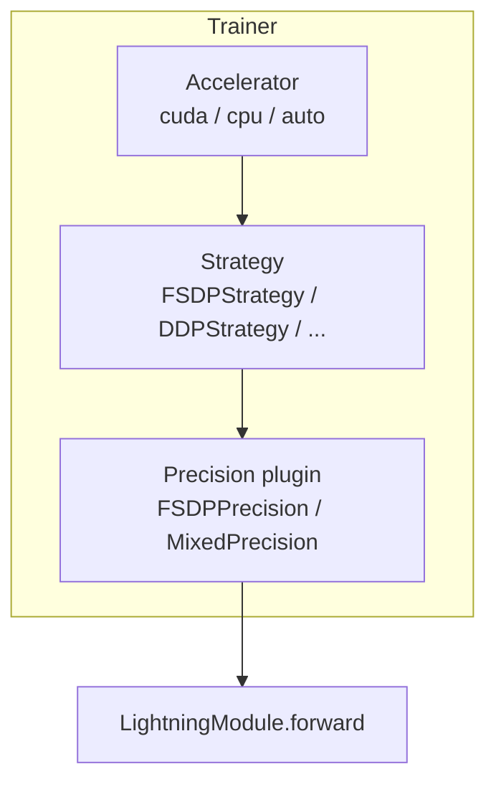
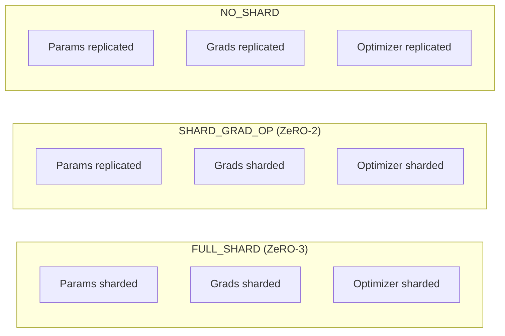
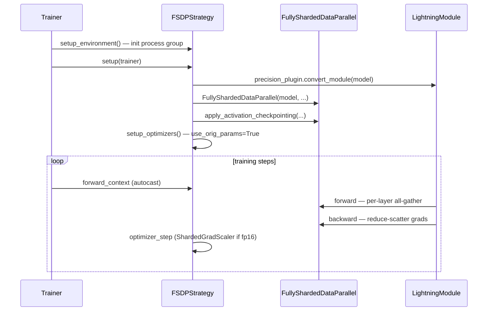

# PyTorch Lightning `FSDPStrategy`: A Practical Deep Dive

A reference guide to Lightning's **Fully Sharded Data Parallel** strategy — what it is, how it plugs into `Trainer`, every knob you can turn, and how those knobs map to the underlying PyTorch `FullyShardedDataParallel` (FSDP) API.

This guide complements the [PyTorch FSDP paper notes](../../pytorch-fsdp/) (the systems paper on ZeRO-style sharding). That paper explains *why* parameter sharding exists; this guide explains *how Lightning wires it* so you can configure and debug real training runs without hand-rolling distributed code.

**Primary source of truth:** `lightning.pytorch.strategies.FSDPStrategy` (Lightning 2.x), which is a thin orchestration layer over `torch.distributed.fsdp.FullyShardedDataParallel`.

**Concrete examples in our stack:** `configs/qwen3_4b_fsdp.yaml` and `run_scripts/explore_gdn_fsdp.py` in `aic-nuformer-research`.

---

## Table of contents

1. [Where FSDPStrategy sits in the Lightning stack](#section-1-where-fsdpstrategy-sits-in-the-lightning-stack)
2. [How to use it (Python, YAML, launch)](#section-2-how-to-use-it-python-yaml-launch)
3. [Constructor arguments — the full inventory](#section-3-constructor-arguments--the-full-inventory)
4. [Sharding strategies: what gets split where](#section-4-sharding-strategies-what-gets-split-where)
5. [Auto-wrap policy: controlling FSDP granularity](#section-5-auto-wrap-policy-controlling-fsdp-granularity)
   - [Excluding modules from FSDP (`ignored_modules` / `ignored_states`)](#excluding-modules-from-fsdp-ignored_modules--ignored_states)
6. [Activation checkpointing policy](#section-6-activation-checkpointing-policy)
7. [Mixed precision and `FSDPPrecision`](#section-7-mixed-precision-and-fsdpprecision)
8. [Checkpointing: `state_dict_type`](#section-8-checkpointing-state_dict_type)
9. [What Lightning does for you at runtime](#section-9-what-lightning-does-for-you-at-runtime)
10. [Knobs you actually tune in practice](#section-10-knobs-you-actually-tune-in-practice)
11. [Gotchas and failure modes](#section-11-gotchas-and-failure-modes)
12. [Appendix: PyTorch FSDP kwargs passed through `**kwargs`](#appendix-pytorch-fsdp-kwargs-passed-through-kwargs)

---

## Section 1: Where FSDPStrategy sits in the Lightning stack

### The problem FSDP solves (30-second version)

Standard **DDP** replicates the full model, gradients, and optimizer state on every GPU. A 4B-parameter model in bf16-mixed AdamW training needs on the order of **~16 bytes per parameter** (weights + master copy + grad + Adam moments) — far more than one GPU can hold at scale.

**FSDP** (ZeRO-3 style) **shards** parameters, gradients, and optimizer states across the data-parallel group. Each rank only stores a slice. Before a layer runs forward, FSDP **all-gathers** the shards it needs into a temporary full weight; after backward, it **reduce-scatters** gradients back into shards. Peak memory drops roughly proportional to world size (modulo activations and communication buffers).

### Strategy vs precision vs accelerator

Lightning splits distributed concerns across three layers:



| Component | Owns | FSDP-specific notes |
|---|---|---|
| **Accelerator** | Device type, moving tensors to GPU | FSDP still needs `accelerator="cuda"` (or `auto` with CUDA visible) |
| **Strategy** (`FSDPStrategy`) | Process group, model wrapping, sharding, collectives, checkpoint I/O | Wraps your `LightningModule` in `FullyShardedDataParallel` |
| **Precision plugin** (`FSDPPrecision`) | Autocast, grad scaler, dtype of inputs | **Required** companion for FSDP — plain `MixedPrecision` is rejected |

When you write:

```python
trainer = L.Trainer(
    strategy="fsdp",           # shorthand → FSDPStrategy()
    precision="bf16-mixed",  # → FSDPPrecision("bf16-mixed")
    devices=8,
)
```

Lightning resolves the string `"fsdp"` via the strategy registry and pairs it with `FSDPPrecision` automatically. If you construct `FSDPStrategy(...)` explicitly, the precision plugin must still be `FSDPPrecision` (or omitted so Lightning injects one from `Trainer(precision=...)`).

### Registered strategy aliases

Lightning registers two string shortcuts:

| String | Equivalent |
|---|---|
| `"fsdp"` | `FSDPStrategy()` with defaults |
| `"fsdp_cpu_offload"` | `FSDPStrategy(cpu_offload=True)` |

For anything non-default (custom wrap policy, hybrid sharding, sharded checkpoints), pass a full `FSDPStrategy(...)` object or a YAML `class_path` block (see §2).

---

## Section 2: How to use it (Python, YAML, launch)

### Minimal Python

```python
import lightning as L
from lightning.pytorch.strategies import FSDPStrategy

strategy = FSDPStrategy(
    sharding_strategy="FULL_SHARD",
    auto_wrap_policy={MyTransformerBlock},  # set of module classes
)

trainer = L.Trainer(
    accelerator="cuda",
    devices=torch.cuda.device_count(),
    strategy=strategy,
    precision="bf16-mixed",
)
trainer.fit(model, train_dataloader)
```

### YAML via jsonargparse (our production pattern)

In `aic-nuformer-research`, training configs declare the strategy as a subclass:

```yaml
trainer:
  accelerator: auto
  precision: bf16-mixed
  num_nodes: 1
  devices: auto
  strategy:
    class_path: lightning.pytorch.strategies.FSDPStrategy
    init_args:
      sharding_strategy: FULL_SHARD
      cpu_offload: false
      auto_wrap_policy:
        - nuformer.modules.block.Block
        - aic_research.modules.gdn_block.GDNBlock
      activation_checkpointing_policy:
        - nuformer.modules.block.Block
        - aic_research.modules.gdn_block.GDNBlock
      state_dict_type: sharded
  gradient_clip_val: 1.0
```

jsonargparse resolves the class list under `auto_wrap_policy` into a `ModuleWrapPolicy` at instantiation time (Lightning helper `_auto_wrap_policy_kwargs`).

### Launch: you must spawn multiple processes

FSDP is a **multi-process** strategy. Single-process `python train.py` with `devices=2` works only because Lightning's launcher spawns workers — but the canonical, reliable pattern is:

```bash
torchrun --nproc_per_node=2 run_scripts/explore_gdn_fsdp.py \
    --config configs/qwen3_4b_fsdp.yaml \
    --max-steps 10
```

Environment variables set by `torchrun` (`RANK`, `LOCAL_RANK`, `WORLD_SIZE`, `MASTER_ADDR`, `MASTER_PORT`) are consumed by Lightning's cluster environment. Do not mix manual `CUDA_VISIBLE_DEVICES` tricks with `devices=auto` without understanding rank-to-GPU mapping.

### String shorthand vs explicit config

| Approach | When to use |
|---|---|
| `strategy="fsdp"` | Quick experiments; defaults: `FULL_SHARD`, `state_dict_type="full"` (PyTorch Lightning) |
| `FSDPStrategy(...)` / YAML `init_args` | Production: custom wrap policy, activation checkpointing, sharded checkpoints, hybrid sharding |
| `configure_sharded_model` hook override | **Advanced / legacy:** you pre-wrap submodules yourself; Lightning skips the top-level FSDP wrap |

---

## Section 3: Constructor arguments — the full inventory

`FSDPStrategy.__init__` signature (Lightning 2.x):

```python
FSDPStrategy(
    # --- ParallelStrategy / infrastructure (usually leave as None; Trainer fills in) ---
    accelerator=None,
    parallel_devices=None,
    cluster_environment=None,
    checkpoint_io=None,          # NOTE: FSDPStrategy does NOT use CheckpointIO
    precision_plugin=None,       # must be FSDPPrecision if set explicitly

    # --- Process group ---
    process_group_backend=None,  # default: nccl on CUDA, gloo on CPU
    timeout=None,                # default: 30 min process-group timeout

    # --- Core FSDP configuration ---
    cpu_offload=None,            # bool or torch.distributed.fsdp.CPUOffload
    mixed_precision=None,        # torch.distributed.fsdp.MixedPrecision (rarely set directly)
    auto_wrap_policy=None,       # set[Module subclass] | callable | ModuleWrapPolicy
    activation_checkpointing=None,       # DEPRECATED — use activation_checkpointing_policy
    activation_checkpointing_policy=None,
    sharding_strategy="FULL_SHARD",
    state_dict_type="full",      # "full" | "sharded"  (Fabric default: "sharded")
    device_mesh=None,            # tuple (replicate, shard) or DeviceMesh; HYBRID_SHARD only

    # --- Passed through to torch FSDP ---
    **kwargs,
)
```

Lightning also **forces** `use_orig_params=True` by default (unless you override in `**kwargs`). This is important — see §11.

Below, each first-class argument is explained in depth.

### `cpu_offload`

**Type:** `bool | CPUOffload | None`  
**Default:** `False` (no offload)

When `True`, FSDP keeps parameter shards on CPU and copies them to GPU only for the layers about to compute. Trades **PCIe bandwidth and latency** for **GPU HBM**.

Lightning normalizes a bare `bool` into:

```python
CPUOffload(offload_params=bool(cpu_offload))
```

For finer control (e.g. offload only parameters, not gradients), construct `CPUOffload` yourself:

```python
from torch.distributed.fsdp import CPUOffload

FSDPStrategy(cpu_offload=CPUOffload(offload_params=True))
```

Use when: model fits in aggregate cluster memory but not per-GPU HBM. Avoid when: PCIe is the bottleneck (common on multi-node without fast links).

### `mixed_precision` (strategy-level, not Trainer-level)

**Type:** `torch.distributed.fsdp.MixedPrecision | None`  
**Default:** `None` — Lightning derives it from `FSDPPrecision` (see §7)

You *can* pass PyTorch's native `MixedPrecision(param_dtype=..., reduce_dtype=..., buffer_dtype=...)` directly to `FSDPStrategy`. In practice, almost everyone sets `Trainer(precision="bf16-mixed")` and lets `FSDPPrecision.mixed_precision_config` build the FSDP config.

Direct override example (expert use):

```python
from torch.distributed.fsdp import MixedPrecision

FSDPStrategy(
    mixed_precision=MixedPrecision(
        param_dtype=torch.bfloat16,
        reduce_dtype=torch.float32,   # all-reduce grads in fp32
        buffer_dtype=torch.bfloat16,
    ),
)
```

### `auto_wrap_policy`

**Type:** `set[type[nn.Module]] | Callable | ModuleWrapPolicy | None`  
**Default:** `None` → FSDP wraps only the **root** `LightningModule` as one giant FSDP instance

This is the **single most important tuning knob** for memory and performance. See §5.

Lightning convenience: pass a **set or list of module classes** (YAML list of import paths) and it becomes `ModuleWrapPolicy({Block, GDNBlock, ...})`.

### `activation_checkpointing` / `activation_checkpointing_policy`

**Type:** same shapes as `auto_wrap_policy`  
**Default:** `None` (no activation checkpointing)

Selects **which submodules** get wrapped with PyTorch's activation checkpointing *after* FSDP wrapping. Independent of the wrap policy — you often want the same class list for both (as in `qwen3_4b_fsdp.yaml`). See §6.

### `sharding_strategy`

**Type:** `"FULL_SHARD" | "SHARD_GRAD_OP" | "NO_SHARD" | "HYBRID_SHARD" | ShardingStrategy`  
**Default:** `"FULL_SHARD"`

Controls **what** is sharded across ranks. See §4.

### `device_mesh`

**Type:** `tuple[int, int] | DeviceMesh | None`  
**Default:** `None`  
**Requires:** `sharding_strategy="HYBRID_SHARD"` (or enum equivalent), PyTorch ≥ 2.2

Tuple `(replication_size, sharding_size)` where `replication_size * sharding_size == world_size`.

Example — 8 GPUs, hybrid shard within node, replicate across 2 nodes:

```python
# 4-way shard inside node, 2-way replicate across nodes → (2, 4), world_size=8
FSDPStrategy(
    sharding_strategy="HYBRID_SHARD",
    device_mesh=(2, 4),
    auto_wrap_policy={TransformerBlock},
)
```

Lightning converts a tuple to `init_device_mesh("cuda", (2, 4))` during setup.

### `state_dict_type`

**Type:** `"full" | "sharded"`  
**Default:** `"full"` in PyTorch Lightning Trainer; our YAML uses `"sharded"`

Controls checkpoint format on save/load. See §8.

### `process_group_backend` and `timeout`

- **`process_group_backend`:** `"nccl"` (GPU), `"gloo"` (CPU fallback), or custom. Default inferred from root device.
- **`timeout`:** `datetime.timedelta` for distributed init / collectives. Default 30 minutes. Increase if slow filesystem checkpoint loads cause NCCL timeouts during resume.

### Infrastructure args (rarely touch directly)

| Arg | Purpose |
|---|---|
| `accelerator` | Wired by `Trainer` |
| `parallel_devices` | List of `torch.device` per local rank |
| `cluster_environment` | SLURM, torchrun env parsing |
| `checkpoint_io` | **Unsupported** — `FSDPStrategy` raises if you set a custom CheckpointIO |
| `precision_plugin` | Must be `FSDPPrecision`; otherwise `TypeError` |

---

## Section 4: Sharding strategies: what gets split where

PyTorch's `ShardingStrategy` enum (string names accepted by Lightning):



| Strategy | Params | Grads | Optimizer | Memory vs DDP | Comm pattern |
|---|---|---|---|---|---|
| **FULL_SHARD** | Sharded | Sharded | Sharded | Lowest per-GPU memory | All-gather before forward; reduce-scatter on backward |
| **SHARD_GRAD_OP** | Replicated | Sharded | Sharded | Medium | Like DDP for params; sharded grad reduce |
| **NO_SHARD** | Replicated | Replicated | Replicated | Same as DDP | Standard DDP all-reduce |
| **HYBRID_SHARD** | Sharded within node; replicated across nodes | Sharded within node | Sharded within node | Good for multi-node | Intra-node all-gather; inter-node replication |

**When to pick which:**

- **FULL_SHARD** — default for large LM training (our `qwen3_4b_fsdp.yaml`). Maximizes model-size headroom.
- **SHARD_GRAD_OP** — when all-gather overhead dominates and the model *barely* fits replicated params per GPU.
- **NO_SHARD** — debugging ("is FSDP the bug?") or tiny models.
- **HYBRID_SHARD** — multi-node jobs where full cross-node all-gather is too expensive; requires `device_mesh` or explicit `process_group`.

---

## Section 5: Auto-wrap policy: controlling FSDP granularity

### Why wrapping matters

FSDP operates on **FSDP instances** — each instance owns a contiguous subtree of the model. Communication (all-gather / reduce-scatter) happens at FSDP boundaries.

| Granularity | Memory | Communication overhead | Typical use |
|---|---|---|---|
| **Root only** (default, no policy) | Highest peak activations (whole model unshard at once) | Lowest number of collectives | Small models / debugging |
| **One FSDP unit per transformer block** | Lower peak — only one block's params gathered at a time | One all-gather per block per forward | **Standard for LLMs** |
| **Sub-block (attention vs MLP separate)** | Even lower peak | More collectives | Huge models, memory-bound |

Our config wraps **each** `Block` and `GDNBlock`:

```yaml
auto_wrap_policy:
  - nuformer.modules.block.Block
  - aic_research.modules.gdn_block.GDNBlock
```

So a 36-layer hybrid model becomes ~36 FSDP leaves (+ embedding/head/root wrappers depending on module tree).

### Accepted policy forms

1. **Set/list of module classes** (recommended in YAML):

   ```python
   FSDPStrategy(auto_wrap_policy={TransformerBlock, nn.Linear})
   ```

   Lightning → `ModuleWrapPolicy({TransformerBlock, nn.Linear})`.

2. **`ModuleWrapPolicy` directly** (Python):

   ```python
   from torch.distributed.fsdp.wrap import ModuleWrapPolicy
   FSDPStrategy(auto_wrap_policy=ModuleWrapPolicy({Block}))
   ```

3. **Custom callable** `(module, recurse, nonwrapped_numel) -> bool` — full control; use when class-based policy is too coarse.

4. **Size-based policies** via `**kwargs` (see Appendix): `size_based_auto_wrap_policy` with `min_num_params=...`.

### What happens at setup

In `FSDPStrategy._setup_model`:

```python
model = FullyShardedDataParallel(
    module=model,
    cpu_offload=self.cpu_offload,
    mixed_precision=self.mixed_precision_config,
    sharding_strategy=self.sharding_strategy,
    device_id=self.root_device.index,
    auto_wrap_policy=...,  # from kwargs
    use_orig_params=True,  # Lightning default
)
```

If **you already wrapped** submodules in `configure_sharded_model`, Lightning detects existing FSDP modules and **drops** `auto_wrap_policy` with a warning.

### Tuning guidance

- **Start** with one wrap per transformer block (matches our YAML).
- If a **specific block type misbehaves** (stateful/recurrent layers, custom buffers — e.g. GDN conv state), try **removing that class** from the policy so it stays inside a parent FSDP unit, or isolate it under `NO_SHARD` via custom policy.
- If **OOM persists**, combine finer wrapping with `activation_checkpointing_policy` (§6).
- If **step time is communication-bound**, coarsen wrapping (fewer FSDP units).

### Excluding modules from FSDP (`ignored_modules` / `ignored_states`)

A frequent need: *"I want FSDP for most of the model, but module X should be left alone."* There are two **very different** ways to "exclude" a module, and confusing them is a common source of bugs.

#### Critical distinction: "not wrapped" ≠ "not sharded"

| Lever | Mechanism | Are the module's params still **sharded**? | Are gradients still **reduced** across ranks? |
|---|---|---|---|
| **Omit class from `auto_wrap_policy`** | Module is folded into its nearest enclosing FSDP unit | **Yes** — its params join the parent unit's FlatParameter and are sharded | Yes (by the parent unit) |
| **Custom callable returns `False`** for the subtree | Same as above | **Yes** | Yes |
| **`ignored_modules=[mod]`** | Module is fully excluded from this FSDP instance | **No** — full unsharded params live on every rank | **No** — FSDP does not touch them |
| **`ignored_states=[param_or_buffer]`** | Specific params/buffers excluded (finer-grained) | **No** for those tensors | **No** |

The trap: **removing a class from the wrap policy does not stop its parameters from being sharded.** It only changes *granularity* — the params get absorbed into the parent FSDP unit's flat parameter and are still split across ranks. If you genuinely want FSDP to leave a module untouched (full replica on every rank, no all-gather, no reduce-scatter, no mixed-precision cast), you need `ignored_modules` or `ignored_states`.

> From the PyTorch docstring: `ignored_modules` exists "to avoid sharding specific parameters at module granularity" — i.e. the params stay full even though everything around them is sharded.

#### What `ignored_modules` actually does

When you pass `ignored_modules=[some_submodule]`:

- The submodule's **own parameters and all its descendants' parameters and buffers** are excluded from this FSDP instance.
- Those tensors are **not flattened, not sharded, not all-gathered, not reduce-scattered.** Each rank keeps the full tensor.
- FSDP's **mixed precision does not cast them** — they keep whatever dtype they were initialized in. (This is the canonical way to force a submodule to stay fp32 while the rest runs bf16.)
- **FSDP does not reduce their gradients.** ⚠️ If those params are trainable and replicated across data-parallel ranks, the ranks will **diverge** unless you sync them yourself (wrap that submodule in `DDP`, or manually all-reduce its grads). For a frozen / eval-only submodule this is a non-issue.

`ignored_states` is the newer, unified form. It accepts **either** an iterable of parameters **or** an iterable of modules, with the same semantics. You may set **only one** of `ignored_modules` / `ignored_states` — passing both raises.

#### The Lightning friction: instances vs class names

`auto_wrap_policy` takes **classes**, so it works great from YAML (a list of import paths). But `ignored_modules` / `ignored_states` take **instances** — the actual `nn.Module` / `nn.Parameter` objects from your built model. The `FSDPStrategy` is constructed **before** your `LightningModule` exists, so **you cannot set these from a YAML class list.** You need a hook that runs once the model is instantiated.

`FSDPStrategy` forwards any unknown kwarg straight to `FullyShardedDataParallel` (see `_setup_model`), so the plumbing is there — you just have to supply the instances late. Two clean patterns:

**Pattern A — subclass `FSDPStrategy` and resolve instances in `_setup_model`** (recommended; keeps auto-wrap for everything else):

```python
from lightning.pytorch.strategies import FSDPStrategy

class FSDPStrategyWithIgnores(FSDPStrategy):
    def _setup_model(self, model):
        # `model` is the (unwrapped) LightningModule — instances exist now.
        # Exclude a buffer-heavy / fp32-sensitive submodule from sharding.
        self.kwargs["ignored_modules"] = [model.core_model.rotary_embedding]
        return super()._setup_model(model)
```

Everything not listed is still auto-wrapped per your `auto_wrap_policy`; only the listed instances are left full and untouched.

**Pattern B — build the FSDP wrap yourself in `LightningModule.configure_model`** (full manual control). Note: if you instead override the legacy `configure_sharded_model` hook, Lightning **skips** its own top-level wrap entirely (it assumes you wrapped everything), and any `auto_wrap_policy` you set is dropped with a warning. Use this only when you want to own the whole wrapping process.

```python
class MyModule(L.LightningModule):
    def configure_model(self):
        from torch.distributed.fsdp import FullyShardedDataParallel as FSDP
        from torch.distributed.fsdp.wrap import ModuleWrapPolicy
        # Wrap the transformer trunk, but ignore the embedding table entirely.
        self.core_model = FSDP(
            self.core_model,
            auto_wrap_policy=ModuleWrapPolicy({Block, GDNBlock}),
            ignored_modules=[self.core_model.embedding],
            use_orig_params=True,
        )
```

#### When you actually want this

- **Buffer-heavy submodules.** As §11 notes, FSDP's handling of registered buffers is fragile, and our codebase deliberately avoids buffers in some layers. If a submodule *must* carry persistent buffers (e.g. GDN convolution state, rotary caches), `ignored_modules` keeps it intact instead of letting FSDP mishandle it.
- **Modules that must stay fp32** (numerically sensitive heads, some norms, loss modules) — ignoring them is cleaner than fighting the mixed-precision config.
- **Frozen submodules** where sharding/communication is pure overhead with no memory payoff — e.g. a frozen embedding or a frozen vision encoder. (Gradients aren't reduced, which is exactly fine when `requires_grad=False`.)
- **Small modules** where the per-collective launch overhead outweighs the tiny memory saved.

#### Note on frozen vs ignored

These are orthogonal. Setting `requires_grad=False` **freezes** a param but FSDP still **shards** it (you keep the memory win, and no gradient is produced so nothing is reduced). `ignored_modules` **un-shards** it (full copy per rank). Reach for `ignored_modules` only when you need the tensor kept whole — for plain freezing, just set `requires_grad=False` and leave it in the wrap.

> ⚠️ With the default `use_orig_params=True`, mixing **trainable and frozen** params *inside the same FSDP unit* can fail flat-parameter construction in some PyTorch versions. If you hit that, either group frozen modules into their own wrap (separate FSDP unit) or ignore them outright.

---

## Section 6: Activation checkpointing policy

Separate from **weight sharding**, activation checkpointing trades **compute for memory** by not storing intermediate activations — they are recomputed in backward.

Lightning applies checkpointing **after** FSDP wrap via `apply_activation_checkpointing`:

```python
# Simplified from lightning/fabric/strategies/fsdp.py
apply_activation_checkpointing(
    module,
    checkpoint_wrapper_fn=checkpoint_wrapper,
    auto_wrap_policy=ModuleWrapPolicy({Block, GDNBlock}),  # from policy
)
```

When you pass a **class set** as `activation_checkpointing_policy`, Lightning reuses the same `ModuleWrapPolicy` machinery as `auto_wrap_policy`.

### Interaction with FSDP

| Concern | Behavior |
|---|---|
| Order of operations | FSDP wrap first, then activation checkpointing wrap |
| Reentrant checkpointing | PyTorch ≥ 2.2 uses default reentrant behavior; older versions force `NO_REENTRANT` |
| Already-checkpointed model | Warning + skip if `CheckpointWrapper` already present |
| `--no-activation-checkpoint` | Our explorer script pops `activation_checkpointing_policy` from YAML for A/B tests |

Typical LLM recipe: **same classes** in both `auto_wrap_policy` and `activation_checkpointing_policy` — checkpoint every block that is also an FSDP leaf.

---

## Section 7: Mixed precision and `FSDPPrecision`

FSDP **requires** `FSDPPrecision`, not the generic AMP plugin.

### Trainer precision → FSDP `MixedPrecision` mapping

When you set `Trainer(precision="bf16-mixed")`, `FSDPPrecision` builds:

```python
torch.distributed.fsdp.MixedPrecision(
    param_dtype=torch.bfloat16,
    reduce_dtype=torch.bfloat16,
    buffer_dtype=torch.bfloat16,
)
```

Supported `precision` strings:

| Trainer `precision` | Param dtype | Autocast in forward | Grad scaler |
|---|---|---|---|
| `"32-true"` | fp32 | No | No |
| `"16-true"` | fp16 | No (full fp16 compute) | No |
| `"bf16-true"` | bf16 | No | No |
| `"16-mixed"` | fp16 | Yes (fp16) | **ShardedGradScaler** (required) |
| `"bf16-mixed"` | bf16 | Yes (bf16) | No |

For `"16-mixed"`, FSDP uses `ShardedGradScaler` — the scaler state is sharded like gradients.

### What FSDPPrecision does beyond dtype

- **`convert_module`** — for `"*-true"` modes, casts module weights to the target dtype before FSDP wrap.
- **`forward_context`** — enables `torch.autocast("cuda", ...)` for `"*-mixed"` modes during forward.
- **`convert_input` / `convert_output`** — cast batch tensors to the expected input dtype.
- **`optimizer_step`** — integrates `ShardedGradScaler` for fp16-mixed.

### Gradient clipping ⚠️

`FSDPPrecision.clip_grad_by_norm` **raises** — you cannot use Lightning's default `gradient_clip_algorithm="norm"` which calls `torch.nn.utils.clip_grad_norm_` on raw parameters.

**Correct approach:** call **`FSDP.clip_grad_norm_(max_norm)`** on the **root FSDP module**:

```python
# Pattern used in SSMCoreLightningModule.configure_gradient_clipping
def configure_gradient_clipping(self, optimizer, gradient_clip_val, gradient_clip_algorithm):
    if gradient_clip_algorithm == "norm":
        self.trainer.strategy.model.clip_grad_norm_(gradient_clip_val)
    else:
        # fall back to Lightning default for 'value' algorithm
        ...
```

Our `qwen3_4b_fsdp.yaml` sets `gradient_clip_val: 1.0` deliberately to exercise this FSDP-native path in smoke tests.

---

## Section 8: Checkpointing: `state_dict_type`

FSDP checkpoints are fundamentally different from DDP because weights are **sharded**.

### `"full"` (default in Lightning Trainer)

- **Save:** all ranks participate; weights gathered to rank 0; **single `.ckpt` file** (standard Lightning checkpoint).
- **Load:** broadcast + scatter from full state dict.
- **Pros:** portable — one file, easy to share, load on different world sizes (with caveats).
- **Cons:** rank 0 needs enough CPU RAM to hold the full model; slow for 100B+.

### `"sharded"` (our YAML default for large runs)

- **Save:** each rank writes its shard; checkpoint path is a **directory** with `N` shard files + metadata.
- **Load:** distributed checkpoint load per rank.
- **Pros:** scalable save/load; no rank-0 memory spike.
- **Cons:** must resume with **same world size**; directory-based, harder to hand-copy.

Lightning's `FSDPStrategy.save_checkpoint` / `load_checkpoint` implement both paths and **do not** use the generic `CheckpointIO` plugin — custom CheckpointIO is rejected.

### Optimizer state

Optimizer states are sharded alongside parameters. Lightning uses `FSDP.optim_state_dict` / `optim_state_dict_to_load` with the same `state_dict_type` context. Mismatch between saved optimizer count and current run raises `RuntimeError`.

---

## Section 9: What Lightning does for you at runtime

End-to-end lifecycle for `trainer.fit`:



### Notable behaviors

| Behavior | Detail |
|---|---|
| **`model_to_device` is a no-op** | FSDP handles device placement via `device_id` |
| **`use_orig_params=True` default** | Optimizer sees original `nn.Parameter` objects, not flat shards — enables multiple param groups, `torch.compile`, and normal `configure_optimizers` |
| **`restore_checkpoint_after_setup=True`** | Checkpoints load after FSDP wrap |
| **`lightning_restore_optimizer=False`** | Optimizer restore handled inside FSDP load path |
| **`tensor_init_context`** | Supports meta-device init; materialize happens bottom-up during FSDP wrap |
| **`reduce()` for metrics** | Uses distributed mean/sum — important for callbacks that aggregate across ranks |
| **`configure_sharded_model` override** | If implemented, Lightning **skips** auto FSDP wrap (legacy escape hatch) |

### Diagnostic pattern (from `explore_gdn_fsdp.py`)

At `on_fit_start`, inspect:

```python
strategy = trainer.strategy
strategy.sharding_strategy
strategy.cpu_offload
strategy._state_dict_type
strategy.kwargs.get("auto_wrap_policy")
trainer.world_size
sum(p.numel() for p in pl_module.parameters())  # local shard view
```

Compare local param count × world_size against expected global count to verify sharding.

---

## Section 10: Knobs you actually tune in practice

Ordered by how often you touch them in LLM training:

| Priority | Knob | Typical starting value | What you're optimizing |
|---|---|---|---|
| 1 | `auto_wrap_policy` | `{TransformerBlock}` | Peak memory vs comms |
| 2 | `sharding_strategy` | `FULL_SHARD` | Memory vs speed |
| 3 | `activation_checkpointing_policy` | same as wrap policy | Activation memory |
| 4 | `Trainer.precision` | `bf16-mixed` | Speed / stability |
| 5 | `state_dict_type` | `sharded` at scale | Checkpoint I/O |
| 6 | `cpu_offload` | `false` | Last-resort GPU memory |
| 7 | `device_mesh` + `HYBRID_SHARD` | multi-node only | Cross-node bandwidth |
| 8 | `**kwargs`: `backward_prefetch`, `forward_prefetch` | defaults | Pipeline comms with compute |
| 9 | `**kwargs`: `limit_all_gathers` | `True` (default) | Memory vs overlap |
| 10 | `**kwargs`: `sync_module_states` | `False` | Set `True` if ranks start from divergent init |

### Our GDN + FSDP exploration knobs

From `configs/qwen3_4b_fsdp.yaml` comments and `explore_gdn_fsdp.py` CLI:

- **`--no-activation-checkpoint`** — pop policy for memory/speed isolation.
- **`--no-compile`** — disable `torch.compile` to separate compile failures from FSDP failures (compile runs **before** FSDP wrap).
- **`--devices N`** — override YAML device count.
- **`gradient_clip_val`** — exercises FSDP-native clipping path.

---

## Section 11: Gotchas and failure modes

### Optimizer must reference FSDP parameters

With `use_orig_params=True` (default), write `configure_optimizers` normally against `self.parameters()`.

With `use_orig_params=False`, you **must** create the optimizer **after** FSDP setup using `self.trainer.model.parameters()` — otherwise Lightning raises:

> The optimizer does not seem to reference any FSDP parameters.

### Do not use `torch.nn.utils.clip_grad_norm_`

Use `strategy.model.clip_grad_norm_(max_norm)` or override `configure_gradient_clipping`. See §7.

### Buffers and FSDP

FSDP's handling of **buffers** (non-parameter tensors registered on modules) is subtle — they are generally **replicated**, not sharded. Our codebase explicitly avoids buffer usage in some layers:

> We avoid using buffers because we've run into various issues doing so with FSDP.

Prefer parameters or explicit state dict management for persistent non-trainable tensors.

### `torch.compile` ordering

Compile the **inner model before** `trainer.fit` lets Lightning wrap with FSDP — or compile after wrap depending on your PyTorch version and policy. Our explorer compiles `CoreModel` **before** Trainer instantiation so FSDP sees the compiled module tree. If compile + FSDP fails, `--no-compile` isolates the issue.

### DataLoader workers + NCCL

FSDP setup uses NCCL on the main process. Multiprocessing DataLoader workers during init can interact badly — our smoke script uses `num_workers=0`.

### Checkpoint resume world size

Sharded checkpoints require the **same** `world_size` as save. Full checkpoints are more flexible but still best-effort across topology changes.

### Strategy registry default vs explicit YAML

`strategy="fsdp"` alone does **not** set your custom `auto_wrap_policy` or `state_dict_type: sharded` — always use explicit `FSDPStrategy` config for production LLM runs.

### Metric logging under sharding

Callbacks that read **parameter tensors** see **local shards** only. For global norms (e.g. weight monitoring), you must `strategy.reduce()` across ranks — see `WeightMonitorCallback`, which all-reduces only when `isinstance(trainer.strategy, FSDPStrategy)`.

---

## Appendix: PyTorch FSDP kwargs passed through `**kwargs`

Anything not listed as a first-class `FSDPStrategy` argument is forwarded to `FullyShardedDataParallel(...)`.

Common passthrough kwargs:

| Kwarg | Default | Effect |
|---|---|---|
| `use_orig_params` | **`True`** (Lightning sets) | Original param objects vs flat params |
| `backward_prefetch` | `BACKWARD_PRE` | Prefetch next layer's params during backward |
| `forward_prefetch` | `False` | Prefetch next layer's params during forward |
| `limit_all_gathers` | `True` | Serialize all-gathers to reduce peak memory |
| `sync_module_states` | `False` | Broadcast loaded weights from rank 0 on wrap |
| `param_init_fn` | `None` | Custom meta → real materialization |
| `ignored_modules` | `None` | Modules excluded from FSDP — params stay **full** on each rank, **not** sharded/reduced/cast. Needs instances, not classes. See §5. |
| `ignored_states` | `None` | Newer unified form of `ignored_modules`; accepts params **or** modules. Only one of the two may be set. See §5. |
| `process_group` | `None` | Custom process group (mutually exclusive with `device_mesh`) |
| `device_mesh` | `None` | Device mesh for hybrid sharding |

Example — forward prefetch for throughput tuning:

```python
FSDPStrategy(
    auto_wrap_policy={Block},
    forward_prefetch=True,
    backward_prefetch=BackwardPrefetch.BACKWARD_PRE,
)
```

Consult the [PyTorch FSDP API docs](https://pytorch.org/docs/stable/fsdp.html) for the authoritative list — PyTorch adds kwargs over time.

---

## Key takeaways

1. **`FSDPStrategy` is orchestration** — it initializes distributed, wraps your module in `FullyShardedDataParallel`, wires `FSDPPrecision`, and handles sharded checkpoint I/O.
2. **Three levers dominate LLM training:** `auto_wrap_policy` (granularity), `sharding_strategy` (what is sharded), `activation_checkpointing_policy` (activation memory).
3. **Always pair FSDP with `FSDPPrecision`** via `Trainer(precision="bf16-mixed")` (or explicit plugin).
4. **Gradient clipping and optimizer setup are FSDP-aware** — use `clip_grad_norm_` on the FSDP root module; rely on `use_orig_params=True` for normal optimizers.
5. **YAML subclass config** (`class_path` + `init_args`) is the maintainable way to version-control FSDP settings alongside the rest of a training run.

---

## Related reading

- [PyTorch FSDP paper notes](../../pytorch-fsdp/) — ZeRO background, communication patterns, Meta's engineering tradeoffs
- [NVFP4 + Lightning plugin guide](./nvfp4-impl-ideas.md) — composing custom precision plugins *on top of* FSDP once the baseline is stable
- [PyTorch FSDP tutorial](https://pytorch.org/tutorials/intermediate/FSDP_tutorial.html)
- [Lightning FSDPStrategy API](https://lightning.ai/docs/pytorch/stable/api/lightning.pytorch.strategies.FSDPStrategy.html)
