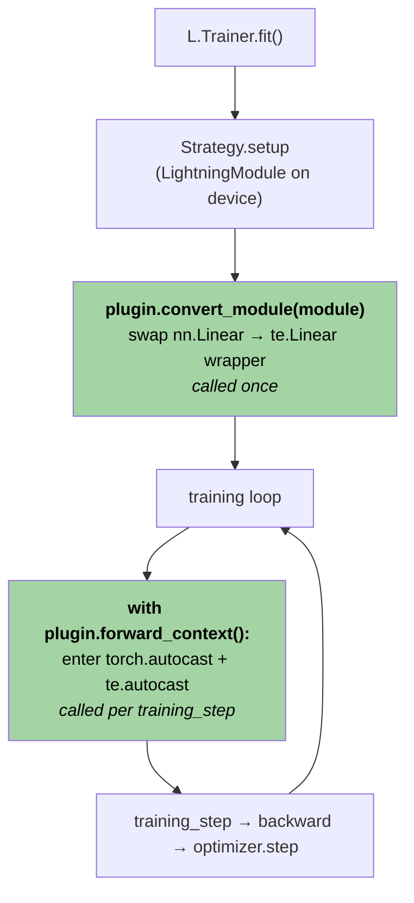

# NVFP4 Training with Transformer Engine in PyTorch Lightning

A practical recipe for enabling **NVFP4** (4-bit floating point with per-block scaling) GEMMs in a PyTorch Lightning training pipeline using NVIDIA's Transformer Engine (`transformer_engine.pytorch as te`) and the `NVFP4BlockScaling` recipe.

NVFP4 turns Hopper/Blackwell tensor-core matmuls into 4-bit GEMMs while keeping the rest of the model in BF16/FP32. The full training-stability story — Random Hadamard Transforms, 2D block scaling, stochastic rounding — lives in the [NVFP4 pretraining paper notes](../../nvfp4-pretraining/). This guide is about **wiring**: assuming you trust the recipe, how do you get it running inside Lightning?

The recipe is short:

1. Wrap `te.Linear` in a thin module that fixes one missing input cast on its FP4 path.
2. Subclass Lightning's `MixedPrecision` plugin so it (a) enters `te.autocast(recipe=NVFP4BlockScaling())` around forward, and (b) swaps every dim-eligible `nn.Linear` for the wrapper at `fit()` start.
3. Hand the plugin to `L.Trainer(plugins=[...])` and train normally.

This guide walks through each piece.

---

## Section 1: Making NVFP4 work with Lightning

### Background: what `MixedPrecision` already does

Lightning ships a `MixedPrecision` plugin (`lightning.pytorch.plugins.precision.amp.MixedPrecision`) that owns every precision-related concern in the training loop:

- Wraps every forward pass in `torch.autocast(dtype=...)`.
- Wraps backward and applies a `GradScaler` for `fp16-mixed` (no-op for `bf16-mixed`).
- Manages `optimizer.step()`, gradient clipping, and state-dict shaping so master weights stay FP32.

When you write `L.Trainer(precision="bf16-mixed")`, Lightning instantiates this plugin under the hood with `dtype=torch.bfloat16`. The two methods that matter for us are tiny:

```python
# lightning/pytorch/plugins/precision/amp.py
class MixedPrecision(Precision):
    def autocast_context_manager(self) -> torch.autocast:
        dtype = torch.bfloat16 if self.precision == "bf16-mixed" else torch.half
        return torch.autocast(self.device, dtype=dtype, cache_enabled=False)

    @contextmanager
    def forward_context(self) -> Generator[None, None, None]:
        """Enable autocast context."""
        with self.autocast_context_manager():
            yield
```

Every other piece of your pipeline — `LightningModule`, optimizer, callbacks — is unaware that mixed precision is active. The plugin owns it. **That is the seam we want.**

---

### How Transformer Engine enables NVFP4

Transformer Engine exposes NVFP4 as **two independent pieces** that have to be active together:

**1. A drop-in `nn.Linear` replacement: `te.Linear`.**

`te.Linear` has the same constructor signature and forward shape as `torch.nn.Linear` (`in_features`, `out_features`, `bias=True`), so it can be substituted into a model without changing the surrounding code. Outside any TE quantization context it runs as a plain BF16/FP32 linear; inside one it dispatches the corresponding low-precision GEMM.

**2. A thread-local autocast context with a recipe: `te.autocast(...)`.**

```python
import transformer_engine.pytorch as te
from transformer_engine.common.recipe import NVFP4BlockScaling

with te.autocast(enabled=True, recipe=NVFP4BlockScaling()):
    y = my_te_linear(x)   # ← this dispatches the FP4 GEMM
```

`te.autocast` is the public switch on TE's quantization path. The `recipe` argument selects the low-precision GEMM kind (FP8 with one recipe family, NVFP4 with `NVFP4BlockScaling`, MXFP8 with another, …), and `te.autocast` sets a thread-local flag every `te.Linear` checks at forward time.

The two pieces are independent: a `te.Linear` outside `te.autocast` is just BF16/FP32; a `te.autocast` block over a model that contains no `te.Linear` is a no-op. NVFP4 happens at the **intersection** — `te.Linear` modules running inside a `te.autocast(recipe=NVFP4BlockScaling())` block.

Crucially, **`torch.autocast` does not trigger TE.** When a `te.Linear` runs inside a plain `torch.autocast(bfloat16)`, none of its FP4 machinery activates — the layer just runs as a normal BF16 linear. The two autocasts are separate contexts with no coupling between them.

So a working NVFP4 forward pass needs **both** contexts active simultaneously:

- `torch.autocast(bfloat16)` so non-TE ops (`nn.LayerNorm`, `nn.Embedding`, attention `bmm`s, the loss) get BF16 autocast as usual.
- `te.autocast(enabled=True, recipe=NVFP4BlockScaling())` so any `te.Linear` in the model dispatches FP4.

That's the TE side of the story. Now: how does it slot into Lightning?

---

### Mapping TE's knobs onto Lightning's plugin hooks

TE's two pieces — *the `Linear` class swap* and *the autocast context* — line up cleanly with `MixedPrecision`'s two extension points.

**`forward_context()`** — a context manager Lightning enters around every forward pass (training step, validation step, predict). The base class's implementation just enters `torch.autocast`. We override it to enter `te.autocast(recipe=NVFP4BlockScaling())` as well, stacked on top of `torch.autocast`. Both contexts are now active around forward — TE-side and torch-side.

**`convert_module(module)`** — called once on the `LightningModule` immediately after the strategy moves it to device, before training starts. The base class returns the module unchanged. We override it to walk the module tree, find every dim-eligible `nn.Linear`, and replace it with `te.Linear` (well, a thin wrapper around it — see next subsection). The replacement clones the FP32 weight values into the new layer's parameters with no dtype change, so AdamW still sees FP32 parameters and keeps FP32 master weights and FP32 moments — exactly what the NVFP4 paper requires.



The two green boxes are the override points. Everything else is base-class `MixedPrecision` behaviour — gradient handling, optimizer step, state-dict shaping.

> **Why not Lightning's existing `TransformerEnginePrecision`?**
> Lightning Fabric ships `lightning.fabric.plugins.precision.TransformerEnginePrecision`, but it predates the NVFP4 path: it hard-codes `te.fp8_autocast` (the FP8-only entry point) and a `DelayedScaling` recipe, casts *all* model weights to a single `weights_dtype`, and replaces `nn.Linear`/`nn.LayerNorm` via class-replacement at construction time. NVFP4 needs FP32 master weights (per the paper) and `te.autocast` with an `NVFP4BlockScaling` recipe — neither of which the stock plugin supports. We extend `MixedPrecision` instead.

---

### The `te.Linear` cast gap

There is one wrinkle in the `convert_module` story above: **`te.Linear` itself has a bug on its FP4 path** — it forgets to cast its input to BF16, and the NVFP4 input quantizer asserts the input *is* BF16. Drop a vanilla `te.Linear` straight into the model and the first forward pass crashes.

The path through `te.Linear.forward` for the NVFP4 case ends up in `transformer_engine.pytorch.module.linear._Linear.forward`, which is a `torch.autograd.Function`. There are two problems with how it interacts with `torch.autocast`:

**1. `torch.autocast` does not enter `_Linear.forward`.**

`torch.amp` only autocasts `autograd.Function`s that are decorated with `@torch.amp.custom_fwd`. `_Linear.forward` is **not** decorated, so `torch.autocast(bfloat16)` skips it entirely. Whatever dtype the input arrives in is what the function sees.

**2. The FP8/FP4 branch inside `_Linear.forward` does not call `cast_if_needed` either.**

Inside `_Linear.forward`, there are two branches based on whether quantization is active:

```python
# transformer_engine/pytorch/module/linear.py, ~L227-L240 (paraphrased)
if fp8 or debug:
    ...
    inputmat = input_quantizer(inputmat)        # ← FP4 path, no cast
else:
    inputmat = cast_if_needed(inp, activation_dtype)   # ← non-FP4 path, casts
```

The non-quantized branch helpfully casts to `activation_dtype` (the autocast dtype) before doing anything. The FP8/FP4 branch goes straight into `input_quantizer(inputmat)` — and the NVFP4 input quantizer asserts its input is BF16, because the Random Hadamard Transform requires it.

The combined effect: an upstream `nn.RMSNorm` returning an FP32 activation flows untouched through `torch.autocast` (skipped, no decorator), through the FP4 branch of `_Linear.forward` (no cast), straight into the input quantizer, which trips an assertion:

```
AssertionError: Input must be in bf16 for RHT
```

The fix is one line of code in the right place: cast the input before calling `te.Linear`. We do this in a thin wrapper module so the rest of the model code is unchanged.

```python
import torch
import torch.nn as nn
import transformer_engine.pytorch as te
from transformer_engine.pytorch.utils import cast_if_needed


def _autocast_dtype(x: torch.Tensor) -> torch.dtype:
    """Mirror TE's own ``set_activation_dtype`` rule (base.py L926-L945):
    if ``torch.autocast`` is active, use its dtype; otherwise fall back to
    the input's own dtype.
    """
    if torch.is_autocast_enabled():
        return torch.get_autocast_dtype(x.device.type)
    return x.dtype


class TeLinearAutocast(nn.Module):
    """Thin ``te.Linear`` wrapper that performs the cast ``te.Linear``
    forgot to do on its FP4 path.

    Under ``bf16-mixed`` autocast, ``cast_if_needed`` casts the input to
    bf16 so the NVFP4 RHT assertion passes. With no autocast active, the
    cast is a no-op and dtype is preserved.
    """

    def __init__(self, in_features: int, out_features: int, bias: bool = True) -> None:
        super().__init__()
        self.te_linear = te.Linear(in_features, out_features, bias=bias)

    def forward(self, x: torch.Tensor) -> torch.Tensor:
        return self.te_linear(cast_if_needed(x, _autocast_dtype(x)))
```

Two things worth pointing out:

- **Dtype-selection logic is borrowed from TE itself.** The function `_autocast_dtype` reproduces TE's `Module.set_activation_dtype` (`base.py` L926-L945) verbatim: prefer the active autocast dtype, fall back to input dtype. Same rule the non-FP4 branch of `_Linear.forward` uses on line 205, so the wrapper behaves identically to the non-FP4 path under any autocast configuration.
- **The wrapper is a `nn.Module`, not a `te.Linear` subclass.** It owns one child, `self.te_linear`. That nesting matters at swap time: the wrapper's parameters live at `<wrapper_path>.te_linear.weight` / `.bias`, and `convert_module` clones the original Linear's `weight`/`bias` data into those slots.

This wrapper is what `convert_module` will install in place of every eligible `nn.Linear`.

---

### The plugin in full

Putting both pieces together — the wrapper and the `MixedPrecision` subclass — gives the complete shippable plugin:

```python
from collections.abc import Generator
from contextlib import contextmanager
from typing import Any

import torch
import torch.nn as nn
import transformer_engine.pytorch as te
from lightning.pytorch.plugins.precision.amp import MixedPrecision
from transformer_engine.common.recipe import NVFP4BlockScaling
from transformer_engine.pytorch.constants import NVFP4_BLOCK_SCALING_SIZE
from transformer_engine.pytorch.utils import cast_if_needed
from typing_extensions import override


def _autocast_dtype(x: torch.Tensor) -> torch.dtype:
    """Match TE's own `set_activation_dtype` logic (base.py L926-L945):
    if `torch.autocast` is active, use its dtype; otherwise fall back to
    the input's own dtype.
    """
    if torch.is_autocast_enabled():
        return torch.get_autocast_dtype(x.device.type)
    return x.dtype


class TeLinearAutocast(nn.Module):
    """Thin `te.Linear` wrapper that runs the cast `te.Linear` forgot to
    do on its FP4 path.

    `te.Linear._Linear.forward` is a `torch.autograd.Function` without
    `@torch.amp.custom_fwd`, so `torch.autocast` skips it. Worse, the
    FP8/FP4 branch inside `_Linear.forward` does NOT call `cast_if_needed`
    before the input quantizer (linear.py L227-L240 — the non-FP8 `else`
    branch does, the FP8 branch doesn't), so an FP32 activation arriving
    from upstream RMSNorm/LayerNorm goes straight to `input_quantizer`
    and trips the RHT bf16 assertion.

    The wrapper inserts the missing `cast_if_needed` and uses the same
    dtype-selection rule TE applies internally for the non-FP8 path —
    `torch.autocast` dtype if active, otherwise input dtype. So under
    `bf16-mixed` we cast to bf16 (RHT happy), under `fp16-mixed` to fp16,
    and under no autocast we leave dtype alone.
    """

    def __init__(self, in_features: int, out_features: int, bias: bool = True) -> None:
        super().__init__()
        self.te_linear = te.Linear(in_features, out_features, bias=bias)

    def forward(self, x: torch.Tensor) -> torch.Tensor:
        return self.te_linear(cast_if_needed(x, _autocast_dtype(x)))


class NVFP4MixedPrecision(MixedPrecision):
    """Lightning `bf16-mixed` (or `16-mixed`) plugin with two NVFP4
    bells-and-whistles bolted on:

    1. `forward_context` also enters `te.autocast` so any `te.Linear`
       in the model dispatches FP4 GEMM.

    2. `convert_module` swaps every dim-eligible `nn.Linear` for
       `TeLinearAutocast` (FP4 GEMM with bf16 input casting). The swap
       is a clone-copy of the FP32 weight/bias (no dtype change), so
       AdamW keeps FP32 masters and FP32 moments for the replaced layer.

       The only filter applied here is NVFP4's hard divisibility
       requirement on both feature dims, sourced from TE's own constant
       `NVFP4_BLOCK_SCALING_SIZE`. Choosing *which* Linears to actually
       replace (vs the dim-eligibility check here) is a separate,
       structural concern — see §2.

    Everything else (gradient scaling, autocast context manager, optimizer
    step / clip / state_dict, etc.) is inherited unchanged from
    `MixedPrecision`.
    """

    def __init__(self, *args: Any, **kwargs: Any) -> None:
        super().__init__(*args, **kwargs)
        self.recipe = NVFP4BlockScaling()

    @override
    @contextmanager
    def forward_context(self) -> Generator[None, None, None]:
        with self.autocast_context_manager(), te.autocast(enabled=True, recipe=self.recipe):
            yield

    @override
    def convert_module(self, module: torch.nn.Module) -> torch.nn.Module:
        replaced: list[str] = []
        skipped: list[str] = []
        for name, child in list(module.named_modules()):
            if type(child) is not torch.nn.Linear:  # exact match — skip te.Linear / TeLinearAutocast
                continue
            if (
                child.in_features % NVFP4_BLOCK_SCALING_SIZE != 0
                or child.out_features % NVFP4_BLOCK_SCALING_SIZE != 0
            ):
                skipped.append(f"{name} (dims not /{NVFP4_BLOCK_SCALING_SIZE})")
                continue
            parent_name, _, attr = name.rpartition(".")
            parent = module.get_submodule(parent_name) if parent_name else module
            new_linear = TeLinearAutocast(
                child.in_features, child.out_features, bias=child.bias is not None
            )
            new_linear.te_linear.weight.data = child.weight.data.clone()
            if child.bias is not None:
                new_linear.te_linear.bias.data = child.bias.data.clone()
            setattr(parent, attr, new_linear)
            replaced.append(name)
        print(f"  convert_module: replaced={replaced} skipped={skipped}")
        return module
```

A few details to call out about `convert_module`:

- **`type(child) is not torch.nn.Linear` is intentional.** An `isinstance` check would also match `te.Linear` (and our own `TeLinearAutocast`), so re-entrant or repeated calls would corrupt the tree. The exact-type check skips anything already converted.
- **The `NVFP4_BLOCK_SCALING_SIZE` divisibility check is non-negotiable.** NVFP4 quantizes in fixed-size blocks along both feature dims; layers whose dims aren't divisible by the block size cannot be FP4'd. We source the constant from TE rather than hard-coding 16, so a future TE release that changes block size keeps working.
- **`weight.data = old.data.clone()` is a `data` assignment, not a `nn.Parameter` swap.** That keeps `requires_grad`, parameter identity, and the parameter graph that AdamW will see as `model.parameters()`.
- **Skipping the LM head, embeddings, sensitive blocks, etc. is not done here.** Dim eligibility is a *necessary* filter, not a *sufficient* one. The structural predicate that decides which dim-eligible Linears actually become NVFP4 belongs in §2.

---

### Wiring into the Trainer

Use the plugin like any other Lightning plugin:

```python
import lightning as L

trainer = L.Trainer(
    plugins=[
        NVFP4MixedPrecision(precision="bf16-mixed", device="cuda"),
    ],
    accelerator="gpu",
    devices=1,
)
trainer.fit(my_lightning_module, train_dataloaders=loader)
```

Two notes on the `Trainer` arguments:

- **Pass the plugin via `plugins=[...]`, not `precision="bf16-mixed"`.** If you set both, Lightning's plugin-resolution path will fight you; the plugin already carries `precision="bf16-mixed"` internally.
- **The plugin is monolithic — it always runs the swap.** There is no "BF16-only" knob. If you want to A/B against vanilla `bf16-mixed`, use Lightning's stock `MixedPrecision` for the baseline and `NVFP4MixedPrecision` for the FP4 run.

Nothing else in your training script changes: `LightningModule.training_step`, `configure_optimizers`, callbacks, the dataloader — all stay as-is. The plugin is a side-channel.

---

### Key takeaways

- Lightning's `MixedPrecision` plugin owns precision concerns. **Subclass it** rather than scattering NVFP4 wiring through your `LightningModule`.
- `torch.autocast(bfloat16)` and `te.autocast(recipe=NVFP4BlockScaling())` are independent contexts and you need **both**. The plugin composes them in `forward_context`.
- `te.Linear` has a known cast gap on its FP4 path: `torch.autocast` does not enter the inner `autograd.Function`, and the function's FP4 branch skips `cast_if_needed`. A four-line `TeLinearAutocast` wrapper restores the cast using TE's own dtype-selection rule.
- `convert_module` clones original FP32 weights into the wrapper, so AdamW keeps FP32 master weights and FP32 moments — matching the NVFP4 paper.
- `Trainer` integration is a single `plugins=[...]` line.

---

## Section 2: Choosing which Linears to replace

> ## ⚠️ TODO — pending research
>
> **This section is a stub.** The §1 plugin replaces every `nn.Linear` whose dims are divisible by `NVFP4_BLOCK_SCALING_SIZE`, which is the *minimum* filter (NVFP4's hard hardware requirement) but **not** the right production policy.
>
> The right policy is paper-driven and we still need to read these two:
>
> - [arxiv 2509.25149](https://arxiv.org/pdf/2509.25149)
> - [arxiv 2604.12374](https://arxiv.org/pdf/2604.12374)
>
> Once digested, we will (a) write up the recommended filter heuristics here and (b) extend the plugin to accept a **predicate** so the filter can be expressed as code. Until then, treat the rest of this section as a *design sketch only* — none of the code below is final, and we expect the API shape to change after the research pass.

### Sketch: the plugin grows a `predicate` argument

The expected change to §1's plugin: take an optional callable that gets the final say on each dim-eligible `nn.Linear`. The plugin keeps applying the dim check; the predicate layers on top.

```python
LinearPredicate = Callable[[str, torch.nn.Linear], bool]


class NVFP4MixedPrecision(MixedPrecision):
    def __init__(
        self,
        *args: Any,
        predicate: LinearPredicate | None = None,
        **kwargs: Any,
    ) -> None:
        super().__init__(*args, **kwargs)
        self.recipe = NVFP4BlockScaling()
        self.predicate = predicate

    @override
    def convert_module(self, module: torch.nn.Module) -> torch.nn.Module:
        for name, child in list(module.named_modules()):
            if type(child) is not torch.nn.Linear:
                continue
            if child.in_features % NVFP4_BLOCK_SCALING_SIZE != 0 \
               or child.out_features % NVFP4_BLOCK_SCALING_SIZE != 0:
                continue  # hard NVFP4 dim constraint
            if self.predicate is not None and not self.predicate(name, child):
                continue  # paper-driven structural filter
            # ... clone weight/bias into TeLinearAutocast and setattr ...
```

The predicate is a pure function of `(dotted_name, layer)`, so it's testable in isolation and composable.

### Sketch: predicate building blocks

The predicates we'd want to compose are likely some combination of *layer name*, *containing block index*, and *parameter count*. A plausible set of building blocks — **rough design only, expect this to change**:

```python
from typing import Callable
import torch

LinearPredicate = Callable[[str, torch.nn.Linear], bool]


def by_min_param_count(min_params: int) -> LinearPredicate:
    """Keep NVFP4 only on Linears with at least `min_params` weight parameters.

    Each `te.Linear` runs a GEMM plus auxiliary scaling/Hadamard kernels
    that are roughly fixed cost. On small Linears those kernels can cost
    more wall-clock than the GEMM speedup buys back, making FP4 a net
    loss vs. BF16. Use this predicate to drop layers below the break-even
    threshold.
    """
    def pred(name: str, layer: torch.nn.Linear) -> bool:
        return layer.in_features * layer.out_features >= min_params
    return pred


def by_name_substring(*substrings: str) -> LinearPredicate:
    """Keep Linears whose dotted name contains any substring."""
    def pred(name: str, layer: torch.nn.Linear) -> bool:
        return any(s in name for s in substrings)
    return pred


def not_by_name_substring(*substrings: str) -> LinearPredicate:
    """Skip Linears whose dotted name contains any substring (e.g. `lm_head`, `embed`)."""
    def pred(name: str, layer: torch.nn.Linear) -> bool:
        return not any(s in name for s in substrings)
    return pred


def by_block_index_range(
    keep_min: int = 0,
    keep_max: int = 10**9,
    block_segment: str = "blocks",
) -> LinearPredicate:
    """Keep Linears whose containing transformer block has index in
    [`keep_min`, `keep_max`).

    Parses the layer's dotted name looking for `<block_segment>.<idx>.<...>`.
    Assumes the standard convention where transformer blocks live under a
    container (`nn.ModuleDict` keyed by `str(idx)` or `nn.ModuleList`) on
    the model. Layers outside that container (embeddings, final norm,
    `lm_head`) return True so they pass through to other predicates.
    """
    def pred(name: str, layer: torch.nn.Linear) -> bool:
        parts = name.split(".")
        for i, part in enumerate(parts[:-1]):
            if part == block_segment and i + 1 < len(parts):
                try:
                    idx = int(parts[i + 1])
                except ValueError:
                    return True
                return keep_min <= idx < keep_max
        return True
    return pred


def all_of(*predicates: LinearPredicate) -> LinearPredicate:
    def pred(name: str, layer: torch.nn.Linear) -> bool:
        return all(p(name, layer) for p in predicates)
    return pred


def any_of(*predicates: LinearPredicate) -> LinearPredicate:
    def pred(name: str, layer: torch.nn.Linear) -> bool:
        return any(p(name, layer) for p in predicates)
    return pred
```

A caller would compose these to express a paper-driven policy. For example, *"FP4 every Linear except the LM head, the first 2 blocks, the last 2 blocks, and anything under 1M params"* might look like:

```python
N_BLOCKS = 28  # from your model config

predicate = all_of(
    not_by_name_substring("lm_head", "embed"),
    by_block_index_range(keep_min=2, keep_max=N_BLOCKS - 2),
    by_min_param_count(1_000_000),
)

trainer = L.Trainer(
    plugins=[
        NVFP4MixedPrecision(
            precision="bf16-mixed",
            device="cuda",
            predicate=predicate,
        ),
    ],
    ...
)
```

### Open questions

- Which blocks to skip?
- What param-count threshold below which FP4 stops paying off?
- Are there per-projection rules (e.g. skip `Wq`, FP4 `Wo`)?

---

## Section 3: Mid-training recipe swapping

> ## ⚠️ TODO — pending research
>
> **This section is a stub.** The idea: train in NVFP4 for the bulk of the run to harvest the speedup, then switch to BF16 (or some milder mixed-precision recipe) for the final fraction of steps so the late-stage gradient signal isn't bottlenecked by 4-bit quantization noise. Whether this actually helps, by how much, and at what crossover point are empirical questions — we still need to do a deep dive into the literature before committing to a design.

### Direction

The plugin in §1 picks a single recipe at construction time and uses it for the whole run. To support mid-training swaps, the plugin would need to become **training-step aware** — read `self.trainer.global_step` inside `forward_context` and pick the recipe (or skip `te.autocast` entirely) based on where we are in the run.

We'll fill in the actual policy — when to swap, what to swap to, whether to leave the `te.Linear` wrappers in place or rip them out — once we know what the papers recommend.
