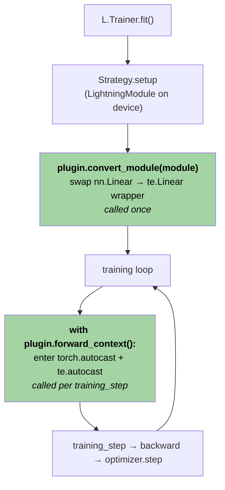

# NVFP4 Training with Transformer Engine in PyTorch Lightning

A practical recipe for enabling **NVFP4** (4-bit floating point with per-block scaling) GEMMs in a PyTorch Lightning training pipeline using NVIDIA's Transformer Engine (`transformer_engine.pytorch as te`) and the `NVFP4BlockScaling` recipe.

NVFP4 turns Hopper/Blackwell tensor-core matmuls into 4-bit GEMMs while keeping the rest of the model in BF16/FP32. The full training-stability story — Random Hadamard Transforms, 2D block scaling, stochastic rounding — lives in the [NVFP4 pretraining paper notes](../../nvfp4-pretraining/). This guide is about **wiring**: assuming you trust the recipe, how do you get it running inside Lightning, choose which layers to convert, deploy the trained model, and reason about checkpointing.

The recipe is short:

1. Wrap `te.Linear` in a thin module that fixes one missing input cast on its FP4 path.
2. Subclass Lightning's `MixedPrecision` plugin so it (a) enters `te.autocast(recipe=NVFP4BlockScaling())` around forward, and (b) swaps every dim-eligible `nn.Linear` for the wrapper at `fit()` start.
3. Hand the plugin to `L.Trainer(plugins=[...])` (or declare it under `trainer.plugins` in YAML) and train normally.
4. At deployment time, optionally re-run the swap inside `te.quantization.quantized_model_init` so weights are born primary-FP4 and the bf16 master is freed.

The guide is organized:

- **§1** Plugin internals — the wrapper, the autocast composition, why both contexts are needed.
- **§2** Selectivity — `boundary_blocks` + `skip_patterns`, the predicate API on the plugin.
- **§3** Inference — `quantized_model_init`, primary-FP4 weights, env knobs, benchmark scaffolding.
- **§4** Checkpointing & PTQ — why QAT needs no extra state, and how this contrasts with NVIDIA's PTQ workflow.
- **Appendix A** Mid-training recipe swapping (still a TODO).

---

## Section 1: Making NVFP4 work with Lightning

### Background: what `MixedPrecision` already does

Lightning ships a `MixedPrecision` plugin (`lightning.pytorch.plugins.precision.amp.MixedPrecision`) that owns every precision-related concern in the training loop:

- Wraps every forward pass in `torch.autocast(dtype=...)`.
- Wraps backward and applies a `GradScaler` for `fp16-mixed` (no-op for `bf16-mixed`).
- Manages `optimizer.step()`, gradient clipping, and state-dict shaping so master weights stay FP32.

When you write `L.Trainer(precision="bf16-mixed")`, Lightning instantiates this plugin under the hood with `dtype=torch.bfloat16`. The two methods that matter for us are tiny:

```python
# lightning/pytorch/plugins/precision/amp.py
class MixedPrecision(Precision):
    def autocast_context_manager(self) -> torch.autocast:
        dtype = torch.bfloat16 if self.precision == "bf16-mixed" else torch.half
        return torch.autocast(self.device, dtype=dtype, cache_enabled=False)

    @contextmanager
    def forward_context(self) -> Generator[None, None, None]:
        """Enable autocast context."""
        with self.autocast_context_manager():
            yield
```

Every other piece of your pipeline — `LightningModule`, optimizer, callbacks — is unaware that mixed precision is active. The plugin owns it. **That is the seam we want.**

---

### How Transformer Engine enables NVFP4

Transformer Engine exposes NVFP4 as **two independent pieces** that have to be active together:

**1. A drop-in `nn.Linear` replacement: `te.Linear`.**

`te.Linear` has the same constructor signature and forward shape as `torch.nn.Linear` (`in_features`, `out_features`, `bias=True`), so it can be substituted into a model without changing the surrounding code. Outside any TE quantization context it runs as a plain BF16/FP32 linear; inside one it dispatches the corresponding low-precision GEMM.

**2. A thread-local autocast context with a recipe: `te.autocast(...)`.**

```python
import transformer_engine.pytorch as te
from transformer_engine.common.recipe import NVFP4BlockScaling

with te.autocast(enabled=True, recipe=NVFP4BlockScaling()):
    y = my_te_linear(x)   # ← this dispatches the FP4 GEMM
```

`te.autocast` is the public switch on TE's quantization path. The `recipe` argument selects the low-precision GEMM kind (FP8 with one recipe family, NVFP4 with `NVFP4BlockScaling`, MXFP8 with another, …), and `te.autocast` sets a thread-local flag every `te.Linear` checks at forward time.

The two pieces are independent: a `te.Linear` outside `te.autocast` is just BF16/FP32; a `te.autocast` block over a model that contains no `te.Linear` is a no-op. NVFP4 happens at the **intersection** — `te.Linear` modules running inside a `te.autocast(recipe=NVFP4BlockScaling())` block.

Crucially, **`torch.autocast` does not trigger TE.** When a `te.Linear` runs inside a plain `torch.autocast(bfloat16)`, none of its FP4 machinery activates — the layer just runs as a normal BF16 linear. The two autocasts are separate contexts with no coupling between them.

So a working NVFP4 forward pass needs **both** contexts active simultaneously:

- `torch.autocast(bfloat16)` so non-TE ops (`nn.LayerNorm`, `nn.Embedding`, attention `bmm`s, the loss) get BF16 autocast as usual.
- `te.autocast(enabled=True, recipe=NVFP4BlockScaling())` so any `te.Linear` in the model dispatches FP4.

That's the TE side of the story. Now: how does it slot into Lightning?

---

### Mapping TE's knobs onto Lightning's plugin hooks

TE's two pieces — *the `Linear` class swap* and *the autocast context* — line up cleanly with `MixedPrecision`'s two extension points.

**`forward_context()`** — a context manager Lightning enters around every forward pass (training step, validation step, predict). The base class's implementation just enters `torch.autocast`. We override it to enter `te.autocast(recipe=NVFP4BlockScaling())` as well, stacked on top of `torch.autocast`. Both contexts are now active around forward — TE-side and torch-side.

**`convert_module(module)`** — called once on the `LightningModule` immediately after the strategy moves it to device, before training starts. The base class returns the module unchanged. We override it to walk the module tree, find every dim-eligible `nn.Linear`, and replace it with `te.Linear` (well, a thin wrapper around it — see next subsection). The replacement clones the FP32 weight values into the new layer's parameters with no dtype change, so AdamW still sees FP32 parameters and keeps FP32 master weights and FP32 moments — exactly what the NVFP4 paper requires.



The two green boxes are the override points. Everything else is base-class `MixedPrecision` behaviour — gradient handling, optimizer step, state-dict shaping.

> **Why not Lightning's existing `TransformerEnginePrecision`?**
> Lightning Fabric ships `lightning.fabric.plugins.precision.TransformerEnginePrecision`, but it predates the NVFP4 path: it hard-codes `te.fp8_autocast` (the FP8-only entry point) and a `DelayedScaling` recipe, casts *all* model weights to a single `weights_dtype`, and replaces `nn.Linear`/`nn.LayerNorm` via class-replacement at construction time. NVFP4 needs FP32 master weights (per the paper) and `te.autocast` with an `NVFP4BlockScaling` recipe — neither of which the stock plugin supports. We extend `MixedPrecision` instead.

---

### The `te.Linear` cast gap

There is one wrinkle in the `convert_module` story above: **`te.Linear` itself has a bug on its FP4 path** — it forgets to cast its input to BF16, and the NVFP4 input quantizer asserts the input *is* BF16. Drop a vanilla `te.Linear` straight into the model and the first forward pass crashes.

The path through `te.Linear.forward` for the NVFP4 case ends up in `transformer_engine.pytorch.module.linear._Linear.forward`, which is a `torch.autograd.Function`. There are two problems with how it interacts with `torch.autocast`:

**1. `torch.autocast` does not enter `_Linear.forward`.**

`torch.amp` only autocasts `autograd.Function`s that are decorated with `@torch.amp.custom_fwd`. `_Linear.forward` is **not** decorated, so `torch.autocast(bfloat16)` skips it entirely. Whatever dtype the input arrives in is what the function sees.

**2. The FP8/FP4 branch inside `_Linear.forward` does not call `cast_if_needed` either.**

Inside `_Linear.forward`, there are two branches based on whether quantization is active:

```python
# transformer_engine/pytorch/module/linear.py, ~L227-L240 (paraphrased)
if fp8 or debug:
    ...
    inputmat = input_quantizer(inputmat)        # ← FP4 path, no cast
else:
    inputmat = cast_if_needed(inp, activation_dtype)   # ← non-FP4 path, casts
```

The non-quantized branch helpfully casts to `activation_dtype` (the autocast dtype) before doing anything. The FP8/FP4 branch goes straight into `input_quantizer(inputmat)` — and the NVFP4 input quantizer asserts its input is BF16, because the Random Hadamard Transform requires it.

The combined effect: an upstream `nn.RMSNorm` returning an FP32 activation flows untouched through `torch.autocast` (skipped, no decorator), through the FP4 branch of `_Linear.forward` (no cast), straight into the input quantizer, which trips an assertion:

```
AssertionError: Input must be in bf16 for RHT
```

The fix is one line of code in the right place: cast the input before calling `te.Linear`. We do this in a thin wrapper module so the rest of the model code is unchanged.

```python
import torch
import torch.nn as nn
import transformer_engine.pytorch as te
from transformer_engine.pytorch.utils import cast_if_needed


def _autocast_dtype(x: torch.Tensor) -> torch.dtype:
    """Mirror TE's own ``set_activation_dtype`` rule (base.py L926-L945):
    if ``torch.autocast`` is active, use its dtype; otherwise fall back to
    the input's own dtype.
    """
    if torch.is_autocast_enabled():
        return torch.get_autocast_dtype(x.device.type)
    return x.dtype


class TeLinearAutocast(nn.Module):
    """Thin ``te.Linear`` wrapper that performs the cast ``te.Linear``
    forgot to do on its FP4 path.

    Under ``bf16-mixed`` autocast, ``cast_if_needed`` casts the input to
    bf16 so the NVFP4 RHT assertion passes. With no autocast active, the
    cast is a no-op and dtype is preserved.
    """

    def __init__(self, in_features: int, out_features: int, bias: bool = True) -> None:
        super().__init__()
        self.te_linear = te.Linear(in_features, out_features, bias=bias)

    def forward(self, x: torch.Tensor) -> torch.Tensor:
        return self.te_linear(cast_if_needed(x, _autocast_dtype(x)))
```

Two things worth pointing out:

- **Dtype-selection logic is borrowed from TE itself.** The function `_autocast_dtype` reproduces TE's `Module.set_activation_dtype` (`base.py` L926-L945) verbatim: prefer the active autocast dtype, fall back to input dtype. Same rule the non-FP4 branch of `_Linear.forward` uses on line 205, so the wrapper behaves identically to the non-FP4 path under any autocast configuration.
- **The wrapper is a `nn.Module`, not a `te.Linear` subclass.** It owns one child, `self.te_linear`. That nesting matters at swap time: the wrapper's parameters live at `<wrapper_path>.te_linear.weight` / `.bias`, and `convert_module` clones the original Linear's `weight`/`bias` data into those slots.

This wrapper is what `convert_module` will install in place of every eligible `nn.Linear`.

---

### The plugin in full

Putting both pieces together — the wrapper and the `MixedPrecision` subclass — gives the complete shippable plugin:

```python
from collections.abc import Generator
from contextlib import contextmanager
from typing import Any

import torch
import torch.nn as nn
import transformer_engine.pytorch as te
from lightning.pytorch.plugins.precision.amp import MixedPrecision
from transformer_engine.common.recipe import NVFP4BlockScaling
from transformer_engine.pytorch.constants import NVFP4_BLOCK_SCALING_SIZE
from transformer_engine.pytorch.utils import cast_if_needed
from typing_extensions import override


def _autocast_dtype(x: torch.Tensor) -> torch.dtype:
    """Match TE's own `set_activation_dtype` logic (base.py L926-L945):
    if `torch.autocast` is active, use its dtype; otherwise fall back to
    the input's own dtype.
    """
    if torch.is_autocast_enabled():
        return torch.get_autocast_dtype(x.device.type)
    return x.dtype


class TeLinearAutocast(nn.Module):
    """Thin `te.Linear` wrapper that runs the cast `te.Linear` forgot to
    do on its FP4 path.

    `te.Linear._Linear.forward` is a `torch.autograd.Function` without
    `@torch.amp.custom_fwd`, so `torch.autocast` skips it. Worse, the
    FP8/FP4 branch inside `_Linear.forward` does NOT call `cast_if_needed`
    before the input quantizer (linear.py L227-L240 — the non-FP8 `else`
    branch does, the FP8 branch doesn't), so an FP32 activation arriving
    from upstream RMSNorm/LayerNorm goes straight to `input_quantizer`
    and trips the RHT bf16 assertion.

    The wrapper inserts the missing `cast_if_needed` and uses the same
    dtype-selection rule TE applies internally for the non-FP8 path —
    `torch.autocast` dtype if active, otherwise input dtype. So under
    `bf16-mixed` we cast to bf16 (RHT happy), under `fp16-mixed` to fp16,
    and under no autocast we leave dtype alone.
    """

    def __init__(self, in_features: int, out_features: int, bias: bool = True) -> None:
        super().__init__()
        self.te_linear = te.Linear(in_features, out_features, bias=bias)

    def forward(self, x: torch.Tensor) -> torch.Tensor:
        return self.te_linear(cast_if_needed(x, _autocast_dtype(x)))


class NVFP4MixedPrecision(MixedPrecision):
    """Lightning `bf16-mixed` (or `16-mixed`) plugin with two NVFP4
    bells-and-whistles bolted on:

    1. `forward_context` also enters `te.autocast` so any `te.Linear`
       in the model dispatches FP4 GEMM.

    2. `convert_module` swaps every dim-eligible `nn.Linear` for
       `TeLinearAutocast` (FP4 GEMM with bf16 input casting). The swap
       is a clone-copy of the FP32 weight/bias (no dtype change), so
       AdamW keeps FP32 masters and FP32 moments for the replaced layer.

       The only filter applied here is NVFP4's hard divisibility
       requirement on both feature dims, sourced from TE's own constant
       `NVFP4_BLOCK_SCALING_SIZE`. Choosing *which* Linears to actually
       replace (vs the dim-eligibility check here) is a separate,
       structural concern — see §2.

    Everything else (gradient scaling, autocast context manager, optimizer
    step / clip / state_dict, etc.) is inherited unchanged from
    `MixedPrecision`.
    """

    def __init__(self, *args: Any, **kwargs: Any) -> None:
        super().__init__(*args, **kwargs)
        self.recipe = NVFP4BlockScaling()

    @override
    @contextmanager
    def forward_context(self) -> Generator[None, None, None]:
        with self.autocast_context_manager(), te.autocast(enabled=True, recipe=self.recipe):
            yield

    @override
    def convert_module(self, module: torch.nn.Module) -> torch.nn.Module:
        replaced: list[str] = []
        skipped: list[str] = []
        for name, child in list(module.named_modules()):
            if type(child) is not torch.nn.Linear:  # exact match — skip te.Linear / TeLinearAutocast
                continue
            if (
                child.in_features % NVFP4_BLOCK_SCALING_SIZE != 0
                or child.out_features % NVFP4_BLOCK_SCALING_SIZE != 0
            ):
                skipped.append(f"{name} (dims not /{NVFP4_BLOCK_SCALING_SIZE})")
                continue
            parent_name, _, attr = name.rpartition(".")
            parent = module.get_submodule(parent_name) if parent_name else module
            new_linear = TeLinearAutocast(
                child.in_features, child.out_features, bias=child.bias is not None
            )
            new_linear.te_linear.weight.data = child.weight.data.clone()
            if child.bias is not None:
                new_linear.te_linear.bias.data = child.bias.data.clone()
            setattr(parent, attr, new_linear)
            replaced.append(name)
        print(f"  convert_module: replaced={replaced} skipped={skipped}")
        return module
```

A few details to call out about `convert_module`:

- **`type(child) is not torch.nn.Linear` is intentional.** An `isinstance` check would also match `te.Linear` (and our own `TeLinearAutocast`), so re-entrant or repeated calls would corrupt the tree. The exact-type check skips anything already converted.
- **The `NVFP4_BLOCK_SCALING_SIZE` divisibility check is non-negotiable.** NVFP4 quantizes in fixed-size blocks along both feature dims; layers whose dims aren't divisible by the block size cannot be FP4'd. We source the constant from TE rather than hard-coding 16, so a future TE release that changes block size keeps working.
- **`weight.data = old.data.clone()` is a `data` assignment, not a `nn.Parameter` swap.** That keeps `requires_grad`, parameter identity, and the parameter graph that AdamW will see as `model.parameters()`.
- **Skipping the LM head, embeddings, sensitive blocks, etc. is not done here.** Dim eligibility is a *necessary* filter, not a *sufficient* one. The structural predicate that decides which dim-eligible Linears actually become NVFP4 belongs in §2.

---

### Wiring into the Trainer

Two equivalent surfaces — pick whichever fits the entry point.

**Python form** (one-off scripts, benchmarks):

```python
import lightning as L

trainer = L.Trainer(
    plugins=[
        NVFP4MixedPrecision(
            precision="bf16-mixed",
            device="cuda",
            boundary_blocks=2,                       # see §2
            skip_patterns=["lm_head", "attention"],  # see §2
        ),
    ],
    accelerator="gpu",
    devices=1,
)
trainer.fit(my_lightning_module, train_dataloaders=loader)
```

**YAML form** (production — read by `experiment_v2.py` via `jsonargparse`):

```yaml
trainer:
  strategy: ddp
  devices: 8
  # ``precision`` is owned by the plugin below — Lightning errors on both.
  plugins:
    - class_path: aic_research.training.precision.NVFP4MixedPrecision
      init_args:
        precision: bf16-mixed
        device: cuda
        boundary_blocks: 2
        skip_patterns: ["lm_head", "attention"]
```

A few notes on the `Trainer` arguments either way:

- **Pass the plugin via `plugins=[...]`, not `precision="bf16-mixed"`.** If you set both, Lightning's plugin-resolution path will fight you; the plugin already carries `precision="bf16-mixed"` internally.
- **The plugin is monolithic — it always runs the swap.** There is no "BF16-only" knob. If you want to A/B against vanilla `bf16-mixed`, use Lightning's stock `MixedPrecision` for the baseline and `NVFP4MixedPrecision` for the FP4 run. (`explore-nvfp4-v2.py` wraps this two-leg pattern as `--bf16-config` + `--nvfp4-config`.)
- **Nothing else in your training script changes.** `LightningModule.training_step`, `configure_optimizers`, callbacks, the dataloader — all stay as-is. The plugin is a side-channel.

### Operational gotchas

Two cluster-environment traps will silently break this setup before you ever reach the FP4 GEMM. Both are documented in `AGENTS.md` / `SDPA_CUDNN_TRAP.md` in the training repo, but worth repeating here because they masquerade as "NVFP4 doesn't work":

- **cuDNN must be 9.19+ for FlashSDPA on the attention path.** TE 2.15's wheel ships with no RPATH on `libtransformer_engine.so` and explicitly probes `libcudnn.so` (unversioned), so on Anyscale B200 nodes it picks up the system's older 9.15 instead of the venv's 9.19. PyTorch's SDPA cuDNN auto-promotion gate (`>= 9.15.1`) then fails, the FX graph bakes in a slow `MATH` decomposition, and attention silently regresses 3-4×. Fix: `setup.sh` patchelfs `$ORIGIN/../../nvidia/cudnn/lib` onto `libtransformer_engine.so` and exports `CUDNN_HOME` from `.venv/bin/activate`. `bash verify_env.sh` is the one-line check.
- **NCCL 2.28+ on AWS-EFA fabrics aborts process-group init** with a misleading "No `NCCL_TUNER_CONFIG_PATH` provided" error during `setup_environment`. Fix: prepend `NCCL_TUNER_PLUGIN=none` to any multi-GPU launch. The literal name `none` makes `dlopen` fail, NCCL falls back to its built-in heuristics (no measurable single-node impact on NVLink/NVSwitch).

### The shipped plugin has more than this

The §1 listing above is the minimal scaffold — what you'd write to convince yourself the wrapper + context-composition idea works. The version that ships in `src/aic_research/training/precision/nvfp4_mixed_precision.py` adds:

- `boundary_blocks` and `skip_patterns` constructor args for selectivity (next section).
- A JSON audit log (`nvfp4_convert_module.json`) listing every `nn.Linear` and whether it was replaced, skipped by dim, or skipped by policy — written rank-0-only into `trainer.default_root_dir` (which `experiment_v2.py` seeds to the per-run output directory).
- An `init_method`-based weight clone (rather than `weight.data = source.data`) so the same `convert_module` call works both for normal swaps and for swaps inside `te.quantization.quantized_model_init` (see §3) — `data` assignment would strip the `NVFP4Tensor` subclass under primary-FP4 init.

The rest of this guide assumes the shipped version.

---

### Key takeaways

- Lightning's `MixedPrecision` plugin owns precision concerns. **Subclass it** rather than scattering NVFP4 wiring through your `LightningModule`.
- `torch.autocast(bfloat16)` and `te.autocast(recipe=NVFP4BlockScaling())` are independent contexts and you need **both**. The plugin composes them in `forward_context`.
- `te.Linear` has a known cast gap on its FP4 path: `torch.autocast` does not enter the inner `autograd.Function`, and the function's FP4 branch skips `cast_if_needed`. A four-line `TeLinearAutocast` wrapper restores the cast using TE's own dtype-selection rule.
- `convert_module` clones original FP32 weights into the wrapper, so AdamW keeps FP32 master weights and FP32 moments — matching the NVFP4 paper.
- `Trainer` integration is a single `plugins=[...]` line in Python or a `trainer.plugins` block in YAML.
- Verify cuDNN 9.19 + `NCCL_TUNER_PLUGIN=none` before blaming NVFP4 for any silent regression.

---

## Section 2: Choosing which Linears to replace

The §1 plugin's *minimum* filter — "swap any `nn.Linear` whose features divide `NVFP4_BLOCK_SCALING_SIZE`" — is necessary (it's the hard hardware constraint) but not sufficient as a production policy. We typically want to preserve a few specific layers in higher precision: the LM head, the first/last few transformer blocks, and (for some architectures) the attention projections. The shipped plugin exposes two knobs for this, both layered on top of the dim check.

### The API

```python
NVFP4MixedPrecision(
    precision="bf16-mixed",
    device="cuda",
    boundary_blocks: int = 0,            # skip first/last N transformer blocks
    skip_patterns: list[str] = [...],    # regex matched against fully-qualified module name
)
```

**`skip_patterns`** is a list of regex strings, each evaluated with `re.search` against the module's fully-qualified name. `re.search` semantics mean plain strings act as substring matches (`"attention"` skips anything with `"attention"` in its dotted path), while still allowing full regex (`r"blocks\.[0-9]+\.attention\."`).

**`boundary_blocks`** skips Linears whose containing block index is in the first or last `boundary_blocks` of the model's `self.blocks` ModuleList. The plugin auto-discovers the total block count by walking `module.named_modules()` and finding the largest integer `i` appearing as `"...blocks.<i>..."` — so callers don't need to pass `n_blocks`. The walk tolerates double-wrapping (e.g. Lightning + `torch.compile` → `model._orig_mod.blocks.<i>...`) because it only looks at the `blocks.<i>` segment regardless of where it sits in the path.

Order: `skip_patterns` is checked first (exits early on match), then the boundary-block check.

### Why this shape (vs. a generic predicate)

An obvious-looking alternative is to take a `predicate: Callable[[str, nn.Linear], bool]` argument and a library of composable building blocks (`by_name_substring`, `by_block_index_range`, `all_of`, ...). The shipped version is narrower on purpose:

- **Two knobs cover every policy we've actually wanted to express.** Across the active configs (six different model shapes), every policy decomposes cleanly into "skip patterns + boundary blocks". A composable predicate library would be solving a generality problem we don't have.
- **Both knobs are JSON-serializable.** The plugin is declared in YAML (`trainer.plugins.[].init_args`) and `jsonargparse` instantiates it. A `Callable` predicate would force an indirection through a registry of named functions — a mechanism nobody has asked for.
- **Both knobs survive the audit log round-trip.** The convert-module report (next subsection) records the policy as data; we can reconstruct exactly what ran by reading the JSON.

If a future ablation needs a more expressive selector — say, "FP4 only Linears with > 1M params *and* containing block index in [2, 26)" — the predicate route is still a clean extension. It should land *as an addition*, not a replacement.

### The convert-module audit log

Every call to `plugin.convert_module(model)` writes a JSON audit (`nvfp4_convert_module.json`) into `trainer.default_root_dir` — which `experiment_v2.py` seeds to the per-run output directory:

```json
{
  "plugin": {
    "class": "NVFP4MixedPrecision",
    "recipe": "NVFP4BlockScaling",
    "block_scaling_size": 16,
    "boundary_blocks": 2,
    "skip_patterns": ["lm_head", "attention"]
  },
  "model_summary": {
    "class": "SingleStageCoreModel",
    "max_block_idx": 27,
    "n_blocks": 28
  },
  "totals": {"replaced": 138, "skipped_policy": 56, "skipped_dim": 0, "total": 194},
  "replaced":       [{"name": "...blocks.2.feed_forward.w1", "in_features": 1024, "out_features": 3072, "bias": false}, ...],
  "skipped_policy": [{"name": "...blocks.0.attention.wq",    "in_features": 1024, "out_features": 2048, "bias": false, "reason": "skip_pattern 'attention'"}, ...],
  "skipped_dim":    [...]
}
```

A few details worth knowing:

- **Rank-0 only.** Behind `@rank_zero_only`. No DDP collective concerns — `default_root_dir` is a plain attribute, unlike `trainer.log_dir` which routes through `MLFlowLogger.save_dir` and can return `None` for remote tracking URIs.
- **Co-located with `config.yaml`.** `experiment_v2.py` writes both into the same per-run directory, so the audit pairs one-to-one with the YAML that produced it.
- **Survives "no trainer" invocations.** When `convert_module` is called outside `trainer.fit` (e.g. the `--inference` benchmark in §3), the disk write is skipped and only the human-readable INFO log fires.
- **`last_swap_report` on the plugin** holds the same dict for in-process inspection by tests / debug.

### Policies we actually use

The active YAMLs under `configs/nvfp_full_runs/` settle into two policy shapes:

**Conservative (deeper architectures, attention sensitivity)** — used by the 28-layer SDPA + GDN baseline:

```yaml
plugins:
  - class_path: aic_research.training.precision.NVFP4MixedPrecision
    init_args:
      precision: bf16-mixed
      device: cuda
      boundary_blocks: 2
      skip_patterns: ["lm_head", "attention"]
```

Skips: LM head, every attention projection (`q_proj`, `k_proj`, `v_proj`, `o_proj`), and the first and last 2 transformer blocks. Effectively converts only the FFN linears in the middle 24 blocks. Conservative because the attention QKV projections are the most commonly cited "last to quantize" surface in PTQ literature, and the boundary-block carve-out hedges against the early/late-layer sensitivity findings.

**Aggressive (shallow + wide MLP architectures)** — used by the 6-layer wide MLP runs:

```yaml
plugins:
  - class_path: aic_research.training.precision.NVFP4MixedPrecision
    init_args:
      precision: bf16-mixed
      device: cuda
      boundary_blocks: 0
      skip_patterns: ["lm_head"]
```

Skips only the LM head; converts every other dim-eligible Linear including all attention projections and every block. The "no attention skip" decision is justified by the fact that wide MLP blocks have plain SDPA attention (no GDN), and the FFN dominates parameter count — leaving attention in BF16 leaves a meaningful chunk of FP4 throughput on the floor for a payoff we haven't seen.

### Open questions for ablation

- **Which blocks to skip, if any?** `boundary_blocks=2` is folklore from FP8/INT8 PTQ; we have no head-to-head NVFP4 ablation yet.
- **Per-projection rules?** Skipping `attention` wholesale is coarser than necessary if the cost lives in only one of `q`/`k`/`v`/`o` — `skip_patterns` can already express this (`["wq", "wk"]` etc.) but we haven't measured it.
- **What param-count threshold below which FP4 stops paying off?** Each `te.Linear` runs Hadamard amax + per-block scale kernels in addition to the GEMM, with roughly fixed cost. On small Linears those auxiliary kernels can swamp the GEMM speedup. The dim-divisibility filter already catches embeddings; this is about the residue.

If any of these need a richer selector than substring + boundary blocks, that's the right time to revisit the predicate library.

---

## Section 3: Inference

Once the plugin trains to convergence, deployment looks superficially the same — load the checkpoint, run `convert_module` to swap `nn.Linear` for `TeLinearAutocast`, run forward — but a few details bite differently and earn their own subsection.

### What changes between training and inference

Training keeps **three** views of every NVFP4-converted Linear's weight live in HBM:

- An **FP32 master** (owned by AdamW; the source of truth for gradient updates).
- A **bf16 view** (autocast-cast on the fly inside `te.Linear.forward`, since `torch.autocast` skips the inner `autograd.Function` — see §1).
- A **transient NVFP4 quant** of the bf16 view, recomputed every forward by TE's weight quantizer kernel.

Inference can collapse all three to **one**:

- An **NVFP4-resident weight** (the `NVFP4Tensor` subclass) computed once at load time and never re-quantized.

The collapse buys two things. First, the bf16 master gets freed from HBM — on top of the ~4× FP4-vs-bf16 ratio for the converted layer, you save another 1× by dropping the master, so the converted layers' weight footprint is ~4× smaller than the bf16 baseline rather than ~2×. Second, `te.Linear.forward` short-circuits past `get_weight_workspace` entirely (`base.py:1432`) when it sees an `NVFP4Tensor` weight, skipping the per-call weight-quantize kernel.

### `quantized_model_init` — the primary-FP4 init context

TE provides `te.quantization.quantized_model_init` as a context manager that, when entered before a `te.Linear` is constructed (or before its `init_method` fires), causes the layer to materialize its weight as a primary `NVFP4Tensor` instead of an FP32 buffer. The plugin's `convert_module` honors this automatically because it hands the source weight to `te.Linear` via `init_method` rather than via `weight.data = source.data`:

```python
import transformer_engine.pytorch.quantization as te_quantization

with te_quantization.quantized_model_init(enabled=True, recipe=plugin.recipe):
    plugin.convert_module(lightning_module)   # primary-FP4 weights from birth
```

Why `init_method` and not `.data` assignment? `data = source.data` strips the `NVFP4Tensor` subclass under `quantized_model_init` (PyTorch's parameter assignment unwraps tensor subclasses). `init_method` runs *inside* TE's parameter construction, so it writes into whatever buffer TE has already set up for the regime — high-precision in the normal case, NVFP4 under primary-FP4 init. One callable, both regimes.

This is the path `explore-nvfp4-v2.py --inference` takes.

### Activation scaling stays online

Even with primary-FP4 weights, NVFP4's per-tensor `scale_2` for each Linear's *input* is still computed every forward — TE 2.15's `HadamardAmaxTmaKernel` runs in the GEMM prologue. This is bit-identical to the training-time path (same TE kernels). The cost is small (~2% of GPU time in our profiles) and removes the need for PTQ-style activation calibration entirely — see §4 for why this matters relative to NVIDIA's `llm_ptq` workflow.

The per-block `scale_1` (E4M3, one per 16-element block) is similarly cheap and likewise computed online.

### Inference benchmark scaffolding

`explore-nvfp4-v2.py --inference` skips `trainer.fit` entirely and runs a forward-only tokens/sec benchmark on synthetic data. Per-leg flow:

1. Build the LightningModule on CPU.
2. Pull the `NVFP4MixedPrecision` plugin out of the YAML's `trainer.plugins` block.
3. Optionally `.to(torch.bfloat16)` the whole module (env-gated by `CAST_BF16=1` — frees the bf16 master pre-emptively).
4. Move to CUDA.
5. Run `plugin.convert_module(...)` inside `quantized_model_init` (NVFP4 leg only — the bf16 baseline doesn't need a swap).
6. Warmup forwards (140 default) so `torch.compile` JIT and the allocator settle.
7. Timed forwards (100 default) bracketed by `torch.cuda.synchronize`.
8. Report `tokens/sec/gpu = (timed × batch × seq_len) / elapsed`.

A few env knobs worth knowing about:

- **`CAST_BF16=1`** — hard-cast the LightningModule to bf16 *before* `convert_module` runs. For the NVFP4 leg, this frees the bf16 master from HBM on the about-to-be-converted layers and pre-casts the non-TE residue (norms, embeddings, lm_head). For the bf16-mixed baseline leg, it moves the autocast cost out of the forward and into setup. Without the flag, the model stays in its declared dtype and `torch.autocast("cuda", torch.bfloat16)` handles per-op casting on the fly — useful for A/B-ing pre-cast vs autocast cost.
- **`NVTE_NVFP4_DISABLE_RHT=1`** — disable the Random Hadamard Transform on the NVFP4 input quantizer. ~5–10% faster on inference forwards in our benches; safe at inference on a model that was trained with RHT *on*, since the trained weights already learned to keep activations well-conditioned.
- **`NVTE_USE_FAST_MATH=1`** — TE's fast-math GEMM heuristics (cuBLAS-Lt). No accuracy cost on Blackwell.
- **`PROFILE_INFERENCE=1`** — capture a Chrome/Perfetto trace of 5 timed forwards and print top CUDA/CPU ops by self-time. Cheap, intended for one-off "where is the time going on this fabric" investigations.

### Operational gotchas at inference time

- **cuDNN must be 9.19+ for FlashSDPA on the attention path.** Same trap as in §1, just as relevant at inference. If `verify_env.sh` doesn't pass, the inference number drops 30-40% silently.
- **`is_first_microbatch=True` on the wrapper is a no-op under primary-FP4.** Don't bother threading it through. `te.Linear.forward` checks if the weight is already a quantized tensor at `base.py:1432`; if so it skips `get_weight_workspace` entirely, which is the only thing that flag controls.
- **The plugin is the source of truth for the recipe at inference too.** `forward_context()` enters `te.autocast(recipe=self.recipe)` on calls from the inference benchmark — same code path as training. No separate inference recipe to maintain.

---

## Section 4: Checkpointing and PTQ

NVFP4-trained models present a small surprise to anyone coming from FP8/INT8 PTQ workflows: there is **no special checkpoint state to save and no calibration step to run**. This section explains why, and how the picture differs from NVIDIA's PTQ tooling (Model-Optimizer's `llm_ptq` workflow).

### What gets checkpointed (and what doesn't)

A standard Lightning checkpoint of a model trained with `NVFP4MixedPrecision` contains exactly what a `bf16-mixed`-trained checkpoint contains:

- **FP32 master weights** for every parameter (including the converted `TeLinearAutocast.te_linear.weight` slots — the plugin's swap clones values, not the parameter type).
- **AdamW first/second moments** (FP32).
- **LR scheduler state.**
- **Lightning state** (epoch, step, dataloader cursor).

There is no NVFP4-specific tensor in the state dict — no per-block `scale_1`, no per-tensor `scale_2`, no quantizer "calibration" state. **All NVFP4 scales are recomputed from the high-precision weight at load time and from the activation tensor at every forward.** Specifically:

- Per-block **`scale_1`** (E4M3, one per 16-element block) is a deterministic function of the source tensor. For weights it's recomputed when `quantized_model_init` runs at load time; for activations it's recomputed in the GEMM prologue.
- Per-tensor **`scale_2`** (FP32, bounding the dynamic range of `scale_1` itself so its E4M3 doesn't clip) is computed online in both paths via TE's `HadamardAmaxTmaKernel`.

This means the same on-disk checkpoint loads cleanly into:

1. A **training resume** (Lightning + NVFP4 plugin → numerics identical to mid-run state).
2. A **primary-FP4 inference build** (`quantized_model_init` + `convert_module` → bf16 masters freed, NVFP4 weights resident, online activation scaling).
3. A **bf16-mixed inference build** (no plugin, no swap → standard bf16 forward, no FP4 anywhere).

All three paths read the same file.

### Why NVIDIA Model-Optimizer's PTQ workflow runs a calibration loop

Reading NVIDIA's `examples/llm_ptq` (`hf_ptq.py`, `multinode_ptq.py`, ...) you'll notice every flow gathers a "calibration set" of 128–512 samples and runs forward passes before exporting:

```python
calib_set = get_dataloader(num_samples=calib_size)

def forward_loop(model):
    for batch in calib_set:
        model(batch)

model = mtq.quantize(model, mtq.NVFP4_DEFAULT_CFG, forward_loop)
```

This **looks** like it contradicts the "no calibration needed" story, but it doesn't — the two workflows occupy different points in the design space:

|                               | Our QAT path (TE + Lightning plugin)                                              | NVIDIA `llm_ptq`                                                                                            |
| ----------------------------- | --------------------------------------------------------------------------------- | ----------------------------------------------------------------------------------------------------------- |
| **Starting point**            | bf16 master, model trained under online FP4 quantization                          | bf16 model never quantized                                                                                  |
| **Activation `scale_2`**      | Computed online every forward (`HadamardAmaxTmaKernel`)                           | Frozen statically per layer, value chosen offline from calibration data                                     |
| **Why frozen statically?**    | —                                                                                 | TRT-LLM / vLLM / SGLang FP4 GEMM kernels skip the per-call amax reduction; the static scale is a kernel input |
| **What "calibration" does**   | Nothing                                                                           | Runs 128–512 samples, observes per-Linear input amax distribution, picks `scale_2`                          |
| **Outlier robustness**        | Trained-in (model has learned to keep activations bounded)                        | Add-on algorithms — AWQ, SmoothQuant, SVDQuant, MSE — search per-channel rotations to compensate            |

The PTQ calibration loop is doing **two distinct jobs**:

1. **Activation `scale_2` estimation** — observe what activations actually look like on representative data, pick a per-tensor scale that captures the typical dynamic range without too much clipping. This is what `mtq.NVFP4_DEFAULT_CFG` does.
2. **Algorithmic outlier mitigation** (`nvfp4_awq`, `nvfp4_mse`, `nvfp4_svdquant`, `nvfp4_local_hessian`) — *learned* per-channel weight rotations that make post-quant outputs match the bf16 reference. Important for non-QAT models where the weights weren't shaped for FP4 quantization noise during training.

`llm_ptq`'s `_cast` family — `fp8_cast`, `nvfp4_cast` — is the calibration-free escape hatch. From the docs:

> *"Formats ending in `cast` (fp8_cast, nvfp4_cast) are fast — they set the amax to the format's full range without data-driven calibration."*

That's the closest deployment-runtime analog to what TE does at training time: skip empirical estimation, use the format max as `scale_2`. Slightly worse accuracy than full calibration, zero calibration cost.

### Three deployment paths from a single QAT checkpoint

When deploying a model trained with `NVFP4MixedPrecision`:

1. **TE-native inference** — load the checkpoint, run `convert_module` inside `quantized_model_init`, serve through PyTorch + TE. Online activation `scale_2` per forward, identical numerics to training, zero calibration. This is what `explore-nvfp4-v2.py --inference` exercises. Best for offline batch eval and any deployment that can ship the TE Python stack.
2. **PTQ export with `nvfp4_cast` activations** — push the bf16 master through `modelopt`'s PTQ flow with the `nvfp4_cast` activation/KV format. Frozen `scale_2 = format_max`, no calibration loop. Targets TRT-LLM / vLLM / SGLang. Slightly faster inference than option 1 (no per-call Hadamard amax), tiny accuracy hit relative to TE-native.
3. **PTQ export with full `nvfp4` activations** — same as option 2 but with a calibration loop on top to estimate `scale_2` from observed amax statistics. Best accuracy when the format max would clip too aggressively. Needs ~512 samples of in-distribution text.

For a QAT-trained model, the AWQ / SmoothQuant / SVDQuant family rarely moves the needle (the model already learned to dodge those failure modes). They matter for PTQ-only models that never saw FP4 noise during training.

### Practical implication

Treat the NVFP4 plugin's checkpoint exactly like any `bf16-mixed` checkpoint: copy it, load it, resume from it, fork it for inference. Nothing about the format requires extra metadata or PTQ tooling — unless and until you're targeting a deployment runtime that needs a frozen-scale artifact, in which case the choice is between options 2 and 3 above based on whether you have calibration data on hand and care about the last few accuracy points.

---

## Appendix A: Mid-training recipe swapping

> **Still a TODO.** The idea: train in NVFP4 for the bulk of the run to harvest the speedup, then switch to BF16 (or a milder mixed-precision recipe) for the final fraction of steps so the late-stage gradient signal isn't bottlenecked by 4-bit quantization noise. Whether this helps, by how much, and at what crossover point are empirical questions we haven't answered yet.

### Direction

The shipped plugin picks a single recipe at construction time and uses it for the whole run. To support mid-training swaps, the plugin would need to become **training-step aware** — read `self.trainer.global_step` inside `forward_context` and pick the recipe (or skip `te.autocast` entirely) based on where we are in the run.

The wrapper-installed `TeLinearAutocast` modules can stay in place across the swap: outside `te.autocast`, they degrade gracefully to plain bf16 linears (the FP4 path inside `te.Linear.forward` only fires when the thread-local `te.autocast` flag is set). So a mid-training swap is genuinely just "stop entering `te.autocast` from `forward_context`" — no module-tree mutation needed.

The actual policy (when to swap, what to swap to, whether to anneal vs hard-cut) waits on a literature pass and an A/B run.
