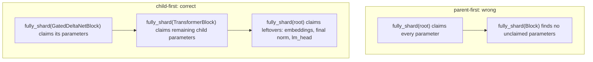

# Declarative FSDP2 `apply_shard`

How to turn a declarative sharding config into the exact sequence of FSDP2
`fully_shard(...)` calls: which modules become units, which parameters are excluded, which precision
policy each unit gets, and what audit trail proves the walk did what the config said.

This is the FSDP2 companion to the [`bf16-mixed` precision guide](precision.md). The precision guide
explains why `MixedPrecisionPolicy` must be passed explicitly under FSDP2. This guide explains where
that policy gets attached when the model is wrapped.

> **Version note.** This is grounded in PyTorch **2.11** `torch.distributed.fsdp.fully_shard` and
> Lightning **2.6.1** `ModelParallelStrategy`, but the design is intentionally implementation-agnostic:
> any FSDP2 strategy needs this same bottom-up walk, parameter filter, and report.

The guide is organized:

- **§1** defines the declarative inputs.
- **§2** explains what FSDP1 used to hide and FSDP2 makes explicit.
- **§3** gives the `apply_shard` algorithm.
- **§4-5** cover the two easy-to-miss correctness rules: child-first ordering and parameter filters.
- **§6-7** cover edge cases and observability.

---

## TL;DR

- FSDP1 was recursive for you: one `FullyShardedDataParallel(model, auto_wrap_policy=...,
  ignored_states=...)` call walked the module tree. FSDP2 `fully_shard` is per-module and
  non-recursive, so the strategy must walk the model and call it on each unit.
- The declarative inputs are a **wrap policy** (module classes that become FSDP2 units),
  **ignore patterns** (parameter FQNs excluded from sharding), and a per-unit
  `MixedPrecisionPolicy`.
- Two details make or break correctness: call `fully_shard` **child-first**, and pass
  `ignored_params` to the exact unit that would otherwise claim each ignored parameter.
- Trainable ignored parameters get no FSDP gradient reduction, so they need a separate DDP-style sync.
- Emit a units report. Without it, a typo in a class path or regex can silently change the training run.

---

## 1. Declarative inputs

Keep the FSDP1 config shape as much as possible so old configs port over:

```yaml
strategy:
  init_args:
    auto_wrap_policy:
      - myproject.modules.TransformerBlock
      - myproject.modules.GatedDeltaNetBlock
    mixed_precision:
      param_dtype: bfloat16
      reduce_dtype: float32
    ignore_patterns:
      - attention\.A_log$
      - attention\.dt_bias$
    reshard_after_forward: true
```

`apply_shard` compiles those fields into runtime objects:

| Input | Matches | Produces |
|---|---|---|
| `auto_wrap_policy` | module classes | the module instances that become FSDP2 units |
| `ignore_patterns` | parameter FQNs, via regex | a set of `nn.Parameter`s passed as `ignored_params` |
| `mixed_precision` | config values | a default `MixedPrecisionPolicy` |
| per-class overrides | module class identity | a replacement policy for matching units |

The output is not a data structure; it is an ordered sequence of `fully_shard(...)` calls.

---

## 2. What changed from FSDP1

FSDP1 did the tree walk inside the wrapper:

```python
# FSDP1: one call; torch recurses with auto_wrap_policy and ignored_states.
model = FullyShardedDataParallel(
    model,
    auto_wrap_policy=ModuleWrapPolicy({TransformerBlock, GatedDeltaNetBlock}),
    ignored_states=ignored_params,
    mixed_precision=torch_fsdp_config,
)
```

FSDP2 makes that recursion the strategy's job:

```python
# FSDP2: fully_shard is per-module and non-recursive.
for module in pick_units(model):
    fully_shard(
        module,
        mesh=dp_mesh,
        mp_policy=unit_policy(module),
        ignored_params=ignored_for(module),
    )

fully_shard(model, mesh=dp_mesh, mp_policy=root_policy, ignored_params=root_ignored)
```

The important rule from the `fully_shard` contract is: parameters already assigned by an earlier
submodule call are not claimed again by a later parent call. That is why the walk must be bottom-up.

---

## 3. The `apply_shard` algorithm

This is the whole mechanism in one pass:

```python
def apply_shard(
    model,
    *,
    wrap_class_paths,
    ignore_patterns,
    mp_policy,
    mp_overrides,
    reshard_after_forward,
    dp_mesh,
):
    # 1. Resolve the declarative config once on the assembled model.
    wrap_classes = {import_class(path) for path in wrap_class_paths}
    ignored = resolve_ignored_params(model, ignore_patterns)

    # 2. Pick units by class and order them deepest-first.
    units = [
        (fqn, module)
        for fqn, module in model.named_modules()
        if type(module) in wrap_classes
    ]
    units.sort(key=lambda item: item[0].count("."), reverse=True)

    # 3. Shard each unit before its parent can claim its parameters.
    for fqn, module in units:
        params = set(module.parameters())
        fully_shard(
            module,
            mesh=dp_mesh,
            mp_policy=mp_overrides.get(type(module), mp_policy),
            reshard_after_forward=reshard_after_forward,
            ignored_params=ignored & params,
        )

    # 4. Shard the root last so embeddings, final norm, and heads are covered.
    fully_shard(
        model,
        mesh=dp_mesh,
        mp_policy=mp_policy,
        reshard_after_forward=False,
        ignored_params=ignored,
    )

    # 5. FSDP skips ignored params in backward, so trainable ones need DDP semantics.
    replicate_ignored_params(ignored, dp_mesh)

    # 6. Make the result inspectable.
    report_units(model, units, ignored)
    return model
```

`resolve_ignored_params` is a reusable regex-over-FQN matcher:

```python
def resolve_ignored_params(model, patterns):
    compiled = [re.compile(pattern) for pattern in patterns]
    matches_by_pattern = {pattern: [] for pattern in patterns}
    ignored = set()

    for fqn, param in model.named_parameters():
        for pattern, regex in zip(patterns, compiled, strict=True):
            if regex.search(fqn):
                ignored.add(param)
                matches_by_pattern[pattern].append(fqn)

    for pattern, matches in matches_by_pattern.items():
        if not matches:
            warn(f"ignore_patterns entry matched no parameters: {pattern}")

    return ignored
```

---

## 4. Child-first is not optional

A parameter belongs to the innermost `fully_shard` unit that claims it. Wrap a parent first, and the
parent claims the child's parameters before the child-specific policy has a chance to apply.



Consequences:

- A per-class precision override only works if that class is wrapped before its parent.
- Parameters not matched by the wrap policy and not inside a wrapped child fall into the root unit.
- The root should still be sharded last. Otherwise root-owned parameters can remain replicated and their
  gradients may not be reduced.

---

## 5. Filters: selection, exclusion, and quantization

The strategy may run three different filters. They are easy to conflate because all of them look like
"skip this thing" in a config file.

| Filter | Config knob | Matches on | Selects | Stage |
|---|---|---|---|---|
| Selection | `auto_wrap_policy` | module class identity | modules that become FSDP2 units | during `apply_shard` |
| Sharding exclusion | `ignore_patterns` | parameter FQN regex | params passed as `ignored_params` | during `apply_shard` |
| Quantization skip | `skip_patterns`, `boundary_blocks` | Linear FQN, block index, dimensions | Linears left in higher precision | before `apply_shard` |

These filters are orthogonal. A parameter can live inside a sharded FSDP2 unit while its `nn.Linear`
module is skipped by a low-precision quantization pass, and a parameter can be ignored by FSDP while
the surrounding module is still selected as a unit.

### 5.1 `ignore_patterns` -> `ignored_params`

`ignore_patterns` resolves to a set of parameters that `fully_shard` must not shard, move, or reduce.
The subtlety is that `ignored_params` is per `fully_shard` call.

If an exp-sensitive scalar such as `attention.A_log` or `attention.dt_bias` lives inside
`SomeBlock.attention`, then the `SomeBlock` call must receive that parameter in `ignored_params`.
Passing it only at the root is too late because the block call has already claimed it.

That is why the algorithm passes the intersection for each unit:

```python
ignored_params = ignored & set(module.parameters())
```

The root receives the full ignored set as a final catch-all for ignored parameters outside every
explicit child unit.

### 5.2 Ignored trainable params still need sync

FSDP ignored parameters are not gradient-reduced. Frozen ignored parameters are fine. Trainable ignored
parameters need an explicit DDP-style sync:

```python
def replicate_ignored_params(ignored, dp_mesh):
    group = dp_mesh.get_group()
    world_size = dist.get_world_size(group)
    device = torch.device("cuda", torch.cuda.current_device())

    for param in ignored:
        param.data = param.data.to(device)
        dist.broadcast(param.data, src=0, group=group)

    def average_grad(grad):
        dist.all_reduce(grad, group=group)
        return grad.div_(world_size)

    for param in [p for p in ignored if p.requires_grad]:
        param.register_hook(average_grad)
```

In production code, return `average_grad` from a helper if each parameter needs its own group or
normalization policy.

### 5.3 Why ignore instead of shard?

Tiny scalars that feed an exponential can be much more sensitive than their size suggests. For example,
a `(num_heads,)` decay parameter stored in bf16 has only about three significant decimal digits; after
`exp(...)`, that rounding error can be amplified into a visible gate error. Keeping that parameter out
of a bf16 all-gather lets it stay fp32.

This should be used sparingly. Ignored trainable parameters lose FSDP's built-in collectives, and an
over-broad regex can quietly turn a sharded training run into a partially replicated one.

### 5.4 Quantization skips happen earlier

A low-precision plugin usually has its own filter at the `nn.Linear -> quantized Linear` swap. Under
FSDP2, that swap should run on the assembled but unsharded model before `apply_shard`, so the resulting
quantized weights shard normally.

A Linear is converted only if all of these are true:

- Its type and dimensions match the kernel requirements.
- It is not inside a boundary block window, such as the first `N` and last `N` transformer blocks.
- It is not matched by an explicit `skip_patterns` regex.

This has no direct sharding meaning. A quantization-skipped Linear is still just a normal parameter as
far as `fully_shard` is concerned.

### 5.5 Matching semantics

- Parameter and Linear filters use `re.search` over the FQN, so a bare string is a substring match.
  Anchor exact suffixes: `attention\.A_log$`.
- Filters are unions: a parameter or Linear is filtered if any pattern matches.
- Selection is by class identity, not regex: `type(module) in wrap_classes`. Subclasses are included only
  if the policy deliberately uses `isinstance(...)`.
- Resolve once on the assembled model and report match counts. Zero-match patterns are usually typos.
- Strip wrapper prefixes such as `_orig_mod.` in human-facing reports, but keep matching rules explicit.

---

## 6. Edge cases

- **`torch.compile` wrappers** can add an `_orig_mod.` prefix to FQNs. Class matching can still work, but
  reports should normalize names so regex misses are visible.
- **Shared or tied parameters** are claimed once. The bottom-up ordering lets `fully_shard` skip already
  assigned parameters in later parent calls.
- **Matched modules with no unclaimed parameters** can produce empty units if their children already
  claimed everything. That is harmless, but the report should distinguish them from useful units.
- **Root leftovers matter.** Embeddings, final norms, heads, and other unmatched parameters need the root
  `fully_shard` call unless they are intentionally replicated and synchronized elsewhere.
- **Nested fp32 carve-outs can fight compilation.** Prefer parameter ignores or child units with explicit
  policies over ad hoc per-module dtype mutation.

---

## 7. Observability: the units report

Emit a JSON report after `apply_shard`. For each FSDP2 unit, include:

- module FQN and class
- whether it is the root
- `param_dtype`, `reduce_dtype`, `output_dtype`, and `cast_forward_inputs`
- sharded vs ignored parameter counts and numel
- ignored parameter FQNs, dtype, and `requires_grad`
- placement information from each parameter's `DTensor`

This report is the equivalent of a compiler trace. It answers the questions that otherwise require
debugging inside the distributed runtime:

- Did every requested class become a unit?
- Did the walk happen child-first?
- Which parameters landed in the root unit?
- Did each ignore regex match anything?
- Are trainable ignored parameters present, and are they explicitly synchronized?
- Did a precision override attach to the intended unit?

---

## Bottom line

`apply_shard` is the declarative compiler for an FSDP2 strategy:

- class paths become a child-first list of FSDP2 units
- regexes become per-call `ignored_params`
- precision config becomes per-unit `MixedPrecisionPolicy`
- root wrapping catches leftovers
- trainable ignored parameters get an explicit sync
- the units report proves the result

FSDP1 hid most of this behind one recursive wrapper call. FSDP2 exposes it, which is more flexible, but
only if the strategy owns the walk deliberately.
