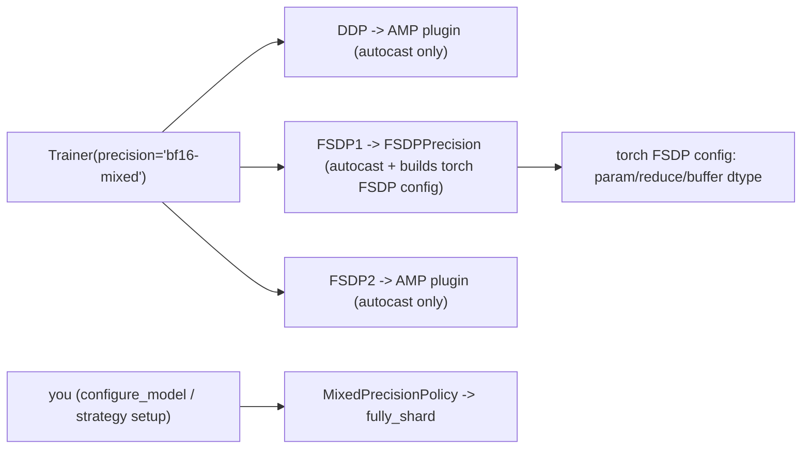
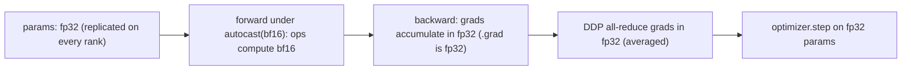
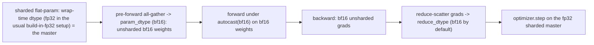
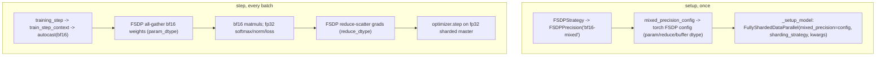
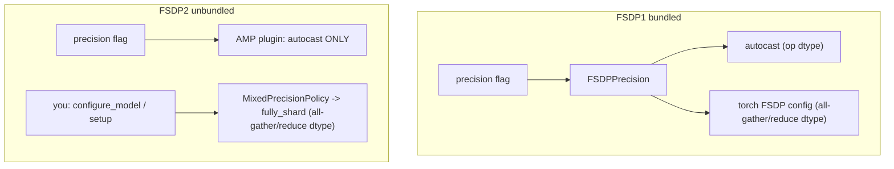

# `bf16-mixed` precision in Lightning: DDP vs FSDP1 vs FSDP2

What `Trainer(precision="bf16-mixed")` *actually* wires up under `DDPStrategy`, `FSDPStrategy`
(FSDP1), and `ModelParallelStrategy` (FSDP2), and why the same precision flag means different things
once sharding enters the picture.

The punchline: `bf16-mixed` always gives you **autocast**, but only FSDP1's Lightning plugin also
turns that flag into a **FSDP sharding/communication dtype config**. In FSDP2, that second part is
your explicit `MixedPrecisionPolicy`.

This complements the practical [Lightning FSDP strategy guide](../accelerated-computing/lightning-fsdp-strategy.md),
especially [its section on mixed precision and `FSDPPrecision`](../accelerated-computing/lightning-fsdp-strategy.md#section-9-mixed-precision-fsdpprecision--nvfp4).

> **Version note.** The code excerpts are lightly trimmed from PyTorch **2.11** and Lightning
> **2.6.1** source captured in the original note. Treat this as a versioned mental model; when
> upgrading either framework, re-check the source files listed in [References](#references).
>
> **Scope.** **DDP**, **FSDP1** (`FullyShardedDataParallel`, flat-param), and **FSDP2** (`fully_shard` +
> `DTensor`, via `ModelParallelStrategy`).

The guide is organized:

- **§1-2** show what plain Lightning autocast does under DDP.
- **§3-5** trace the extra FSDP1 bridge: `FSDPPrecision` -> `torch.distributed.fsdp.MixedPrecision`.
- **§6** shows the FSDP2 split: autocast comes from Lightning, sharding dtype comes from you.
- **§7-8** summarize the side-by-side behavior and the practical gotchas.

---

## Mind the name collisions

Most of the confusion here is naming: **four classes** are all called some variant of *MixedPrecision* /
*MixedPrecisionPolicy*, and they live at different layers. Keep them straight and the rest is easy:

| Shorthand used below | Fully-qualified name | What it actually is |
|---|---|---|
| **AMP plugin** | `lightning.pytorch.plugins.precision.MixedPrecision` | A Lightning precision *plugin* that does nothing but run `torch.autocast`. This is the plugin **DDP** gets. |
| **`FSDPPrecision`** | `lightning.pytorch.plugins.precision.FSDPPrecision` | A Lightning precision *plugin* for FSDP1: it runs autocast **and** builds the torch FSDP config below. The plugin **FSDP1** gets. |
| **torch FSDP config** | `torch.distributed.fsdp.MixedPrecision` | A plain dataclass `(param_dtype, reduce_dtype, buffer_dtype)` telling **torch FSDP1** what dtype to all-gather params, reduce grads, and hold buffers in. Not a Lightning plugin at all. |
| **FSDP2 policy** | `torch.distributed.fsdp.MixedPrecisionPolicy` | The **FSDP2** (`fully_shard`) analog of the torch FSDP config: module-level `(param_dtype, reduce_dtype, output_dtype, cast_forward_inputs)`, **no `buffer_dtype`**. **You** pass it to `fully_shard`; nothing derives it from the precision flag. |

Two more `mixed_precision*` names sit on the strategy: `FSDPStrategy.mixed_precision` (an optional
**torch FSDP config** you can pass in YAML) and `FSDPStrategy.mixed_precision_config` (a property that
returns the **torch FSDP config** actually used). Every time "MixedPrecision" appears below it is tagged
with which of these four it is.



---

## TL;DR

- `bf16-mixed` is, at heart, **`torch.autocast`** — an *op-level* dtype policy (matmul/conv in bf16,
  softmax/norm/loss kept fp32). It never changes how parameters are *stored*.
- **DDP**: the precision flag resolves to the **`MixedPrecision`** plugin, which is *only* autocast.
  Parameters stay replicated in fp32; gradients all-reduce in fp32; the optimizer steps fp32. bf16 exists
  only transiently inside ops (tensor-core speed), not in storage or comm.
- **FSDP1**: the flag resolves to **`FSDPPrecision`**, which does **two** things from the one flag:
  (1) the same autocast, **and** (2) builds a `torch.distributed.fsdp.MixedPrecision(param/reduce/buffer)`
  that `FSDPStrategy` hands to `FullyShardedDataParallel`. By default that second part makes the **param
  all-gather and grad reduce-scatter run in bf16** — the comm/memory win DDP autocast can't give you.
  A strategy-level `mixed_precision=` override can still choose fp32 reduction or fp32 buffers.
- **FSDP2** (`fully_shard` / `ModelParallelStrategy`): there is **no `FSDPPrecision`** — the flag gives only
  the **AMP plugin** (autocast). The sharding dtype comes from a **`MixedPrecisionPolicy`** that *you* pass
  to `fully_shard`. So `bf16-mixed` *alone* leaves the all-gather in the parameter's original dtype
  (normally fp32); you must set the policy yourself.
- **The role of `FSDPPrecision`** is exactly that bridge (flag → `torch.distributed.fsdp.MixedPrecision`)
  plus FSDP-specific handling of the grad scaler (`ShardedGradScaler`) and gradient clipping (it *refuses*
  generic norm clipping, because flat-param clipping must go through the FSDP root module).

---

## 1. `bf16-mixed` is autocast (the half DDP and FSDP1 share)

`torch.autocast` wraps the forward pass and casts the **operands of specific ops** to bf16 (matmul, conv,
linear) while keeping numerically sensitive ops (softmax, layer norm, `log`/`exp`, loss reductions) in
fp32 via its built-in fp32 allowlist. It does **not** touch parameter storage.

```python
# What "mixed" means, regardless of strategy:
with torch.autocast("cuda", dtype=torch.bfloat16):   # cache_enabled=False in Lightning
    y = layer(x)        # linear/matmul run bf16; their inputs are cast on the fly
    loss = ce(logits.float(), target)   # autocast keeps the reduction/softmax in fp32
# params, .grad, and the optimizer state are all still fp32 here
```

Because bf16 has the **same exponent range as fp32**, there is **no loss scaling** (unlike fp16 /
`16-mixed`, which needs a `GradScaler`). Lightning exposes autocast through *precision plugins*, and
**which plugin you get depends on the strategy** — that is the whole story below.

```python
# lightning/pytorch/trainer/connectors/accelerator_connector.py  (Lightning 2.6.1)
def _check_and_init_precision(self) -> Precision:
    ...
    if isinstance(self.strategy, FSDPStrategy):
        return FSDPPrecision(self._precision_flag)          # <-- FSDP1 path
    ...
    if self._precision_flag in ("16-mixed", "bf16-mixed"):
        device = self._accelerator_flag if self._accelerator_flag in ("cpu", "mps") else "cuda"
        return MixedPrecision(self._precision_flag, device)  # <-- DDP (and most others) path
```

`DDPStrategy` is none of the special cases, so it falls through to `MixedPrecision`. `FSDPStrategy` is
matched first and gets `FSDPPrecision`.

---

## 2. DDP: the `MixedPrecision` plugin = pure autocast

```python
# lightning/pytorch/plugins/precision/amp.py  (Lightning 2.6.1)
class MixedPrecision(Precision):
    def __init__(self, precision, device, scaler=None):
        # bf16-mixed -> no scaler; 16-mixed -> torch.amp.GradScaler
        if scaler is None and precision == "16-mixed":
            scaler = torch.amp.GradScaler(device=device)
        ...

    def autocast_context_manager(self) -> torch.autocast:
        dtype = torch.bfloat16 if self.precision == "bf16-mixed" else torch.half
        return torch.autocast(self.device, dtype=dtype, cache_enabled=False)

    @contextmanager
    def forward_context(self):
        with self.autocast_context_manager():   # the ONLY thing it does for bf16
            yield
    # convert_module / convert_input: inherited base no-ops -> params & inputs stay fp32
```

DDP keeps a **full fp32 replica** of the model on every rank. The plugin adds nothing but autocast, so:



- **Storage:** fp32 params + fp32 optimizer state, fully replicated (no sharding).
- **Comm:** fp32 gradient all-reduce (DDP does not change grad dtype).
- **bf16 footprint:** transient activations/matmul inputs only — it buys **tensor-core throughput**, not
  memory. There is no bf16 parameter copy and no bf16 comm.

---

## 3. FSDP1: the `FSDPPrecision` plugin = autocast **+** flat-param `MixedPrecision`

`FSDPStrategy` gets `FSDPPrecision`, which bundles **both** precision layers behind the single flag:

```python
# lightning/pytorch/plugins/precision/fsdp.py  (Lightning 2.6.1)
class FSDPPrecision(Precision):
    # (1) SAME autocast as the DDP plugin
    def forward_context(self):
        if "mixed" in self.precision:
            return torch.autocast("cuda", dtype=(torch.bfloat16 if self.precision == "bf16-mixed"
                                                  else torch.float16))
        return _DtypeContextManager(self._desired_input_dtype)  # *-true path

    # (2) THE FSDP-SPECIFIC PART: build the torch.distributed.fsdp.MixedPrecision the strategy will use
    @property
    def mixed_precision_config(self) -> "TorchMixedPrecision":
        if self.precision in ("bf16-true", "bf16-mixed"):
            param_dtype = reduce_dtype = buffer_dtype = torch.bfloat16   # ALL bf16 by default
        elif self.precision == "32-true":
            param_dtype = reduce_dtype = buffer_dtype = torch.float32
        ...
        return TorchMixedPrecision(param_dtype=param_dtype,
                                   reduce_dtype=reduce_dtype,
                                   buffer_dtype=buffer_dtype)
```

`FSDPStrategy` then feeds that config into the FSDP wrap (a strategy-level `mixed_precision=` wins if you
pass one explicitly, otherwise it falls back to the plugin's config):

```python
# lightning/pytorch/strategies/fsdp.py  (Lightning 2.6.1)
@property
def mixed_precision_config(self):
    if self.mixed_precision:                      # explicit strategy kwarg wins (see Gotchas)
        return self.mixed_precision
    if isinstance(self.precision_plugin, FSDPPrecision):
        return self.precision_plugin.mixed_precision_config
# ...wrap:  FullyShardedDataParallel(module, ..., mixed_precision=self.mixed_precision_config)
```

`torch.distributed.fsdp.MixedPrecision` then drives the flat-param sharding dtypes:



- **Storage:** params/grads/optimizer state are **sharded** across the data-parallel group; FSDP keeps the
  sharded flat-param in its **wrap-time dtype** (fp32 in the standard "build the model in fp32" pattern),
  which is the master the optimizer steps.
- **Comm:** the all-gather uses `param_dtype` (bf16) and the reduce-scatter uses `reduce_dtype`
  (**bf16 by default** — see Gotchas) → bf16 comm, roughly half the bytes of DDP's fp32 all-reduce.
- **Two casts now exist:** the flat-param `param_dtype` cast (module/comm-level, from
  `torch.distributed.fsdp.MixedPrecision`) **and** autocast (op-level, from `forward_context`). On a matmul
  they agree (both bf16); autocast still adds the **fp32 protection** for softmax/norm/loss.

---

## 4. End-to-end trace: `precision="bf16-mixed"` under FSDP1

Follow the single flag from config to GPU. There are only **five steps**, split across **setup** (build
objects + wrap the model, once) and **step** (autocast + collectives, every batch). The tags in
**bold** point back to the name-collision table.

**Setup 1 — the connector picks the plugin.** `FSDPStrategy` resolves to the **`FSDPPrecision`** plugin
(the branch from §1).

**Setup 2 — `FSDPPrecision` builds a torch FSDP config from the flag.** Its `mixed_precision_config`
property turns `"bf16-mixed"` into a **torch FSDP config**:

```python
# FSDPPrecision.mixed_precision_config  ->  torch.distributed.fsdp.MixedPrecision
torch_fsdp_config = MixedPrecision(param_dtype=bf16, reduce_dtype=bf16, buffer_dtype=bf16)  # all bf16, from the flag
```

(A `mixed_precision=` you pass at the **strategy** level in YAML *overrides* this. That is how you
keep bf16 all-gather while forcing fp32 gradient reduction; see §3 and §8.)

**Setup 3 — the strategy hands that config to torch FSDP1 and wraps the model:**

```python
# FSDPStrategy._setup_model  (lightning/pytorch/strategies/fsdp.py)
model = FullyShardedDataParallel(
    module,
    mixed_precision=self.mixed_precision_config,   # <- the torch FSDP config from Setup 2
    sharding_strategy=self.sharding_strategy,      # FULL_SHARD / SHARD_GRAD_OP / ...
    **self.kwargs,                                 # auto_wrap_policy, ignored_states, use_orig_params, ...
)
```

`setup()` runs this in order: `convert_module` (a no-op for `bf16-mixed`) → `_setup_model` (this wrap) →
`setup_optimizers` (so the optimizer references the now-sharded params). After the wrap: params are
sharded, the **resident shard stays fp32** (the optimizer master), and torch now knows the all-gather /
reduce dtypes.

**Step 4 — every batch enters autocast.** The base strategy opens the plugin's context around the step:

```python
# Strategy.training_step  ->  Precision.train_step_context  ->  forward_context
with self.precision_plugin.train_step_context():   # FSDPPrecision.forward_context() == torch.autocast("cuda", bf16)
    self.lightning_module.training_step(batch)
```

**Step 5 — inside one step, the two halves meet:**

1. torch FSDP pre-forward hook **all-gathers** the bf16 weights (`param_dtype`).
2. autocast runs matmuls in bf16, keeps softmax / norm / loss in fp32.
3. backward produces bf16 unsharded grads.
4. torch FSDP post-backward **reduce-scatters** grads (`reduce_dtype`).
5. optimizer steps the **fp32 sharded master**.



**Bottom line:** `bf16-mixed` under FSDP1 is wired by exactly **two** objects — the **torch FSDP config**
(Setup 2–3, controls the all-gather/reduce dtype) and the **`FSDPPrecision` autocast** (Step 4, controls
the op dtype). DDP has only the second one; that single difference is the whole story.

---

## 5. The role of `FSDPPrecision`

Why FSDP can't just reuse the DDP `MixedPrecision` plugin — method by method:

| `FSDPPrecision` member | What it does | Why DDP's `MixedPrecision` doesn't need it |
|---|---|---|
| connector gate | It is the **only** precision plugin `FSDPStrategy` accepts | DDP has no sharded flat-param to configure |
| `mixed_precision_config` | **The bridge**: maps the flag → `torch.distributed.fsdp.MixedPrecision(param_dtype, reduce_dtype, buffer_dtype)` consumed by `FullyShardedDataParallel` | DDP never all-gathers/reduce-scatters params, so there is no param/comm dtype to set |
| `forward_context` | autocast for `*-mixed`; default-dtype context for `*-true` | identical autocast idea (shared) |
| `module_init_context` / `tensor_init_context` | build params under `param_dtype` (meta-/empty-init friendly so sharded init matches) | DDP builds in default fp32 |
| `convert_module` | `module.to(dtype)` for `*-true` | same for `*-true` (shared) |
| `convert_input` | cast the batch to `_desired_input_dtype` (**fp32** for `bf16-mixed`; bf16 for `bf16-true`) | same map |
| `scaler` | uses **`ShardedGradScaler`** for `16-mixed` (fp16) | DDP uses plain `torch.amp.GradScaler`; sharded grads need the sharded-aware scaler |
| `clip_grad_by_norm` | **raises `MisconfigurationException`** | DDP's base plugin clips fine with generic `torch.nn.utils.clip_grad_norm_` |

The two members that genuinely *only* make sense for FSDP:

**`mixed_precision_config` (the reason the class exists).** A flat `FlatParameter` is all-gathered and
reduce-scattered as one buffer; FSDP needs to be told the dtype of those collectives and of the resident
buffers. `FSDPPrecision` derives that `torch.distributed.fsdp.MixedPrecision` from the precision flag so
you get it "for free" from `precision="bf16-mixed"`. DDP has no such collective over params, so its plugin
carries no equivalent.

**`clip_grad_by_norm` refusing to run.** Norm clipping needs the *global* gradient norm. For an FSDP1
flat param the grads are sharded slices, so a plain `torch.nn.utils.clip_grad_norm_` over local shards
computes the **wrong** norm — the correct path is `FullyShardedDataParallel.clip_grad_norm_()` on the root
module. `FSDPPrecision` therefore raises rather than silently mis-clip:

```python
# lightning/pytorch/plugins/precision/fsdp.py
def clip_grad_by_norm(self, *_, **__):
    raise MisconfigurationException(
        "`gradient_clip_algorithm='norm'` is currently not supported for `FSDPPrecision`")
```

The companion FSDP guide shows the same pattern in a LightningModule: branch on `FSDPStrategy` and
call the root module's `clip_grad_norm_` instead of the precision plugin.

For `bf16-mixed` specifically, the scaler/`pre_backward`/`optimizer_step` machinery is inert (no scaler),
so the *active* difference from DDP reduces to the one thing: `mixed_precision_config` turning the
parameter all-gather + grad reduce-scatter into bf16.

---

## 6. FSDP2: precision is *unbundled*

FSDP2 (`fully_shard` + `DTensor`, driven by `ModelParallelStrategy`) has the **same two layers** — autocast
and a sharding-dtype config — but **splits who owns them**. There is no `FSDPPrecision`: the flag drives
*only* autocast, and the sharding dtypes come from a **FSDP2 policy** (`MixedPrecisionPolicy`) that *you*
hand to `fully_shard`. Nothing derives it from `trainer.precision`.

### 6.1 The flag no longer touches FSDP

`ModelParallelStrategy` is a `ParallelStrategy`, **not** an `FSDPStrategy`, so the connector's FSDP branch
is skipped — it never builds an `FSDPPrecision`:

```python
# accelerator_connector._check_and_init_precision()  (Lightning 2.6.1)
if isinstance(self.strategy, FSDPStrategy):       # ModelParallelStrategy is NOT this -> skipped
    return FSDPPrecision(...)
if self._precision_flag in ("16-true", "bf16-true"):
    return HalfPrecision(self._precision_flag)    # module.to(dtype)
if self._precision_flag == "32-true":
    return Precision()                            # no-op base
if self._precision_flag in ("16-mixed", "bf16-mixed"):
    return MixedPrecision(self._precision_flag, device)   # the AMP plugin -> autocast ONLY

# ...and ModelParallelStrategy is restricted to: ("32-true", "bf16-mixed", "bf16-true", "16-true")
#    note: "16-mixed" is NOT allowed (no sharded fp16 scaler path here)
```

So `bf16-mixed` here gives the **AMP plugin** — the *same* autocast DDP uses — and **nothing else**. The
flag has zero effect on how params are sharded or all-gathered.

### 6.2 You own the sharding dtype via `MixedPrecisionPolicy`

The FSDP2 analog of the **torch FSDP config** is the **FSDP2 policy**, passed per `fully_shard` call:

```python
# torch.distributed.fsdp (PT 2.11): MixedPrecisionPolicy is module-level, not autocast
fully_shard(
    block,
    mesh=mesh,
    mp_policy=MixedPrecisionPolicy(
        param_dtype=bf16,         # all-gather + compute dtype  (the comm/memory win)
        reduce_dtype=fp32,        # grad reduce-scatter dtype
        # output_dtype=None,        # optional: cast the unit's float outputs
        # cast_forward_inputs=True, # cast this unit's inputs to param_dtype at the boundary
    ),
)
# no buffer_dtype field (removed); the sharded master stays in its ORIGINAL dtype -> fp32 optimizer "for free"
```

Differences from FSDP1's flat-param config:

- **Per-param `DTensor`, per-module policy.** Each `fully_shard` call can carry a *different* `mp_policy`
  (e.g. keep small norms fp32) — not one dtype for a whole flat buffer.
- **`cast_forward_inputs` is the module-boundary analog of autocast's input cast** — coarser than
  autocast's op-level fp32 allowlist (softmax/norm aren't auto-protected unless the module upcasts).
- **No `buffer_dtype`** — buffers keep their dtype.

### 6.3 Who calls `fully_shard`?

Lightning's `ModelParallelStrategy` does **not** shard for you: you apply `fully_shard` yourself in
`LightningModule.configure_model()` (or a strategy `setup()` override). That is the ownership split —
**flag → AMP plugin → autocast** is Lightning's; **`mp_policy` → `fully_shard`** is yours:

```python
def configure_model(self):
    mp = MixedPrecisionPolicy(param_dtype=bf16, reduce_dtype=fp32)   # YOU choose this
    for block in self.model.blocks:
        fully_shard(block, mesh=self.device_mesh["data_parallel"], mp_policy=mp)
    fully_shard(self.model, mesh=self.device_mesh["data_parallel"], mp_policy=mp)
```

### 6.4 The traps this split creates

- **`bf16-mixed` alone (no `mp_policy`)** -> autocast runs, but `fully_shard` defaults to
  `param_dtype=None`, so the all-gather uses the parameter's original dtype, normally **fp32**. You get
  bf16 math but still pay fp32 communication and fp32 unsharded weights at the unit boundary. Under
  FSDP1 this surprise is harder to hit because the flag sets `param_dtype=bf16`. **You must set the
  policy.**
- **`bf16-true` (+ policy)** → `HalfPrecision.convert_module` casts the module to bf16 *before* shard, so
  the sharded **master becomes bf16** — you lose FSDP2's usual fp32 master. This is usually an
  inference-only choice unless you deliberately want low-precision training state.
- **Grad clipping uses the DTensor-aware path.** No `FSDPPrecision`, so the base
  `Precision.clip_grad_by_norm` can call `torch.nn.utils.clip_grad_norm_`, which is DTensor-aware in this
  stack. The FSDP1 "raise → use the root module's `clip_grad_norm_`" workaround (§5) is unnecessary.

### 6.5 Recommended recipe (mirror the FSDP1 end-state)

- `precision="bf16-mixed"` (AMP autocast for op-level fp32 safety) **+** `MixedPrecisionPolicy(param=bf16,
  reduce=fp32)` — closest to the FSDP1 arm; easiest A/B.
- or `precision="32-true"` (no autocast) **+** the same policy — the autocast-free torchtitan idiom; then
  fp32 safety relies on module internals (RMSNorm/loss upcasting).

Either way **always set `mp_policy.param_dtype` explicitly** — never rely on the flag to make the
all-gather bf16.



**Bottom line:** FSDP1 bundles autocast + sharding-dtype behind one flag (`FSDPPrecision`); FSDP2 **splits**
them — the flag still owns autocast, but **you** own the sharding dtype via `MixedPrecisionPolicy`. Set
both on purpose, or the all-gather silently stays in the original parameter dtype, normally fp32.

---

## 7. Side-by-side: `bf16-mixed`

| Aspect | **DDP** (`MixedPrecision`) | **FSDP1** (`FSDPPrecision`) | **FSDP2** (`ModelParallelStrategy`) |
|---|---|---|---|
| Precision plugin | `MixedPrecision` (AMP) | `FSDPPrecision` | `MixedPrecision` (AMP) — *no FSDP plugin* |
| Sets the FSDP dtype? | n/a | **yes, from the flag** | **no** — you set `MixedPrecisionPolicy` |
| Autocast in forward | yes (bf16) | yes (bf16) | yes for `bf16-mixed`; none for `32-true` |
| Param storage | full fp32, **replicated** | fp32 master, **sharded** flat-param | original dtype master, **sharded** per-param `DTensor` (normally fp32) |
| Unsharded/compute weights | fp32 (autocast casts op inputs) | **bf16** (`param_dtype`) + autocast | **bf16** iff `mp_policy.param_dtype=bf16`, else fp32 |
| Gradient comm | **fp32** all-reduce | **bf16** reduce-scatter by default; overrideable | `reduce_dtype` reduce-scatter; choose explicitly |
| Optimizer master | fp32 | fp32 (sharded, if initialized fp32) | original dtype (normally fp32), *unless* `bf16-true` |
| Grad scaler (fp16, `16-mixed`) | `torch.amp.GradScaler` | `ShardedGradScaler` | `16-mixed` **not allowed** |
| Norm clipping | generic `clip_grad_norm_` | plugin **raises** → root `clip_grad_norm_` | generic `clip_grad_norm_` (`DTensor`-aware) |
| `buffer_dtype` | n/a | settable (bf16 default) | **removed** (buffers stay fp32) |
| What bf16 buys | compute throughput | throughput **+** ~½ comm **+** sharded mem | same as FSDP1, but the dtype is **yours to set** |

---

## 8. Gotchas

- **FSDP1 `reduce_dtype`/`buffer_dtype` default to bf16** for `bf16-mixed`. Reducing grads in bf16 across
  many ranks can lose precision, and bf16 buffers can be a bad fit for some cached state. The fix is to
  pass an explicit strategy-level `mixed_precision=torch.distributed.fsdp.MixedPrecision(param_dtype=bf16,
  reduce_dtype=fp32, buffer_dtype=None)` when you want bf16 all-gather, fp32 reduction, and fp32 buffers.
  That strategy-level config **wins** over the plugin's flag-derived config (see §3).
- **`*-mixed` vs `*-true`.** `bf16-mixed` = autocast, params stay fp32. `bf16-true` = `convert_module`
  does `module.to(bf16)` and there is no autocast; under FSDP1 the wrap-time dtype is then bf16 (no fp32
  master). Use `*-true` for inference, `*-mixed` for training.
- **bf16 needs no scaler; fp16 does.** Only `16-mixed` engages a scaler — `ShardedGradScaler` under FSDP1,
  `torch.amp.GradScaler` under DDP. This is the one place `FSDPPrecision`'s `pre_backward`/`optimizer_step`
  overrides matter.

---

## References

- `lightning/pytorch/trainer/connectors/accelerator_connector.py` — `_check_and_init_precision`.
- `lightning/pytorch/plugins/precision/amp.py` — `MixedPrecision` (DDP path).
- `lightning/pytorch/plugins/precision/fsdp.py` — `FSDPPrecision` (FSDP1 path).
- `lightning/pytorch/plugins/precision/precision.py` — base `Precision` (`clip_grad_by_norm`).
- `lightning/pytorch/strategies/fsdp.py` — `FSDPStrategy.mixed_precision_config` + FSDP wrap.
- `lightning/pytorch/strategies/model_parallel.py` — `ModelParallelStrategy` (FSDP2 path; no `FSDPPrecision`).
- `torch.distributed.fsdp` (PT 2.11) — `MixedPrecision`, `MixedPrecisionPolicy`, `fully_shard`, `FullyShardedDataParallel`, `ShardedGradScaler`.
