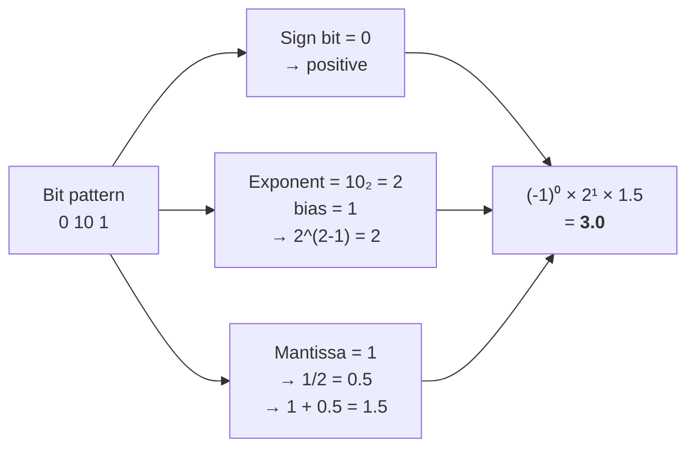
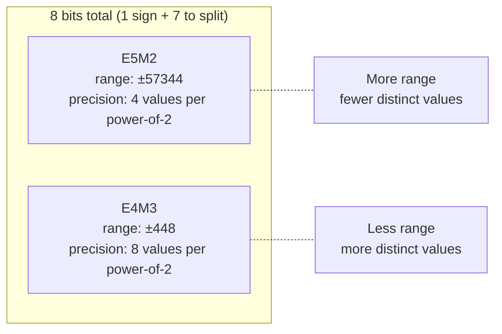

# Section 1: Introduction

> **Paper reference:** Section 1, pages 1-2

## What this section covers

The introduction frames the problem: training frontier LLMs is absurdly expensive (tens to hundreds of yottaflops). FP8 training is now standard, but FP4 could unlock 2-3x more throughput and halve memory usage. The catch is that squeezing numbers into just 4 bits causes instability, especially at scale and over long training runs. The paper claims they've solved this.

---

## Background you need: How floats work at the bit level

Since the entire paper is about shrinking numbers from 32 bits down to 4 bits, you need to understand what's inside a floating-point number.

### The three parts of a float

Every floating-point number has three fields:

```
┌──────┬────────────────┬─────────────────────┐
│ Sign │   Exponent     │      Mantissa        │
│ 1 bit│   E bits       │      M bits          │
└──────┴────────────────┴─────────────────────┘
```

- **Sign (1 bit):** 0 = positive, 1 = negative
- **Exponent (E bits):** controls the *range* -- how big or small the number can be
- **Mantissa (M bits):** controls the *precision* -- how many distinct values you can represent between powers of 2

### The formula: how bits become a number

```
value = (-1)^sign  ×  2^(exponent - bias)  ×  (1 + mantissa_fraction)
         ────────     ───────────────────     ───────────────────────
         ± sign       power-of-2 scaling       the "1.something"
```

Let's unpack each piece:

**1) The sign bit** -- straightforward: `(-1)^0 = +1`, `(-1)^1 = -1`.

**2) The exponent with bias** -- the exponent bits store an unsigned integer, but we need negative exponents too (for numbers < 1). So we subtract a fixed **bias** = `2^(E-1) - 1`. This lets the stored value represent both negative and positive powers of 2.

| E bits | Bias | Stored range | Actual exponent range |
|--------|------|--------------|-----------------------|
| 8 (FP32) | 127 | 0-255 | -127 to +128 |
| 5 (FP16) | 15 | 0-31 | -15 to +16 |
| 4 (E4M3) | 7 | 0-15 | -7 to +8 |
| 2 (E2M1) | 1 | 0-3 | -1 to +2 |

**3) The mantissa as a fraction** -- the mantissa bits represent a binary fraction *after* an implicit leading 1. Think of it as `1.bbb...` in binary:

```
Mantissa bits: b₁ b₂ b₃ ...

Fraction = b₁×(1/2) + b₂×(1/4) + b₃×(1/8) + ...

Full significand = 1 + fraction    (the implicit "1." prefix)
```

So mantissa bits `101` in a 3-bit mantissa = `1/2 + 0 + 1/8` = `0.625`, and the full significand is `1.625`.

> **Special case (subnormals):** When *all exponent bits are zero*, the implicit leading 1 becomes 0, giving `0.bbb...` instead. This lets the format represent very small numbers near zero, including zero itself.

### Worked example: decoding an FP8 E4M3 value

```
Bit pattern:  0  1010  110
              │  ────  ───
              │   │     └── mantissa = 1/2 + 1/4 + 0 = 0.75
              │   └── exponent (stored) = 10 (decimal) 
              └── sign = 0 (positive)

bias = 2^(4-1) - 1 = 7
actual exponent = 10 - 7 = 3

value = (-1)^0 × 2^3 × (1 + 0.75)
      = +1     × 8   × 1.75
      = 14.0
```

### Worked example: decoding an FP4 E2M1 value

```
Bit pattern:  0  10  1
              │  ──  │
              │  │   └── mantissa = 1/2 = 0.5
              │  └── exponent (stored) = 2
              └── sign = 0 (positive)

bias = 2^(2-1) - 1 = 1
actual exponent = 2 - 1 = 1

value = (-1)^0 × 2^1 × (1 + 0.5)
      = +1     × 2   × 1.5
      = 3.0
```

Here's how the full decode flows as a diagram:



### The exponent/mantissa tradeoff

More exponent bits = wider range (bigger and smaller numbers). More mantissa bits = finer precision (more distinct values between powers of 2). With a fixed bit budget, you must choose:



This tradeoff is why the paper uses E4M3 for NVFP4 scale factors (need precision) vs E8M0/UE8M0 for MXFP4 scale factors (need range, zero mantissa bits).

### Bit layout comparison for all formats in the paper

```
FP32   (32 bits):  S EEEEEEEE MMMMMMMMMMMMMMMMMMMMMMM
                   1    8                23

BF16   (16 bits):  S EEEEEEEE MMMMMMM
                   1    8        7

FP8 E5M2 (8 bits): S EEEEE MM
                    1   5    2

FP8 E4M3 (8 bits): S EEEE MMM
                    1   4    3

FP4 E2M1 (4 bits): S EE M          ← the star of this paper
                    1  2  1
```

| Format | Bits | Layout | Max value | Use in paper |
|--------|------|--------|-----------|-------------|
| FP32 | 32 | E8M23 | ~3.4×10³⁸ | Master weights, optimizer states |
| BF16 | 16 | E8M7 | ~3.4×10³⁸ | Sensitive layers, reductions |
| FP8 (E4M3) | 8 | E4M3 | 448 | Scale factors in NVFP4 |
| FP8 (E5M2) | 8 | E5M2 | 57344 | Wider range, less precision |
| FP4 (E2M1) | 4 | E2M1 | 6 | The star of this paper |

Notice BF16 and FP32 have the same max value -- BF16 just kept all 8 exponent bits and slashed mantissa from 23 to 7, preserving range at the cost of precision. That's why BF16 became popular for deep learning: neural nets care more about range than precision.

### The E2M1 format (FP4) -- only 16 values exist

With just 2 exponent bits and 1 mantissa bit, let's enumerate *every possible value*:

```
 Sign │ Exp │ Mant │ Exponent  │ Significand │ Value
──────┼─────┼──────┼───────────┼─────────────┼──────
   0  │  00 │   0  │ subnormal │  0 + 0    = 0.0  │  +0
   0  │  00 │   1  │ subnormal │  0 + 0.5  = 0.5  │  +0.5
   0  │  01 │   0  │ 2^(1-1)=1 │  1 + 0    = 1.0  │  +1.0
   0  │  01 │   1  │ 2^(1-1)=1 │  1 + 0.5  = 1.5  │  +1.5
   0  │  10 │   0  │ 2^(2-1)=2 │  1 + 0    = 2.0  │  +2.0
   0  │  10 │   1  │ 2^(2-1)=2 │  1 + 0.5  = 3.0  │  +3.0
   0  │  11 │   0  │ 2^(3-1)=4 │  1 + 0    = 4.0  │  +4.0
   0  │  11 │   1  │ 2^(3-1)=4 │  1 + 0.5  = 6.0  │  +6.0
──────┼─────┼──────┼───────────┼─────────────┼──────
   1  │ ... │  ... │   (same as above, negated)     │  -0 to -6
```

All 16 representable FP4 values on a number line:

```
  -6  -4  -3  -2 -1.5 -1 -0.5  0  +0.5 +1 +1.5 +2  +3  +4     +6
───●───●───●───●───●───●───●───●───●───●───●───●───●───●─────────●──→
   ◄─── sparse ───►  ◄── dense ──►     ◄── dense ──►  ◄── sparse ──►
```

Notice the values get **sparser as they get larger** -- there are two values between 0 and 1 (0.5 and 1.0) but only two values between 4 and 6. This is inherent to all floating-point: precision is relative, not absolute. That's it -- 16 total values. For comparison, FP32 has ~4 billion distinct values. This is why going to FP4 is brutal -- you're trying to represent the full range of weights and activations with just 8 positive numbers.

### The notation: ExMy

The paper uses `E2M1`, `E4M3`, `E8M0`, etc. throughout. This just means:
- **E** = number of exponent bits
- **M** = number of mantissa bits
- Total bits = 1 (sign) + E + M

One oddball: **UE8M0** (used by MXFP4 scale factors) has no sign bit and no mantissa -- it's an 8-bit unsigned exponent that can only represent powers of 2, from 2⁻¹²⁷ to 2¹²⁷. Zero mantissa bits means no values *between* powers of 2, which is why this is a coarser way to scale.

> **Paper ref:** "Floating-point types are denoted as ExMy and consist of one sign bit, x exponent bits, and y mantissa bits." (footnote 1, page 2)

---

## Background you need: Quantization basics

Quantization = converting a tensor from high precision (FP32/BF16) to low precision (FP8/FP4). The challenge is fitting a wide range of values into a tiny set of representable numbers.

### Scale factors -- the key idea

Raw FP32 weights might range from -100 to +100, but FP4 can only represent up to ±6. So you **scale** the values first:

```python
# Pseudocode for basic quantization
amax = max(abs(tensor))          # find the largest magnitude
scale = fp4_max / amax           # scale factor to map amax -> fp4 max (6.0)
scaled_tensor = tensor * scale   # now values fit in FP4 range
quantized = round_to_fp4(scaled_tensor)

# To use the result, you descale:
result = quantized / scale       # approximately recovers original values
```

### Block scaling (microscaling)

Instead of one scale factor per entire tensor, you can use one scale factor per **block** of N elements. This captures local dynamic range much better because different parts of a tensor can have very different magnitudes.

```
Tensor: [0.001, 0.002, 0.001, ..., 50.0, 80.0, 60.0, ...]
         ^^^^^^^^^^^^^^^^^^^^^^^^    ^^^^^^^^^^^^^^^^^^^^^^^^
         Block 1: scale = small      Block 2: scale = large
```

This is the core of "microscaling" (MX) formats. MXFP4 uses blocks of 32. NVFP4 uses blocks of 16 (smaller = better local fit).

### Rounding -- where precision dies

When you scale a value and it falls between two FP4-representable numbers, you must round. Two strategies:

1. **Round-to-nearest-even (RNE):** Always pick the closest representable value. Deterministic. Can introduce systematic bias.
2. **Stochastic rounding:** Randomly round up or down, with probability proportional to distance. Unbiased on average.

We'll see in Section 4 why stochastic rounding matters specifically for gradients.

---

## What the paper proposes (high-level)

The paper introduces four techniques that together make FP4 training stable:

| Technique | Why it's needed | Section |
|-----------|----------------|---------|
| **Selective high-precision layers** | Some layers (especially final ones) are too sensitive for FP4 | 4.1 |
| **Random Hadamard Transforms** | Spreads outlier values so they don't wreck quantization | 4.2 |
| **2D block scaling** | Keeps weights quantized the same way in forward and backward pass (preserves chain rule) | 4.3 |
| **Stochastic rounding** | Removes systematic bias from gradient quantization | 4.4 |

### The key claim

They train a 12B-parameter model on 10 trillion tokens in FP4 and it matches an FP8 baseline on downstream tasks (e.g., MMLU-Pro: 62.58% vs 62.62%). This is the first public demonstration of FP4 training at this scale.

---

## Quick primer: Mamba (since the model is a hybrid)

The model they use is a **hybrid Mamba-Transformer** (Nemotron-H). Since you know Transformers, here's the quick version of Mamba:

- **Mamba** is a **State Space Model (SSM)** -- it processes sequences by maintaining a hidden state that gets updated at each step, similar to an RNN
- Unlike attention (which looks at all tokens at once, O(n²)), Mamba processes tokens sequentially in O(n) time
- **Mamba-2** (used here) reformulates the SSM computation as matrix multiplications, making it GPU-friendly
- The hybrid architecture mixes Mamba-2 blocks (for efficient long-range modeling) with Self-Attention blocks (for precise token interactions) and FFN blocks

For this paper, the Mamba vs Transformer distinction doesn't matter much -- what matters is that both have **linear layers** (matrix multiplications), and those are what get quantized to FP4. The paper's techniques apply to any architecture with linear layers.

---

## Key takeaway from the introduction

The introduction sets up a gap: FP8 training works great, FP4 *should* give 2-3x speedup, but naive FP4 training diverges. The paper fills this gap with a specific combination of techniques. The rest of the paper is structured as:

- **Section 2:** What NVFP4 actually is (the data format)
- **Section 3:** Show me the results (12B model, 10T tokens)
- **Section 4:** The secret sauce (training methodology)
- **Section 5:** Why NVFP4 beats the other FP4 format (MXFP4)

---

*Next: [Section 2 -- NVFP4 Format](section_2_nvfp4_format.md)* -- we'll dig into the actual bit layout and two-level scaling scheme.
