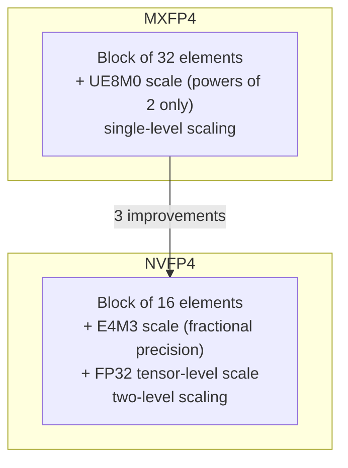
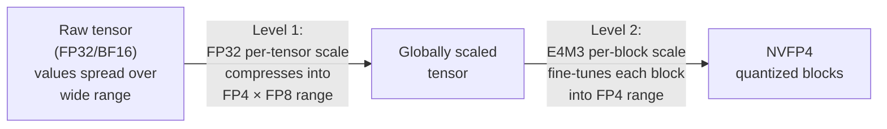
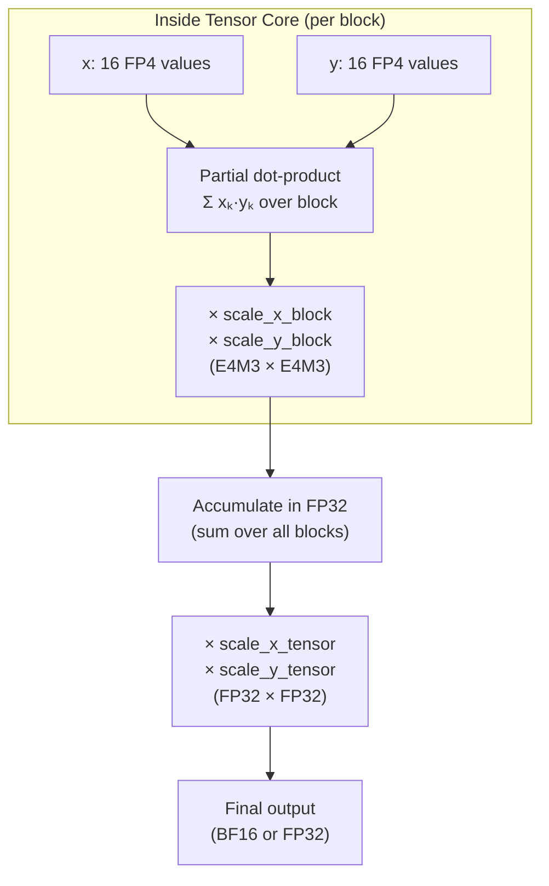

# Section 2: NVFP4 Format

> **Paper reference:** Section 2 (pages 2-3), Appendix B (pages 15-17)

## What this section covers

This section defines the NVFP4 data format -- how numbers are actually stored in memory. NVFP4 is NVIDIA's improvement over the standard MXFP4 microscaling format, with three key changes: smaller blocks, more precise scale factors, and a two-level scaling scheme. The paper also pulls in Appendix B here, which gives the full quantization procedure.

---

## Starting point: MXFP4 (what NVFP4 improves on)

Before NVFP4, the standard FP4 microscaling format was **MXFP4** (from the Open Compute Project). Here's how it works:

```
MXFP4 block (32 elements):

┌─────────────────────────────────────────────────────────┐
│  32 × FP4 (E2M1) data elements                         │
│  [v₁, v₂, v₃, ... , v₃₂]                              │
├─────────────────────────────────────────────────────────┤
│  1 × UE8M0 scale factor (shared by all 32 elements)    │
│  → power-of-two only: 2⁻¹²⁷ to 2¹²⁷                   │
└─────────────────────────────────────────────────────────┘
```

**Two problems with MXFP4:**

1. **Block of 32 is coarse** -- elements within a block may have very different magnitudes, but they all share one scale factor. The scale must accommodate the largest value, so small values get crushed toward zero.

2. **UE8M0 scale factors are imprecise** -- they can only represent powers of 2 (no mantissa bits). The scale often can't map the block's max value to the FP4 max exactly, wasting representable range.

---

## NVFP4: three improvements



| Property | MXFP4 | NVFP4 |
|----------|-------|-------|
| Block size | 32 | **16** (half → better local fit) |
| Block scale format | UE8M0 (power-of-2) | **E4M3** (fractional precision) |
| Tensor-level scale | none | **FP32** (second level of scaling) |
| Scale factor precision | ~1 bit effective | ~FP8 precision |

### Improvement 1: Smaller blocks (32 → 16)

A block of 16 elements has less internal variation than a block of 32. Less variation means the shared scale factor is a better fit for every element in the block, so fewer values get crushed to zero or saturated.

```
Block of 32:  [0.01, 0.02, ..., 5.0, 80.0]   ← scale dominated by 80.0
              0.01 gets crushed to 0 after quantization

Block of 16:  [0.01, 0.02, ..., 5.0] [50.0, 80.0, ...]
              ↑ this block has its    ↑ this block has its
                own smaller scale       own larger scale
              → 0.01 survives with a scale tuned to small values
```

### Improvement 2: E4M3 scale factors (instead of UE8M0)

UE8M0 can only represent powers of 2: ..., 0.25, 0.5, 1, 2, 4, 8, ...

E4M3 can represent 8 distinct values between each power of 2 (because 3 mantissa bits → 2³ = 8 steps). This means the scale factor can match the block's actual max value much more closely.

**Concrete example** -- say a block's max absolute value is 3.1:

```
Target decode scale = amax / fp4_max = 3.1 / 6.0 = 0.5167

UE8M0 (power-of-2 only):
  Nearest values: 0.5 or 1.0
  Round up to 1.0 to prevent saturation
  → After scaling: 3.1 / 1.0 = 3.1 → rounds to FP4 value 3.0
  → Reconstructed: 3.0 × 1.0 = 3.0    (3.2% error)
  → But now max FP4 values ±4 and ±6 are WASTED
    (nothing in the block maps there)

E4M3 (fractional precision):
  Can represent 0.5, 0.5625, 0.625, ... many values near 0.5167
  Best match: ~0.5
  → After scaling: 3.1 / 0.5 = 6.2 → rounds to FP4 value 6.0
  → Reconstructed: 6.0 × 0.5 = 3.0    (3.2% error for this value)
  → But the full FP4 range ±0.5 to ±6 is utilized
```

> **Paper ref:** "In the worst case, FP4 is unable to represent the samples at ±4 and ±6. This also reduces the dynamic range by nearly one binade" (Appendix B.4, page 17)

### Improvement 3: Two-level scaling

E4M3 has less range than UE8M0 (max 448 vs 2¹²⁷). To compensate, NVFP4 adds an FP32 scale factor at the tensor level that first shifts all values into a range where E4M3 block scales can handle them.



Think of it as coarse + fine adjustment:
- **Level 1 (FP32, per-tensor):** "Zoom the entire tensor so its overall magnitude fits within what E4M3 scales can handle"
- **Level 2 (E4M3, per-block):** "Fine-tune each block of 16 elements so the local max maps to ±6 in FP4"

---

## The full NVFP4 memory layout

Here's what a quantized matrix looks like in memory (based on Figure 1 in the paper):

```
A 16×32 weight matrix stored in NVFP4:

              ◄──── 32 columns ────►
         ┌────────────────┬────────────────┐
         │   Block (0,0)  │   Block (0,1)  │  ▲
         │  16 FP4 values │  16 FP4 values │  │
         │  + 1 E4M3 scale│  + 1 E4M3 scale│  │
         ├────────────────┼────────────────┤  16 rows
         │   Block (1,0)  │   Block (1,1)  │  │
         │  16 FP4 values │  16 FP4 values │  │
         │  + 1 E4M3 scale│  + 1 E4M3 scale│  │
         ├────────────────┼────────────────┤  │
         │      ...       │      ...       │  │
         └────────────────┴────────────────┘  ▼

         + 1 FP32 tensor-level scale (shared by entire matrix)
```

Each block of 16 contiguous FP4 elements has its own E4M3 scale factor. The element with the largest magnitude in each block (the "amax") is encoded at near-FP8 precision -- because the scale factor is chosen to map it exactly to the FP4 max. The paper highlights this: **at least 6.25% of values** (1 out of 16, the amax of each block) are stored at near-FP8 quality.

---

## The quantization procedure (from Appendix B)

Here's the complete encode/decode pipeline, step by step with code:

```python
import numpy as np

def quantize_to_nvfp4(tensor, block_size=16):
    """
    Full NVFP4 quantization procedure (Appendix B).
    """
    FP4_MAX = 6.0    # max representable in E2M1
    E4M3_MAX = 448.0 # max representable in E4M3

    # ── Level 1: Global tensor-level scaling (Eq. 1) ──
    tensor_amax = np.max(np.abs(tensor))
    # Scale so that tensor_amax maps to FP4_MAX × E4M3_MAX
    # (the max value representable by the FP4 × FP8 product)
    s_enc = (FP4_MAX * E4M3_MAX) / tensor_amax    # Equation 1
    s_dec = 1.0 / s_enc                            # stored in FP32

    # ── Level 2: Per-block scaling ──
    blocks = tensor.reshape(-1, block_size)
    quantized_blocks = []
    block_scales_e4m3 = []

    for block in blocks:
        block_amax = np.max(np.abs(block))

        # Decode scale: maps block amax → FP4 max (Eq. 2)
        s_dec_block = block_amax / FP4_MAX

        # Store the block scale in E4M3 after applying global scale (Eq. 3)
        s_dec_block_e4m3 = round_to_e4m3(s_dec_block * s_enc)

        # Derive the encode scale by inverting (ensures round-trip accuracy)
        s_enc_block = 1.0 / (float(s_dec_block_e4m3) * s_dec)

        # Quantize each element (Eq. 4)
        quantized = round_to_fp4(block * s_enc_block)

        quantized_blocks.append(quantized)
        block_scales_e4m3.append(s_dec_block_e4m3)

    return quantized_blocks, block_scales_e4m3, s_dec
```

### What gets stored in memory

```
Stored:
  ├── quantized_blocks[]     → FP4 values (the actual data, 4 bits each)
  ├── block_scales_e4m3[]    → E4M3 scale per block (8 bits each)
  └── s_dec                  → FP32 tensor-level decode scale (32 bits, one per tensor)
```

### How Tensor Cores use this during a GEMM

When two NVFP4 tensors are multiplied, the hardware:

1. Reads FP4 elements from both operands within a block
2. Computes a partial dot-product over the block (16 multiply-adds)
3. Multiplies the partial result by **both** block-level E4M3 scales (one from each operand)
4. Accumulates partial results in FP32
5. After the full GEMM, multiplies by **both** tensor-level FP32 scales



> **Paper ref:** Equation 5, page 16 -- the partial dot-product formula with scale factors.

---

## Memory overhead of scale factors

A natural question: do all these scale factors eat up the memory savings?

```
Per block of 16 FP4 elements:
  Data:  16 × 4 bits = 64 bits  =  8 bytes
  Scale:  1 × 8 bits =  8 bits  =  1 byte
  ──────────────────────────────────────────
  Total: 72 bits for 16 values = 4.5 bits per value

Per tensor:
  + 32 bits (FP32 global scale) -- negligible for large tensors
```

Compare to FP8: 8 bits per value. So NVFP4 at ~4.5 bits/value is still roughly **44% smaller** than FP8. MXFP4 (block of 32 with 8-bit scale) would be `(32×4 + 8) / 32 = 4.25 bits/value` -- slightly more compact, but at the cost of accuracy.

---

## NVFP4 vs MXFP4: the wasted-range problem

The paper makes a detailed argument (Appendix B.4) about why UE8M0 power-of-two scales waste FP4 range. Here's the worked example from the paper:

```
Block amax = 3 + δ  (just above 3)

Goal: scale the block so amax maps to FP4 max (6.0)
      decode_scale = amax / 6 = 0.5 + δ/6  (just above 0.5)

MXFP4 (UE8M0, power-of-two only):
  Round scale UP to avoid saturation → decode_scale = 1.0
  After scaling: amax / 1.0 = 3 + δ → quantizes to 3.0 in FP4

  ✗ FP4 values ±4 and ±6 are never used (wasted)
  ✗ Effective dynamic range: log₂(3/0.5) = 2.58 binades
    instead of full log₂(6/0.5) = 3.58 binades

NVFP4 (E4M3, fractional precision):
  Can represent 0.5, 0.5625, ... → picks value close to 0.5167
  After scaling: amax maps close to 6.0 in FP4

  ✓ Full FP4 range utilized
  ✓ Full 3.58 binades of dynamic range preserved
```

> A **binade** is the interval between two consecutive powers of 2 (e.g., [2,4) or [4,8)). Losing one binade means losing half the representable range.

---

## Hardware support: Blackwell Tensor Cores

NVFP4 isn't just a paper format -- it has native hardware support on NVIDIA Blackwell GPUs:

| Format | Speedup vs BF16 (GB200) | Speedup vs BF16 (GB300) |
|--------|------------------------|------------------------|
| MXFP8 | 2× | 2× |
| MXFP4 | 4× | 6× |
| NVFP4 | 4× | 6× |

NVFP4 and MXFP4 have the **same throughput** (both are 4-bit). The advantage of NVFP4 is purely in numerical quality -- you get the same speed as MXFP4 but with better accuracy. The hardware also natively supports stochastic rounding for the FP4 conversion instruction, which Section 4.4 will show is critical.

---

## Key takeaways

1. **NVFP4 = FP4 data + E4M3 block scales + FP32 tensor scale** -- a two-level microscaling scheme
2. **Smaller blocks (16 vs 32)** reduce within-block dynamic range variation
3. **E4M3 scales (vs UE8M0)** don't waste the FP4 representable range
4. **Memory: ~4.5 bits/value** -- still roughly half the size of FP8
5. **Same hardware throughput as MXFP4** on Blackwell -- the gains are purely from better numerics
6. **At least 6.25% of values** (block amax values) are effectively stored at FP8 precision

---

*Previous: [Section 1 -- Introduction](section_1_introduction.md)*
*Next: [Section 3 -- Training Results](section_3_training_results.md)* -- we'll look at the 12B model loss curves and benchmark numbers.
