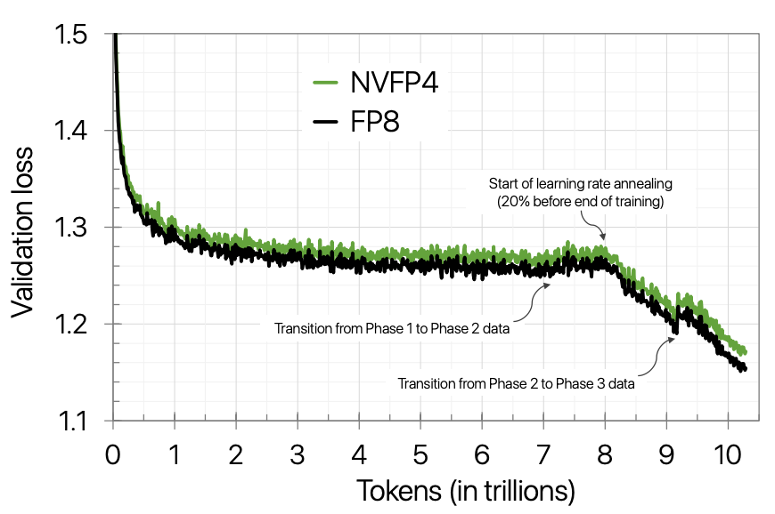
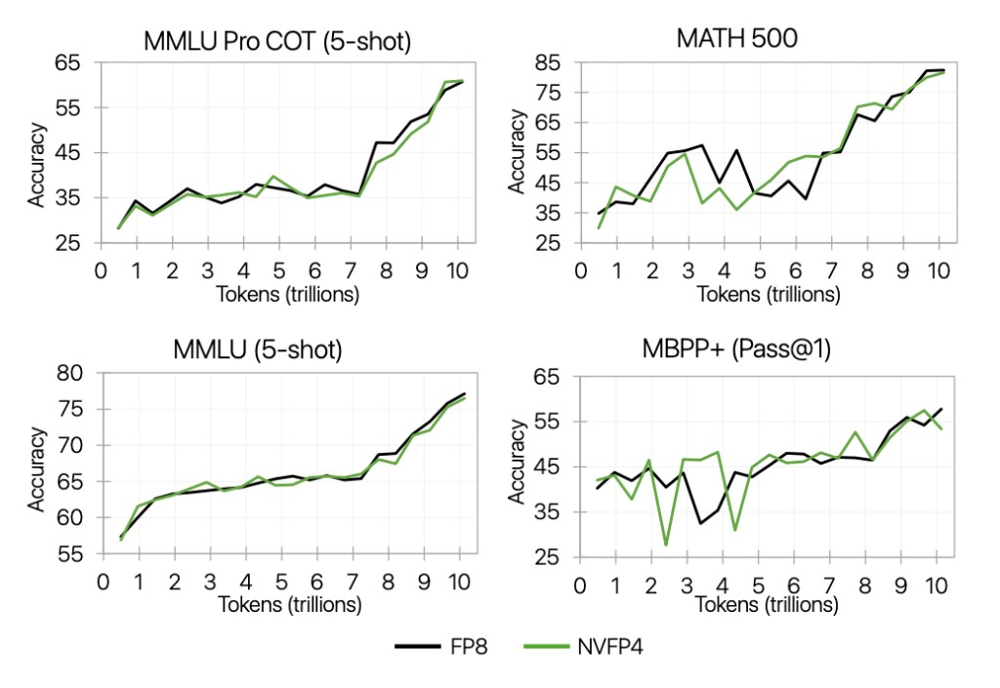
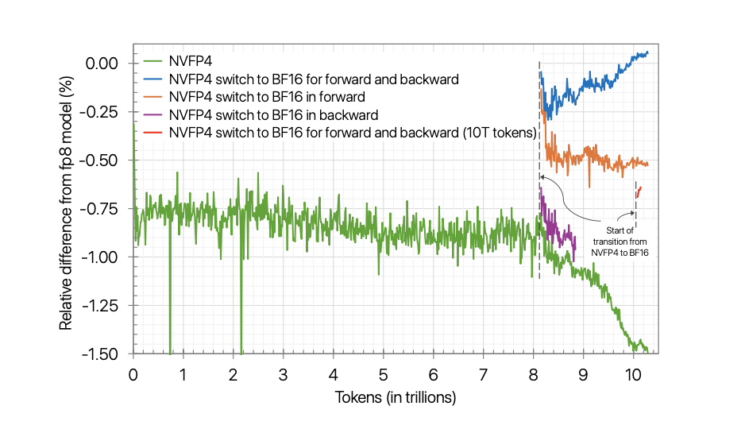
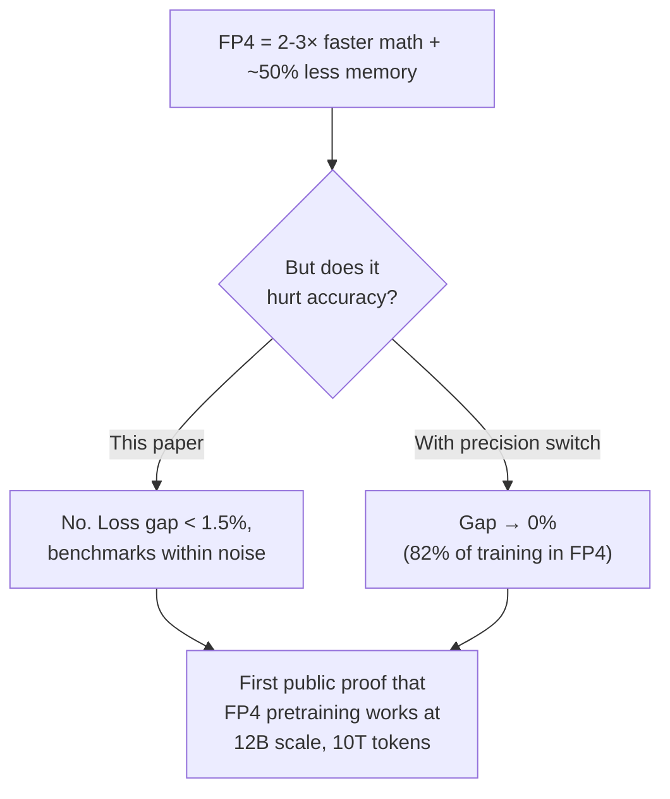

# Section 3: Training with NVFP4 (Results)

> **Paper reference:** Section 3 (pages 4-5), Appendix A.1 (pages 14-15)

## What this section covers

This is the "show me the numbers" section. The authors train a 12B-parameter hybrid Mamba-Transformer on 10 trillion tokens using NVFP4 and compare everything against an FP8 baseline. The headline: NVFP4 matches FP8 on virtually every benchmark.

---

## The experimental setup

### Model: Nemotron-H 12B

```
Architecture: Hybrid Mamba-Transformer (Nemotron-H family)

62 blocks total:
  ├── 6  × Self-Attention blocks
  ├── 28 × FFN blocks (Squared ReLU activation)
  └── 28 × Mamba-2 blocks

Each block has 2 linear layers → 124 linear layers total

Hidden dim: 5120    FFN dim: 20480    Sequence length: 8192
```

This is a strong production-quality model (Nemotron-Nano-12B-v2-Base), not a toy experiment. The choice of a hybrid architecture also shows the techniques generalize beyond pure Transformers.

### Training details

| Parameter | Value |
|-----------|-------|
| Tokens | 10 trillion |
| Batch size | 736 |
| Sequence length | 8192 |
| Learning rate | 4.5 × 10⁻⁴ (constant for 80%, decays to 4.5 × 10⁻⁶ over last 20%) |
| LR schedule | Warmup-Stable-Decay (WSD) |
| Optimizer | Adam (β₁=0.9, β₂=0.95) |
| Weight decay | 0.1 |

### Dataset

A 3-phase data blend of 10T tokens:
- **Phase 1 (70%):** Diverse mix -- web crawl, Wikipedia, math, code, academic, multilingual
- **Phase 2 (20%):** Higher-quality data
- **Phase 3 (10%):** Highest-quality data

This phased approach (from NVIDIA's earlier work) progressively shifts toward quality. The data blend changes cause visible artifacts in the loss curve.

### What's in FP4 vs what's not

```
NVFP4 precision:
  ├── 104 linear layers (84%) → NVFP4
  └── 20 linear layers (16%) → BF16
       ├── First 2 blocks (4 linear layers)
       └── Last 8 blocks (16 linear layers)

FP8 baseline:
  ├── All linear layers → E4M3
  └── Except first 1 block + last 2 blocks → BF16
```

Both methods keep a small fraction in higher precision. NVFP4 keeps more (16% vs ~5%) because FP4 is more aggressive. Section 4.1 explains why these specific layers need protection.

---

## Result 1: Validation loss tracks FP8 closely

The loss curves (Figure 2 in the paper) show NVFP4 tracking FP8 throughout 10T tokens:



> Green = NVFP4, Black = FP8. The two curves nearly overlap. Note the annotations: LR annealing starts at ~8T, data phase transitions at ~7T and ~9T.

Key observations:

- **During stable phase (0-8T):** relative loss error consistently **below 1%**
- **During LR decay (8T-10T):** gap widens to **~1.5%**. This is expected -- as the learning rate shrinks, the model can't correct for accumulated FP4 quantization errors as effectively
- **Loss jump at ~9T:** not a bug -- it's from switching to Phase 3 data blend. Both FP8 and NVFP4 show it
- **Loss curve slope change at ~8T:** from the learning rate starting to decay

### Why the gap widens during decay

During stable-phase training (high learning rate), gradient updates are large enough to overcome small quantization errors. During decay, updates shrink and quantization noise becomes relatively more significant. The paper later shows (Appendix D) this gap can be closed by switching to BF16 for the final ~18% of training.

---

## Result 2: Downstream benchmarks match

The paper also tracks four benchmarks throughout training (Figure 3). NVFP4 and FP8 track each other on MMLU-Pro, MMLU, MATH 500, and MBPP+:



> Green = NVFP4, Black = FP8. All four tasks track closely throughout. MBPP+ (bottom-right) is the noisiest -- both curves oscillate, making final-checkpoint comparisons unreliable.

Despite the small loss gap, actual benchmark performance is nearly identical:

```
                          FP8      NVFP4     Gap
                         ─────    ─────    ──────
 Knowledge & Reasoning
   MMLU (5-shot)         77.36    76.57    -0.79
   MMLU-Pro (5-shot)     62.62    62.58    -0.04  ← virtually identical
   AGIEval English CoT   67.01    70.31    +3.30  ← NVFP4 wins

 Math
   GSM8k CoT             89.08    92.27    +3.19  ← NVFP4 wins
   MATH 500              83.32    81.48    -1.84

 Code
   HumanEval+            59.93    57.43    -2.50
   MBPP+                 59.11    55.91    -3.20  ← worst gap

 Commonsense
   ARC Challenge         91.81    91.81     0.00  ← exact match
   HellaSwag             83.83    83.09    -0.74
   PIQA                  82.64    82.70    +0.06
   Winogrande            80.58    78.77    -1.81

 Multilingual
   Global MMLU           74.00    74.94    +0.94
   MGSM                  81.87    85.53    +3.66  ← NVFP4 wins
```

### Reading the results

- **Most benchmarks are within noise** (~1-2 points). Some NVFP4 wins, some FP8 wins.
- **Code tasks** are the only consistent weakness for NVFP4 (-2.5 to -3.2 points). The paper suspects this is evaluation noise -- MBPP+ accuracy drops on the very final checkpoint, and picking a different checkpoint might close the gap.
- **Several tasks NVFP4 actually wins on** (AGIEval, GSM8k, MGSM). This isn't because FP4 is better -- it's within the noise band of evaluation variance.
- **All evaluations run in BF16** -- meaning both models are compared by loading their trained weights and running inference at high precision. The FP4 is only during training.

---

## The "switch to higher precision" trick (Appendix D)

If even the ~1.5% loss gap matters, the paper shows you can close it by switching precision late in training (Figure 7):



> Green = NVFP4 all the way (~1.5% gap). Blue = switch fwd+bwd to BF16 at 8.2T (fully closes gap). Orange = switch fwd only (mostly closes gap). Purple = switch bwd only (little effect). Red = late switch at 10T.

- Switching **forward pass only** to BF16 at 8.2T recovers most of the gap (1.5% → 0.5%)
- Switching **both forward and backward** at 8.2T fully closes the gap
- Switching very late (at 10T, for just ~1% of training) still helps noticeably
- Most of the loss gap comes from **forward pass quantization** (not backward)

This means in practice you can do ~82% of training in FP4 (getting the speed benefit) and switch to higher precision for the final decay phase to recover full accuracy.

---

## Why these results matter



Prior to this paper, FP4 training had only been shown on small models or short training runs. The 10T token horizon is important because quantization errors can accumulate over time -- stability at 100B tokens doesn't guarantee stability at 10T tokens. This is the first evidence it works at production scale.

---

## Key takeaways

1. **NVFP4 tracks FP8 within ~1% loss** for 80% of training, widening to ~1.5% during learning rate decay
2. **Downstream benchmarks are within noise** -- no consistent quality degradation except mild weakness on code tasks
3. **The loss gap can be fully closed** by switching to BF16 for the final ~18% of training (forward pass is enough)
4. **10T tokens is the longest FP4 training run ever published** -- stability over long horizons was the open question, and this answers it

---

*Previous: [Section 2 -- NVFP4 Format](section_2_nvfp4_format.md)*
*Next: [Section 4 -- Training Methodology](section_4_training_methodology.md)* -- the core technical contribution: the four techniques that make this work.
