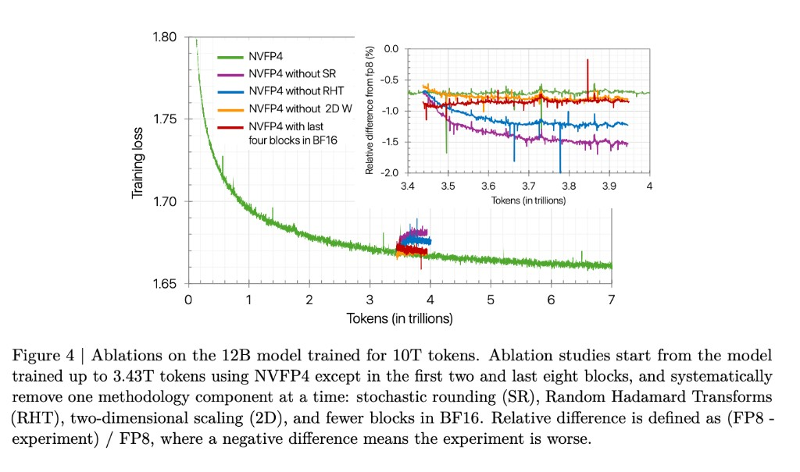
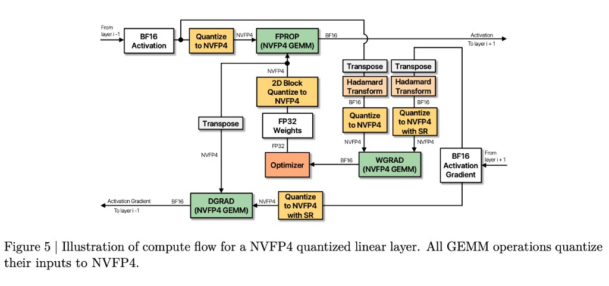
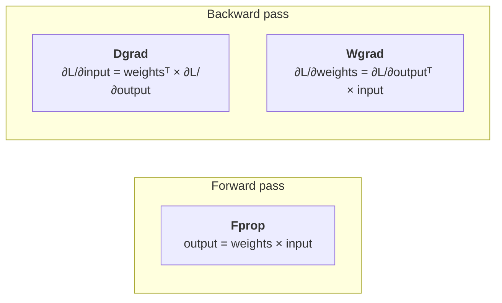
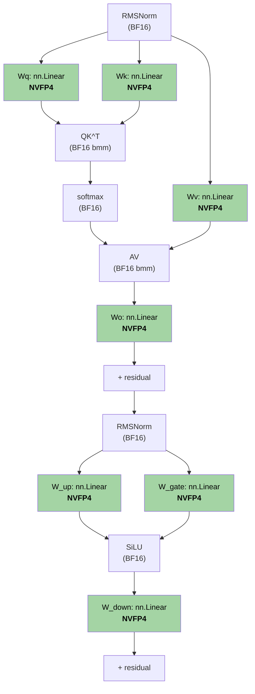
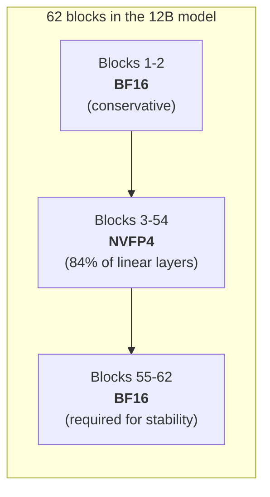

# Section 4: Training Methodology

> **Paper reference:** Section 4 (pages 5-9), Appendix C (page 17), Appendix E (pages 18-22)

## What this section covers

This is the core contribution of the paper. FP4 training doesn't work out of the box -- naive quantization of all tensors to 4 bits causes divergence. The authors introduce four techniques that together make it stable. Each technique addresses a specific failure mode:

| Technique | Failure mode it fixes |
|-----------|----------------------|
| 4.1 Mixed precision | Some layers need more dynamic range than FP4 provides |
| 4.2 Random Hadamard Transforms | Outliers dominate block scaling, crushing other values |
| 4.3 2D block scaling | Forward and backward see different quantized weights (breaks chain rule) |
| 4.4 Stochastic rounding | Deterministic rounding creates systematic bias in gradients |

The ablation study (Figure 4) proves each one matters -- removing any single technique degrades the 12B model:



> Green = full NVFP4 method. Each other color removes one technique: purple = no stochastic rounding, blue = no Hadamard, orange = no 2D weight scaling, red = fewer BF16 blocks. The inset (right) shows relative difference from FP8 -- every ablation is worse than the full method.

And here's the full compute flow for one NVFP4 linear layer (Figure 5):



> Shows the three GEMMs (Fprop, Dgrad, Wgrad) with all quantization, transform, and transpose steps. Note: 2D block quantization only on weights (green), Hadamard transforms only on Wgrad inputs (yellow), stochastic rounding (SR) only on gradient quantization (orange).

---

## 4.1 Mixed Precision: Keep sensitive layers in BF16

You already know mixed precision training -- using lower precision for speed while keeping master weights in FP32. This section is about *which layers* can tolerate FP4 and which can't.

There are two **independent** decisions hiding inside that question, and it's easy to confuse them:

| Decision | Question | Granularity |
|---|---|---|
| **(a) What kind of *op*?** | Which operations run as NVFP4 GEMMs vs. stay BF16/FP32? | Op type |
| **(b) Which *blocks*?** | Among FP4-eligible `nn.Linear` modules, which ones actually get swapped vs. held back? | Per-block in the model |

(a) is fixed by the recipe: only `nn.Linear` GEMMs are FP4-eligible; everything else (embeddings, lm_head, norms, softmax, activations, attention's internal batched matmuls) stays BF16. (b) is a knob: even among FP4-eligible `nn.Linear`s, the first few and last few blocks of the model are kept in BF16 because they're too sensitive.

We'll cover (a) at the op level, then walk through every module of a standard Transformer block to show exactly which `nn.Linear`s are eligible. Then (b): which blocks stay BF16 entirely.

### Decision (a): Which OPS run in FP4

Only the **GEMM operations inside linear layers** are computed in FP4. Each linear layer has three GEMMs:



These three GEMMs are the workhorses -- they consume FP4 inputs and produce BF16/FP32 outputs. Everything else keeps its original precision:

- **Token embeddings (`nn.Embedding`)** → BF16. Lookup, not a GEMM.
- **LM head / output projection to vocab** → BF16. Even though it's literally `nn.Linear`, it produces vocab-scale logits feeding directly into the loss, so the paper keeps it in BF16.
- **Normalization layers (RMSNorm, LayerNorm)** → BF16/FP32. Reduction op, not a GEMM.
- **Non-linearities (Squared ReLU, GELU, SiLU)** → BF16. Element-wise.
- **Attention internals (softmax, QK^T scores, AV output)** → BF16. *See gotcha below.*
- **Master weights and optimizer states** → FP32.
- **Weight gradient accumulators** → FP32.
- **Tensor-parallel reductions** → BF16.

> **Subtle but critical:** the **QK^T and AV matmuls inside attention** are NOT `nn.Linear` modules -- they are batched matmuls (`bmm` / `einsum`) over the already-projected Q, K, V activation tensors. They stay BF16. The four `nn.Linear` modules *surrounding* attention -- `Wq`, `Wk`, `Wv`, `Wo` -- DO get NVFP4'd.
>
> If you swap modules by `isinstance(mod, nn.Linear)`, you get this right automatically. If you've hand-written attention with custom matmuls (e.g. via `torch.matmul` on per-head tensors), be careful not to FP4 the QK^T or AV ops.

### Decision (a) applied to a standard Transformer block

Here's the per-module breakdown for one block of a typical decoder-only Transformer (Llama-style, with SwiGLU FFN). Green = FP4-eligible (`nn.Linear`); white = BF16:



The complete checklist for a standard Transformer:

| Module | What it is | Replace with NVFP4? | Why / why not |
|---|---|---|---|
| Token embedding (`nn.Embedding`) | Lookup table | **No** | Not `nn.Linear`; gather, not GEMM |
| Pre-attention RMSNorm | Reduce + scale | **No** | Not a GEMM |
| `Wq` (Q projection) | `nn.Linear` | **Yes** | Matmul, robust to FP4 |
| `Wk` (K projection) | `nn.Linear` | **Yes** | Matmul, robust to FP4 |
| `Wv` (V projection) | `nn.Linear` | **Yes** | Matmul, robust to FP4 |
| QK^T scores | Batched matmul | **No** | Inside attention, not `nn.Linear` |
| `softmax` | Element-wise normalize | **No** | Numerically sensitive |
| AV output | Batched matmul | **No** | Inside attention, not `nn.Linear` |
| `Wo` (attention output projection) | `nn.Linear` | **Yes** | Matmul, robust to FP4 |
| Pre-FFN RMSNorm | Reduce + scale | **No** | Not a GEMM |
| `W_up` (FFN input projection) | `nn.Linear` | **Yes** | Largest matmul in the block |
| `W_gate` (FFN gate, GLU variants) | `nn.Linear` | **Yes** | Largest matmul in the block |
| Activation (SiLU/GELU/Squared ReLU) | Element-wise | **No** | Not a GEMM |
| `W_down` (FFN output projection) | `nn.Linear` | **Yes** | Largest matmul in the block |
| Final RMSNorm (post-blocks) | Reduce + scale | **No** | Not a GEMM |
| `lm_head` (logits projection) | `nn.Linear` | **No** | Output-sensitive; vocab-scale logits feed the loss |

So in a standard SwiGLU Transformer block, **7 `nn.Linear` modules** (`Wq`, `Wk`, `Wv`, `Wo`, `W_up`, `W_gate`, `W_down`) are FP4-eligible -- but only if the block as a whole isn't held back by decision (b). Variants:

- **Fused QKV** (one `nn.Linear` producing concatenated Q, K, V): counts as one FP4-eligible module instead of three.
- **Plain (non-GLU) FFN**: drop `W_gate`; just `W_up` and `W_down`.
- **Tied embeddings** (`lm_head` shares weights with the embedding): the tied tensor stays BF16 since both endpoints are BF16.
- **MoE blocks**: each expert's three FFN linears are FP4-eligible the same way. The router (`nn.Linear` mapping hidden → n_experts) is technically eligible, but it's tiny -- common practice is to keep it in BF16 since the FP4 win is negligible at small sizes. The paper's model isn't MoE.
- **Hybrid Mamba/Attention blocks** (like the paper's Nemotron-H 12B): same rule applies block by block. Mamba2 blocks have input/output `nn.Linear`s that go NVFP4; the SSM scan itself stays BF16 (it's a structured recurrence, not a GEMM).

### Decision (b): Which BLOCKS keep ALL their `nn.Linear`s in BF16

Even among FP4-eligible `nn.Linear` modules, the paper finds **the first few and last few blocks cause divergence** when quantized to FP4. From the ablation (Appendix E.2):

- All layers in FP4 → **diverges**
- Last 1 block in BF16 → **diverges**
- Last 2 blocks in BF16 → **diverges**
- Last 4 blocks in BF16 → **stable**
- First 4 blocks in BF16 (last still in FP4) → **diverges**

The pattern is clear: sensitivity is concentrated at the **end** of the network. The paper observes that final layers have **larger quantization errors in weight gradients** -- they need more dynamic range and mantissa precision than FP4 can provide. The first-block guard is more of a belt-and-suspenders move; the late-block guard is the load-bearing one.

For the 12B model, they conservatively keep the **first 2 + last 8 blocks** in BF16 (≈16% of linear layers; 104 of 124 in FP4). Figure 4 shows that even just the last 4 blocks in BF16 works, so there's room to push more of the network to FP4 if you want to be aggressive.



### Putting (a) and (b) together: the swap recipe

A correct module-replacement predicate combines both decisions:

```python
import torch.nn as nn
import transformer_engine.pytorch as te

def should_use_nvfp4(name: str, mod: nn.Module, n_blocks: int,
                     bf16_first: int = 2, bf16_last: int = 8) -> bool:
    if not isinstance(mod, nn.Linear):
        return False                          # (a) not a GEMM
    if "lm_head" in name or "embed" in name:
        return False                          # (a) output/input projection -> BF16
    block_idx = parse_block_idx(name)         # e.g. "model.layers.5.mlp.up_proj" -> 5
    if block_idx is None:
        return False                          # not inside a transformer block -> BF16
    if block_idx < bf16_first:
        return False                          # (b) early-block guard
    if block_idx >= n_blocks - bf16_last:
        return False                          # (b) late-block guard (the load-bearing one)
    return True

for name, mod in list(model.named_modules()):
    if should_use_nvfp4(name, mod, n_blocks=62):
        replace_with(mod, te.Linear(mod.in_features, mod.out_features,
                                    bias=mod.bias is not None))
```

For production-grade variants of this predicate (size-based filters, regex patterns, MoE-aware selection, named-pattern guards, plus a Lightning plugin wrapping all of it) see [`guides/accelerated-computing/nvfp4-impl-ideas.md`](../guides/accelerated-computing/nvfp4-impl-ideas.md).

---

## 4.2 Random Hadamard Transforms

This is the technique that will be most new to you. Let's build it from the ground up.

### The problem: outliers wreck block quantization

Neural network tensors often have **outlier values** -- a few elements with much larger magnitude than the rest. When you quantize a block of 16 elements, the scale factor is set by the block's max absolute value. If one element is 10× larger than the rest, the scale is dominated by that outlier, and the other 15 values get crushed into a tiny part of the FP4 range.

```
Block: [0.1, 0.2, 0.15, 0.3, 0.1, ..., 0.2, 50.0]
                                              ^^^^^ outlier

Scale set by 50.0 → other values (0.1 to 0.3) mapped to
near-zero in FP4 → effectively lost
```

### The idea: spread the outlier across all elements

What if you could take that one big value and redistribute its energy evenly across the whole block? Instead of `[small, small, ..., HUGE]`, you'd get `[medium, medium, ..., medium]` -- a much more uniform distribution that quantizes well.

This is exactly what a **Hadamard transform** does. It's a specific orthogonal rotation that mixes all elements together.

### What is a Hadamard matrix?

A Hadamard matrix is a square matrix where every entry is +1 or -1 (normalized by 1/√n), and all rows are orthogonal to each other. The simplest one:

```
H₂ = (1/√2) × [ +1  +1 ]
                [ +1  -1 ]
```

Larger Hadamard matrices are built recursively using the Kronecker product:

```
H₄ = (1/√2) × H₂ ⊗ H₂ = (1/2) × [ +1  +1  +1  +1 ]
                                    [ +1  -1  +1  -1 ]
                                    [ +1  +1  -1  -1 ]
                                    [ +1  -1  -1  +1 ]
```

### Why Hadamard transforms help: a concrete example

```python
import numpy as np

x = np.array([0.1, 0.2, 50.0, 0.3])

H4 = 0.5 * np.array([
    [+1, +1, +1, +1],
    [+1, -1, +1, -1],
    [+1, +1, -1, -1],
    [+1, -1, -1, +1],
])

x_transformed = x @ H4
# x_transformed ≈ [25.3, -24.7, 24.9, -25.1]
```

Before transform: one value (50.0) dominates, three values are tiny.
After transform: all four values have similar magnitude (~25). The outlier energy is spread evenly.

This transformed version quantizes much better -- all values use the full FP4 range instead of just one value hogging it.

### Why it doesn't break the math: orthogonality

The key property is that `H × Hᵀ = I` (Hadamard matrices are orthogonal). So if you transform both operands of a matrix multiply, the transforms cancel:

```
C = A × B
  = (A × H) × (Hᵀ × B)     ← insert H × Hᵀ = I in the middle
  = A_transformed × B_transformed
```

The result is identical. You're just rotating the inputs into a space where they quantize better, and the rotation undoes itself in the dot product.

### The "Random" part

Plain Hadamard transforms work, but tensors can have "structured" patterns that align with the Hadamard basis and survive the transform. To prevent this, you multiply by a **random diagonal sign matrix** first:

```
Random Hadamard Transform = S × H

where S = diagonal matrix with random ±1 entries
```

This randomly flips the sign of rows/columns before the Hadamard rotation, making it much harder for any structured pattern to survive. The paper uses a **single fixed random seed** shared across all layers for the entire training run -- there's no benefit from more randomness (Appendix E.4.3).

### Which GEMMs get the transform?

This is where it gets subtle. The paper only applies Hadamard transforms to **Wgrad inputs** (not Fprop or Dgrad):

```
Fprop:  output = W × x              → NO transform
Dgrad:  ∂L/∂x = Wᵀ × ∂L/∂y         → NO transform
Wgrad:  ∂L/∂W = (∂L/∂y)ᵀ × x       → YES, transform both inputs
```

**Why not Fprop and Dgrad?** Because of the 2D scaling constraint (Section 4.3). Hadamard transforms along the dot-product dimension would create different quantized representations for weights in forward vs backward, violating the chain rule. Since weights must stay consistent, transforms can only be applied to GEMMs where the weight tensor isn't an input -- that's Wgrad (which takes activations and gradients as inputs).

The ablation (Appendix E.4.1) confirms: applying RHT to Fprop or Dgrad actually *hurts* the 1.2B model.

### Matrix size: 16×16 is the sweet spot

The transform is applied in tiles -- every 16×16 block of the tensor is multiplied by a 16×16 Hadamard matrix. Larger matrices spread outliers more, but cost more compute:

- **4×4:** Too small for the 12B model -- outliers not sufficiently spread (Appendix E.4.2)
- **16×16:** Good convergence, moderate cost
- **128×128:** Marginal improvement over 16×16, higher cost

At the 1.2B scale, matrix size doesn't matter. At 12B, it does -- because larger models have more outliers. The paper chooses 16×16 as the best tradeoff.

---

## 4.3 Two-Dimensional (2D) Block Scaling

### The problem: the chain rule breaks

This is a subtle but important issue. During training:

- **Forward pass:** weights are quantized along **rows** (the dot-product dimension for `W × x`)
- **Backward pass:** weights are **transposed**, so the dot-product dimension is now **columns**

With standard 1D block scaling (1×16 blocks along the dot-product dimension), the same weight matrix gets **different scale factors** in forward vs backward. This means the quantized weight matrix is different in each pass:

```
Forward:  y = W_fprop × x        (W quantized along rows)
Backward: ∂x = W_bprop^T × ∂y   (W quantized along columns)

W_fprop ≠ W_bprop   ← different quantizations!
```

This is a chain rule violation. Backpropagation assumes it's differentiating the *same function* used in the forward pass. If the quantized weights differ, the gradient is wrong -- it's the gradient of a *different* function.

### The solution: 2D blocks

Instead of 1×16 blocks (a row of 16 elements sharing one scale), use **16×16 blocks** (a 16×16 patch sharing one scale). A 16×16 block is invariant to transposition -- the same block boundaries and the same scale factor apply whether you read the matrix by rows or by columns.

```
1D scaling (1×16):

Forward (rows):     [████████████████] ← block boundary
                    [████████████████]
Backward (cols):    [██] ← DIFFERENT block boundaries!
                    [██]
                    [██]
                    ...

2D scaling (16×16):

Forward (rows):     ┌────────────────┐
                    │                │ ← same block
                    │    16 × 16     │    regardless of
                    │                │    read direction
                    └────────────────┘
Backward (cols):    (same block, transposed = same block)
```

### The tradeoff

2D scaling has coarser granularity than 1D (one scale per 256 elements vs one per 16). This means slightly less precise scaling. But the benefit of consistent quantization outweighs the cost -- the ablation in Figure 4 confirms removing 2D weight scaling hurts convergence.

### What about activations?

Only **weights** use 2D scaling. Activations and gradients keep 1D scaling (1×16) because:

1. Finer-grained scaling improves quantization accuracy
2. Training is less sensitive to inconsistencies in activation tensors (Appendix E.5)
3. Weights can "adapt" to their quantized values over training steps; activations change every step

---

## 4.4 Stochastic Rounding

### The problem: deterministic rounding creates bias

When a value falls between two FP4-representable numbers, round-to-nearest-even (RNE) always picks the same direction. Over millions of gradient updates, this creates a **systematic bias** -- gradients are consistently pushed in one direction.

Consider a gradient value of 0.7 that needs to be quantized to FP4. The nearest FP4 values are 0.5 and 1.0:

```
Nearest-even rounding:
  0.7 → 0.5  (always, every step)
  Bias: -0.2 per step, accumulated over millions of steps

Stochastic rounding:
  0.7 → 1.0  with probability 40%  (distance 0.3 / 0.5)
  0.7 → 0.5  with probability 60%  (distance 0.2 / 0.5)
  Expected value: 0.4×1.0 + 0.6×0.5 = 0.70 (unbiased!)
```

### How stochastic rounding works

For a value `v` between two FP4 values `lo` and `hi`:

```
P(round to hi) = (v - lo) / (hi - lo)
P(round to lo) = (hi - v) / (hi - lo)
```

The closer `v` is to `hi`, the more likely it rounds up. On average, `E[round(v)] = v` -- it's an **unbiased estimator**.

```python
import numpy as np

def stochastic_round_to_fp4(value, fp4_values):
    """Round value to nearest FP4 with stochastic rounding."""
    lo = max(v for v in fp4_values if v <= value)
    hi = min(v for v in fp4_values if v >= value)
    if lo == hi:
        return lo
    prob_hi = (value - lo) / (hi - lo)
    return hi if np.random.random() < prob_hi else lo
```

### Which tensors get stochastic rounding?

This is critical -- stochastic rounding helps gradients but **hurts** other tensors:

| Tensor | Rounding | Why |
|--------|----------|-----|
| Weights | Round-to-nearest-even | SR adds noise that hurts forward pass accuracy |
| Activations | Round-to-nearest-even | Same reason -- SR increases quantization error |
| **Gradients** | **Stochastic rounding** | Removes systematic bias in gradient updates |

The ablation (Appendix E.3) is stark:
- SR on gradients → **stable convergence**
- SR on activations → **diverges**
- SR on weights → **diverges**

The paper explains: stochastic rounding introduces more quantization *error* than nearest rounding (higher variance). For the forward pass, you want minimum error. For gradients, you want minimum *bias* even at the cost of more variance, because bias accumulates while variance averages out.

### Hardware support

Blackwell GPUs have **native stochastic rounding** in their FP4 conversion instructions, so this doesn't need a software implementation. No performance penalty.

---

## Putting it all together

Here's how all four techniques interact in the compute flow for a single linear layer:

```mermaid
flowchart TB
    subgraph "Forward Pass (Fprop)"
        x["Input x<br/>(BF16)"] --> qx["Quantize x → NVFP4<br/>(1D scaling, RNE)"]
        w["Weights W<br/>(FP32)"] --> qw["Quantize W → NVFP4<br/>(<b>2D scaling</b>, RNE)"]
        qx --> gemm1["NVFP4 GEMM<br/>y = W × x"]
        qw --> gemm1
        gemm1 --> y["Output y (BF16)"]
    end

    subgraph "Backward: Dgrad"
        dy1["∂L/∂y<br/>(BF16)"] --> qdy1["Quantize ∂L/∂y → NVFP4<br/>(1D scaling, <b>SR</b>)"]
        qw2["W (same 2D-quantized)"] --> tpose["Transpose"]
        tpose --> gemm2["NVFP4 GEMM<br/>∂L/∂x = Wᵀ × ∂L/∂y"]
        qdy1 --> gemm2
        gemm2 --> dx["∂L/∂x (BF16)"]
    end

    subgraph "Backward: Wgrad"
        dy2["∂L/∂y<br/>(BF16)"] --> hdy["<b>Hadamard Transform</b>"]
        x2["Input x<br/>(saved from fwd)"] --> hx["<b>Hadamard Transform</b>"]
        hdy --> qdy2["Quantize → NVFP4<br/>(1D scaling, <b>SR</b>)"]
        hx --> qx2["Quantize → NVFP4<br/>(1D scaling, RNE)"]
        qdy2 --> gemm3["NVFP4 GEMM<br/>∂L/∂W = ∂L/∂yᵀ × x"]
        qx2 --> gemm3
        gemm3 --> dw["∂L/∂W (FP32) → Optimizer"]
    end
```



Summary of what applies where:

| | Fprop | Dgrad | Wgrad |
|---|---|---|---|
| **Hadamard transform** | No | No | **Yes** (both inputs) |
| **2D scaling** | **Yes** (weights) | **Yes** (same weights) | No (not on weights) |
| **Stochastic rounding** | No | **Yes** (gradients) | **Yes** (gradients) |
| **High-precision layers** | First 2 + last 8 blocks → BF16 | Same layers | Same layers |

---

## Key takeaways

1. **Mixed precision:** ~16% of layers (first 2 + last 8 blocks) stay in BF16. Final layers are most sensitive -- they need more dynamic range than FP4 provides.
2. **Random Hadamard Transforms:** Orthogonal rotation that spreads outliers evenly, applied only to Wgrad inputs. 16×16 tile size with a single fixed random seed.
3. **2D block scaling:** 16×16 scale blocks for weights ensure identical quantization in forward and backward, preserving the chain rule. Activations keep 1D scaling.
4. **Stochastic rounding:** Applied only to gradients. Removes systematic quantization bias at the cost of variance (which averages out). Native hardware support on Blackwell.
5. **All four are needed** -- removing any one degrades the 12B model's convergence (Figure 4).

---

*Previous: [Section 3 -- Training Results](section_3_training_results.md)*
*Next: [Section 5 -- NVFP4 vs MXFP4](section_5_nvfp4_vs_mxfp4.md)* -- head-to-head comparison of the two FP4 formats.
