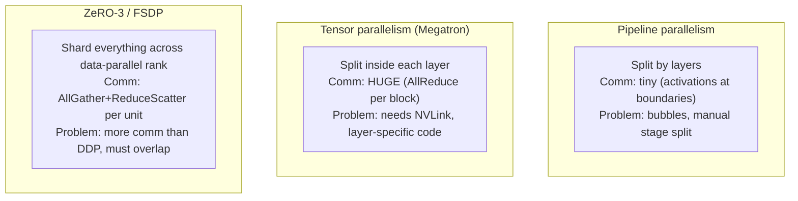

# Section 1: Introduction

> **Paper reference:** Section 1, pages 1–2

## What this section covers

The introduction sets up the *why* of FSDP:

1. **Models are outgrowing single GPUs.** GPT-3 has 175B parameters; modern recsys models exceed 1T. Plain data parallelism (DDP) requires the whole model to fit on one GPU, so it's a non-starter at this scale.
2. **The community has three established workarounds** -- pipeline parallelism, tensor parallelism, and ZeRO-style parameter sharding -- but each has frustrating limitations: they're either tied to specific model architectures (pipeline/tensor) or to fragile internals of the framework (ZeRO in DeepSpeed).
3. **The paper's pitch:** a *native* PyTorch solution co-designed with the Tensor system, dispatcher, and CUDA caching allocator. The result is **FSDP** -- Fully Sharded Data Parallel -- which shards parameters across ranks and re-materializes them on-demand for each layer.
4. **Four engineering challenges** drive the design: user experience, hardware heterogeneity, resource utilization, and memory planning. Each gets a corresponding technique that later sections will detail.

Per your knowledge questionnaire, you're solid on DDP and mixed precision, so I'll skip those. The bigger gaps -- ZeRO, pipeline/tensor parallelism, and the parameter-sharding family -- get a proper build-up below before we get to FSDP itself.

---

## Background you need: The memory problem at scale

Before motivating FSDP we need a concrete sense of *why* a 175B model can't fit on a single GPU even when each parameter is "only" a few bytes. This is the "familiar" optimizer-memory math you flagged -- here it is in one table.

### Per-parameter memory cost for an Adam-trained model in mixed precision

For each scalar parameter, training keeps the following:

| Item | Precision | Bytes/param |
|---|---|---|
| Parameter (low precision, used in fwd/bwd) | BF16 | 2 |
| Parameter (FP32 master copy, used in optimizer step) | FP32 | 4 |
| Gradient (low precision after backward) | BF16 | 2 |
| Adam 1st moment `m` (FP32) | FP32 | 4 |
| Adam 2nd moment `v` (FP32) | FP32 | 4 |
| **Total per parameter** | | **16 bytes** |

So a 175B-parameter model needs **~2.8 TB** of state just to hold parameters/grads/optimizer (plus activations during forward, plus temporary buffers). An A100 has 80 GB. The ratio is ~35×.

DDP replicates *all of this* on every GPU. Even with 1000 GPUs in DDP mode, each one still needs to fit the full 2.8 TB. That's the wall this paper is trying to break.

### The "if only" idea

What if instead of replicating, we *split* the parameters/grads/optimizer state across GPUs and only briefly reconstitute the parts we need for computation? With 1000 GPUs, each one would hold ~2.8 GB of state -- now we have plenty of room for activations and we can train models orders of magnitude larger.

That "if only" is what both ZeRO and FSDP do, and it's the entire game.

> **Paper ref:** "DDP requires all model parameters, gradients, and optimizer states to fit in the memory of one GPU device... when training models with more than one billion parameters using a 40GB GPU device, DDP will likely encounter out-of-memory errors on each device." (Section 2.1, page 3)

---

## Background you need: The parallelism landscape

You marked pipeline parallelism, tensor parallelism, and ZeRO as "new". The intro name-drops all three as the prior art FSDP improves on. Here they are -- the punchline is that they all attack the same memory problem but in very different ways.

### Strategy A: Pipeline parallelism (split by *layers*)

Take a model with `L` layers. Partition the *layers* across `K` GPUs: GPU 0 gets layers 1–8, GPU 1 gets layers 9–16, etc. Each "stage" is a contiguous chunk of the model.

```
Pipeline parallelism with 4 stages, processing micro-batches m1..m4:

         GPU0 (stage 0)    GPU1 (stage 1)    GPU2 (stage 2)    GPU3 (stage 3)
time 1:  m1 fwd            -                 -                 -
time 2:  m2 fwd            m1 fwd            -                 -
time 3:  m3 fwd            m2 fwd            m1 fwd            -
time 4:  m4 fwd            m3 fwd            m2 fwd            m1 fwd          ← pipeline full
time 5:  m4 bwd            m4 fwd-cont       m3 fwd            m2 fwd
...                        (or m1 bwd in some schedules)
```

**Communication pattern:** between adjacent stages you send *activations* forward and *activation gradients* back. That's it. Bandwidth required per step is small (just one tensor at a stage boundary).

**Strengths:** small comm cost; great for very deep models.

**Weaknesses:**
- **Pipeline bubbles** -- at the beginning and end of every step, only some stages are doing useful work (see times 1, 2, 3 above). Schedulers like GPipe, PipeDream, 1F1B try to minimize this.
- **Architecture-coupled.** You have to manually decide which layers go on which stage, and getting the split right (so stages have similar compute time) requires careful tuning. Doesn't work for arbitrary model topologies.
- **Doesn't help if a single layer doesn't fit on a GPU.** Pipeline only splits *across* layers, not *within* them.

### Strategy B: Tensor parallelism (split by *neurons inside a layer*)

Tensor parallelism (Megatron-LM style) shards the *individual weight matrices* of a single layer. Take a linear layer `Y = X W` where `W ∈ ℝ^{d × 4d}`. Split `W` column-wise into chunks `W_1, ..., W_K` across `K` GPUs:

```
Forward:
  GPU_i holds W_i  (a d × 4d/K slice of W)
  Each GPU computes its slice:   Y_i = X W_i        ← X is replicated
  Concatenate along feature dim: Y = [Y_1, Y_2, ..., Y_K]  ← via AllGather
```

For transformers, the standard pattern is:
- column-parallel linear → activation → row-parallel linear → AllReduce
- so one transformer block has *two collective communications per forward pass* (one AllReduce in attention, one in MLP), plus the same in backward.

**Strengths:** very fine-grained; can shard a single huge linear layer (e.g. the `4d → d` MLP-out layer of a 175B model).

**Weaknesses:**
- **Very high bandwidth requirements.** AllReduce on every block means tensor parallelism is essentially impossible across hosts (network too slow). You need NVLink within a node, which caps tensor parallelism at the number of GPUs per node (typically 8).
- **Architecture-coupled.** The implementation depends intimately on the *shape* of each layer (linear vs attention vs LayerNorm). Adding a new layer type means writing new sharding code.
- **Activation communication is on the critical path.** Each AllReduce blocks the next computation step.

### Strategy C: ZeRO-style parameter sharding (split parameters across the *data-parallel* axis)

Now the one FSDP is directly inspired by. ZeRO comes from DeepSpeed (Rajbhandari et al. 2020) and has three "stages":

```
ZeRO stages, for a model trained with N data-parallel ranks:

  Stage 1 (ZeRO-1):   shard the OPTIMIZER STATES.
                      Parameters and gradients stay replicated.
                      Memory saving: only m, v (Adam) split → big chunk of total.

  Stage 2 (ZeRO-2):   shard optimizer states AND GRADIENTS.
                      Parameters still replicated.
                      Each rank only stores its 1/N slice of gradients after
                      the gradient-reduction step.

  Stage 3 (ZeRO-3):   shard optimizer states, gradients, AND PARAMETERS.
                      Each rank only holds 1/N of the parameters.
                      Need to AllGather params on-demand for forward/backward.
```

ZeRO-3 is the interesting one for this paper, because **FSDP is essentially ZeRO-3** (with significant design and implementation differences). The high-level loop for ZeRO-3:

```
For each forward pass:
  for each "unit" of the model (e.g. each transformer block):
    1. AllGather the parameters of this unit (currently sharded)
       → now every rank has the full parameter tensors for this unit
    2. Compute the forward pass for this unit (just like local training)
    3. Free the AllGathered copy → back to sharded
For each backward pass (in reverse order):
  for each unit:
    1. AllGather the parameters again (we freed them after forward)
    2. Compute the backward pass for this unit
    3. ReduceScatter the gradients → each rank only keeps its 1/N slice
    4. Free the AllGathered parameters
```

Two collectives per unit per iteration: AllGather (parameter restore) before compute, ReduceScatter (gradient sharding) after backward.

**Strengths:**
- Architecture-agnostic. Works for *any* model -- you just need to chunk it into "units" of whatever granularity you like (per-layer, per-block, whatever fits memory).
- Drop-in replacement for DDP -- the user-facing API can look almost identical.

**Weaknesses:**
- **More communication than DDP.** DDP only AllReduces gradients in backward. ZeRO-3 AllGathers parameters in *both* forward and backward, plus ReduceScatters gradients. Total comm volume is ~1.5× DDP.
- **Communication is on the critical path** unless you can overlap with compute. The bulk of FSDP's engineering effort goes into hiding this overhead.

### Putting it together



| Strategy | Splits across | Comm per step | Architecture-coupled? | Granularity |
|---|---|---|---|---|
| Pipeline | layers | small (activations) | yes, need stage def | coarse (layer groups) |
| Tensor | inside-layer weight matrices | huge (AllReduce/block) | yes, per-layer-type code | very fine |
| ZeRO-3 / FSDP | parameters across data-parallel ranks | ~1.5× DDP | no (works on any model) | tunable (per "unit") |

These are not mutually exclusive -- you can combine them ("3D parallelism" as in Megatron-DeepSpeed). FSDP focuses on making the ZeRO-3-style axis a first-class PyTorch citizen, and Section 7 will discuss how to compose it with the other two.

> **Paper ref:** "Pipeline parallelism partitions a model instance into stages... Tensor parallelism shards model parameters, conducts partial computation on individual devices and communicates activations at required layer boundaries. Zero-Redundancy parallelism shards parameters as well but communicates parameters on-demand to recover their unsharded form and executes the model as if it were replicated on every device." (Section 1, page 1, paragraph 2)

---

## Background you need: Collective communication primitives (quick refresher)

You marked the collectives as "familiar". Quick reminder of the four FSDP cares about, since they show up constantly from here on:

```
N ranks. Each rank starts with its own data block.

AllReduce(x_r → s):
  Every rank gets the SAME reduced (typically summed) result.
  Before:  rank0=x0, rank1=x1, rank2=x2, rank3=x3
  After:   every rank has s = x0+x1+x2+x3
  Cost (ring): 2(N-1)/N × volume of x.
  → DDP uses this for gradient averaging.

AllGather(x_r → [x_0,...,x_{N-1}]):
  Every rank ends up with the CONCATENATION of all ranks' data.
  Before:  rank0=x0, rank1=x1, rank2=x2, rank3=x3
  After:   every rank has [x0, x1, x2, x3]
  Cost (ring): (N-1)/N × N × per-rank input = (N-1) × per-rank input.
  → FSDP uses this to reconstruct full parameters from shards.

ReduceScatter(x_r → s_r):
  Reduces, then scatters: every rank gets a DIFFERENT slice of the
  reduced result.
  Before:  rank0=[a0,b0,c0,d0], rank1=[a1,b1,c1,d1], ...
  After:   rank0=a0+a1+a2+a3, rank1=b0+b1+b2+b3, ...
  Cost (ring): (N-1)/N × volume of one rank's input.
  → FSDP uses this to reduce gradients while leaving each rank with
    only its own shard.

Note: AllReduce ≡ ReduceScatter + AllGather.
      That equivalence is why FSDP's comm is ~1.5× DDP:
      DDP does one AllReduce per param ≈ 2× volume.
      FSDP does AllGather (fwd) + AllGather (bwd) + ReduceScatter (bwd) ≈ 3× volume.
```

Two facts to keep in mind for later sections:

1. **NCCL's AllGather and ReduceScatter want *evenly-sized* inputs per rank.** Uneven inputs fall back to slower implementations. FSDP's "FlatParameter" design (Section 3.2) exists largely to guarantee even shapes.
2. **Bigger collectives are more efficient than many small ones.** Per-collective launch overhead is ~tens of microseconds; below ~33M elements per collective, the overhead starts to dominate (Figure 2b in the paper). So coalescing many parameters into one collective is a real win.

---

## The paper's pitch (Section 1 of the paper proper)

With the background out of the way, the introduction itself becomes very compact. The paper argues:

### 1. The community needs a *native* large-model solution

Existing techniques fall into two camps:

- **Architecture-coupled** (pipeline, tensor parallelism) -- requires per-model engineering.
- **Framework-internals-coupled** (DeepSpeed ZeRO-3) -- tightly bound to PyTorch's internal tensor implementation. When PyTorch changes internals, ZeRO breaks. From the user's POV the API is also "off to the side" of standard PyTorch -- you have to learn DeepSpeed's abstractions.

The thesis: a solution **co-designed with the framework's core** -- Tensor system, dispatcher, CUDA caching allocator -- will be both more robust (won't break with framework updates) and more pleasant to use (same mental model as local training).

### 2. The FSDP algorithm in one paragraph

> "FSDP breaks down a model instance into smaller units and then flattens and shards all of the parameters within each unit. The sharded parameters are communicated and recovered on-demand before computations, and then they are immediately discarded afterwards." (page 1, end of paragraph 4)

That's it. Each "unit" -- you choose the granularity, typically one transformer block -- becomes the atomic thing that gets AllGathered, used, and freed. Peak memory is determined by **size of the sharded model + size of the largest single unit** rather than the full model.

### 3. The four engineering challenges (and previewed solutions)

The bulk of the intro is a four-bullet preview of why this is hard in practice. These map 1-to-1 to Section 3 of the paper:

| Challenge | Why it's hard | FSDP's answer | Where it's covered |
|---|---|---|---|
| **User Experience** | Large models can't be materialized on a single GPU to begin with -- so DDP's "construct, then wrap" pattern doesn't work. | **Deferred initialization** -- record init ops on a fake device, replay on real GPU one unit at a time. | §3.1, §4.1 |
| **Hardware Heterogeneity** | Datacenters have 8 GPUs/node on fast NVLink, and slower cross-host networks. A one-size-fits-all sharding factor wastes either bandwidth or memory. | **Configurable sharding factor F** -- full sharding (`F=W`), hybrid sharding (`1 < F < W`), or full replication (`F=1`). | §3.2 |
| **Resource Utilization** | The extra AllGather/ReduceScatter introduce serial communication that blocks compute → idle GPUs. | **Aggressive overlap + prefetching** -- separate CUDA streams; backward-prefetch the next AllGather; forward-prefetch for static graphs. | §3.3 |
| **Memory Planning** | PyTorch's caching allocator can cause `cudaMalloc` retries when CPU runs far ahead of GPU. | **Rate limiter** -- block the CPU thread to at most 2 inflight AllGathers. | §3.4 |

A quick note on the last two, since you flagged CUDA streams and the caching allocator as "new":

- **CUDA streams** are FIFO queues of GPU work. Kernels launched into different streams can execute concurrently if the hardware allows. PyTorch normally puts everything on a default "computation" stream; FSDP adds a separate "communication" stream for collectives so they can overlap with the default-stream compute. We'll explain this in detail in Section 3.3.
- **CUDA caching allocator** is PyTorch's middle layer between your code and CUDA. Instead of calling `cudaMalloc` every time you allocate a tensor (expensive), PyTorch grabs large chunks of memory upfront and parcels them out. When memory gets tight, this can fail and trigger a fallback `cudaMalloc` ("malloc retry"), which is slow. We'll explain this in detail in Section 3.4.

> **Paper ref:** "FSDP introduces deferred initialization... FSDP offers configurable sharding strategies... FSDP can squeeze out bubbles using an abundant set of tools to aggressively overlap communication with computation through operation reordering and parameter prefetching. Lastly, FSDP optimizes memory usage by prudently restricting the amount of blocks allocated for inflight unsharded parameters and suspending CPU execution if necessary." (Section 1, page 2, paragraph 6)

### 4. Headline results

The intro previews the evaluation (Section 5):

- Evaluated on up to **512 80GB A100 GPUs**.
- On small models (T5-611M, T5-2B): comparable to DDP.
- On models DDP cannot fit: FSDP works (T5-11B, GPT-175B, 768B-param DHEN recsys).
- **Near-linear scalability** in TFLOPS per GPU as you scale out.
- Achieves ~60% A100 hardware utilization on GPT-175B (~186 TFLOPS/GPU vs A100's 312 TFLOPS BF16 peak).

FSDP is **beta as of PyTorch 2.0** and is used by both industrial and research applications.

---

## What gets called what (terminology to fix now)

Two terms appear throughout the paper and they're easy to mix up:

- **FSDP** -- the technique / algorithm in the abstract.
- **`FullyShardedDataParallel`** -- the specific Python class in PyTorch that wraps a model and applies FSDP. (Sometimes shortened to `FSDP` in code -- when you see `model = FSDP(model)` in PyTorch examples, that's `FullyShardedDataParallel`.)
- **`fully_shard`** -- a newer functional API (no wrapper, just a hook installer) that does the same thing while preserving the original module structure.

Section 4 ("Implementation") will compare the two APIs. For the algorithmic discussion in Section 3, the distinction doesn't matter.

---

## Paper roadmap

| Section | What it covers | Why you'd care |
|---|---|---|
| **2** | Background on PyTorch's distributed training history (DDP, model partitioning, model sharding) | Frames the design space and the trade-offs between "communicate activations" vs "communicate parameters" |
| **3** | The FSDP algorithm: initialization, sharding strategies, comm optimizations, memory management | The conceptual core of the paper -- read this carefully |
| **4** | Implementation details: API design, FlatParameter, autograd integration, mixed precision | Lower-level mechanics; useful if you want to read/contribute to the code |
| **5** | Evaluation on T5-11B, GPT-175B, DHEN-768B, up to 512 A100s | The "does it actually work" section |
| **6** | Related work (ZeRO, MiCS, pipeline, Megatron, etc.) | Where FSDP sits in the literature |
| **7** | Composability with pipeline/tensor parallelism, and known limitations | Practical adoption guidance |

---

## Key takeaways from the introduction

1. **The fundamental problem** is that with a 175B model in Adam+mixed precision, you need ~2.8 TB just for state -- 35× a single A100. DDP replicates this; ZeRO-style sharding splits it.
2. **Three families of parallelism exist** -- pipeline (split by layer), tensor (split inside layer), ZeRO-style sharding (split parameters across data-parallel rank). Each has different communication patterns and trade-offs.
3. **FSDP is ZeRO-3 done natively in PyTorch.** Same algorithm at the highest level: shard parameters, AllGather on-demand, free after use, ReduceScatter gradients. But co-designed with PyTorch internals for robustness and UX.
4. **Four practical challenges** drive the rest of the paper: initialization of models that can't fit on one GPU, hardware heterogeneity (intra-node vs cross-node bandwidth), comm/compute overlap, and caching-allocator behavior under fast CPU threads. Each will get its own treatment in Section 3.

---

*Next: [Section 2 -- Background](section_2_background.md)* -- the paper walks through PyTorch's distributed-training history: DDP (which you know), Tensor RPC + pipeline (model partitioning), and the parameter-vs-activation communication trade-off that motivates FSDP's design choice.
