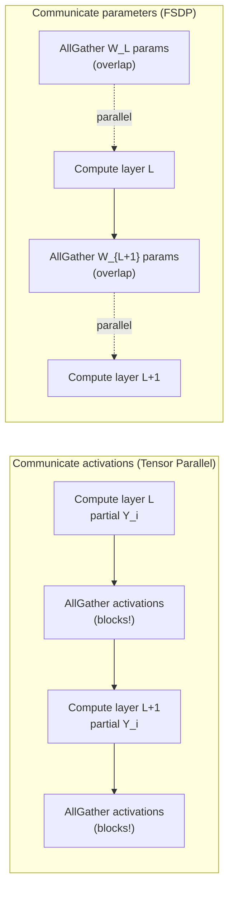

# Section 2: Background

> **Paper reference:** Section 2, pages 2–3

## What this section covers

Section 2 is short -- it sets up the design space for distributed training in PyTorch. The paper walks through three families in order of historical adoption:

1. **Model Replication** -- the DDP approach. Every GPU holds the whole model. (you marked solid)
2. **Model Partitioning** -- pipeline parallelism and Tensor RPC. Models split across GPUs by *layers* or by *arbitrary remote calls*. (we covered this lightly in §1)
3. **Model Sharding** -- the family FSDP belongs to. Two flavors: "communicate activations" vs "communicate parameters". This is the critical fork in the road that defines FSDP's character.

Since you're solid on DDP and have the high-level parallelism picture from §1, this section mostly exists to expose the **two sharding sub-strategies** -- because the paper's choice of "communicate parameters" is a foundational design decision that everything else builds on. We'll spend most of our time there.

---

## 2.1 Model Replication (DDP) -- a one-paragraph recap

The DDP recipe in the paper, condensed:

```
For each training step:
  1. Every rank has a full copy of the model.
  2. Each rank gets a different shard of the global batch.
  3. Forward pass: each rank computes its own loss on its batch shard.
  4. Backward pass: each rank computes its own gradients.
  5. AllReduce the gradients across ranks → every rank has identical
     averaged gradients.
  6. Optimizer step: every rank applies the same update, so model
     replicas stay in sync.

Key optimization (Li et al. 2020): the AllReduce in step 5 is
"bucketed" and overlapped with the still-running backward pass --
as soon as a layer's gradients are ready, fire the AllReduce while
earlier layers' gradients are still being computed.
```

The hard limit: **every rank must hold the entire model + grads + optimizer state.** §1 showed that's 16 bytes per param for an Adam+BF16 setup, so a 175B model needs ~2.8 TB on every GPU. Not happening.

> **Paper ref:** "DDP requires all model parameters, gradients, and optimizer states to fit in the memory of one GPU device." (page 3)

---

## 2.2 Model Partitioning -- splitting the *model* across devices

When the model doesn't fit on one device, the natural reaction is: cut it up. The paper distinguishes two PyTorch features in this camp:

### Pipeline parallelism

We covered the mechanics in §1 (split by layers; pass activations between stages; deal with bubbles via micro-batching). The paper's framing here is about *adoption friction* rather than algorithm:

- You must restructure the model into a sequence of stages -- this is invasive to model code.
- The number of stages, micro-batches, and scheduling discipline (1F1B, interleaved, etc.) all need careful tuning per model and per cluster.
- Not natively a *single-program multi-data (SPMD)* paradigm -- different ranks run different code. Many industrial training infrastructures only support SPMD.

### Tensor RPC

PyTorch ships a `torch.distributed.rpc` package that lets you execute arbitrary Python/Tensor operations on remote workers. It's lower-level than pipeline -- you literally write code like "compute layer 5 on rank 2, then send the result here". Powerful but:

- You're writing distributed code by hand.
- Not SPMD again (different ranks run different code).
- High barrier to entry.

The paper's point: **both partitioning approaches require nontrivial code changes from the user.** Even though they solve the memory problem, they don't scale as a developer experience.

> **Paper ref:** "they either limit the model to a sequence of stages or require modifications to the model authoring code to insert remote computations, which can pose a significant obstacle to users' adoption. Moreover, many industrial training infrastructures only support the single-program multi-data paradigm, which necessitates a simpler entry point to handle large models." (page 3)

---

## 2.3 Model Sharding -- the meaty bit

This is where we land. Sharding **also splits the model across devices, but differently from partitioning**: each rank holds a *slice* of every parameter tensor, rather than a full copy of a subset of layers.

```
Partitioning (pipeline):           Sharding (ZeRO-3 / FSDP):
  ┌─────────┐  ┌─────────┐         ┌─────────┐  ┌─────────┐
  │ layers  │  │ layers  │         │ part of │  │ part of │
  │  1..8   │  │  9..16  │         │ every   │  │ every   │
  │ (full)  │  │ (full)  │         │ layer   │  │ layer   │
  └─────────┘  └─────────┘         └─────────┘  └─────────┘
   rank 0       rank 1              rank 0       rank 1
```

After sharding, no rank has enough info to do a normal forward pass on its own -- each rank only has a *fraction* of every weight matrix. So we need extra communication. The paper identifies **two qualitatively different ways** to handle this. This is *the* design fork.

### Strategy 2.3.1: Communicate **activations** (keep params sharded forever)

Each rank computes only on its own slice of every parameter, producing only its own partial-result activation. To complete a layer's computation, ranks exchange activations.

```
Layer L:  Y = X @ W
  Sharded:  W = [W_0 | W_1 | W_2 | W_3]  (split column-wise across 4 ranks)

  Each rank computes Y_i = X @ W_i  (a slice of Y)
  Then AllGather Y_0..Y_3 along the feature dim → every rank has full Y.
```

Whether or not the AllGather is needed at every layer depends on how the next layer is sharded; standard Megatron-LM patterns do it twice per transformer block.

**Key property:** parameters are *never* fully materialized on any device. So this works even when a single weight matrix is too big to fit in GPU memory.

**Critical downside:** the activation communication is on the **critical path between layers.** Layer L's computation depends on the activation, which depends on layer L-1's output, which depends on its activation. You can't overlap this communication with the computation that produced it -- the data isn't ready yet.

This is the **tensor-parallelism family** -- Megatron-LM, GSPMD, etc.

> **Paper ref:** "Perform computations with parameter shards and communicate activations accordingly. With this approach, ranks never need to fully materialize any parameter. However, each communication will appear in the critical path as it is inserted between two consecutive and dependent computation operations." (page 3)

### Strategy 2.3.2: Communicate **parameters** (reconstruct, then compute, then free)

Before each layer runs, AllGather the parameter shards from all ranks → every rank now has the full unsharded parameter. Compute the layer normally (just like local training). Then *free* the unsharded copy.

```
Layer L:  Y = X @ W
  Sharded:  rank i holds W[i*chunk : (i+1)*chunk]   (one slice of W)

  Step 1: AllGather W shards → every rank has full W.
  Step 2: Compute Y = X @ W normally.
  Step 3: Free the unsharded W → each rank only keeps its shard.
```

**Key property:** the AllGather doesn't depend on the current layer's computation -- it only depends on knowing which parameters to fetch. So we can **issue the AllGather for layer L+1 in parallel with the compute of layer L**. The communication and computation overlap, hiding the comm cost.



**Critical downside:** the unsharded parameter must fit in a single GPU's memory. If a single weight matrix is 100 GB, this approach doesn't work -- you can't materialize it on one rank.

This is the **ZeRO-3 / FSDP family**.

> **Paper ref:** "Perform the same computation as local training by communicating parameter on-demand before computations. Since parameter communications do not have any data dependency on preceding computations, they can overlap with the preceding computations performed in the same forward or backward pass. However, this approach requires that the on-demand communicated parameters could be fully materialized and could fit in the memory of a single GPU device." (page 3)

### Why FSDP chose "communicate parameters"

The paper's claim is pragmatic: for the **vast majority of large models today**, the largest single weight matrix or transformer block easily fits in one GPU's memory, even if the *whole model* doesn't. So you don't need the activation-comm fallback. And in exchange for that mild constraint you get **overlap-able communication**, which is a much bigger win.

Specifically, for a 175B GPT-3:
- Hidden dim is 12288. A single linear layer is `12288 × 4*12288 = 12288 × 49152` weights.
- In BF16, that's `12288 × 49152 × 2 ≈ 1.2 GB`.
- An A100 80GB has *plenty* of room for that, plus activations, plus optimizer state for the local shard.

So the unit boundary "the unsharded thing fits on one GPU" is rarely binding. The paper notes that if it ever becomes binding, you can **combine both strategies** -- use FSDP for most layers and tensor parallelism for any too-big layer. Section 7.1.2 will revisit this.

### Comparison table

| Aspect | Communicate activations | Communicate parameters (FSDP) |
|---|---|---|
| What's sent | activation tensors | parameter shards |
| When | between dependent computations | before computation, in advance |
| Critical-path? | yes (blocks compute) | no (overlap with prior compute) |
| Per-rank peak param memory | one shard only (ideal) | one shard + one full unsharded unit |
| Works if single weight > GPU? | yes | no |
| Examples | Megatron-LM tensor parallel | ZeRO-3, FSDP |

---

## A subtler point: why "near local training"?

You'll see the paper say things like "FSDP executes the model **as if it were replicated on every device.**" This phrase is important and means something specific.

Within step 2 of the "communicate parameters" recipe -- "compute Y = X @ W normally" -- the math each rank does is *identical* to what a single-GPU run would do, because it has the full W and the full X for its data-parallel slice. So:

- Numerics are mostly identical to local training (ignoring small reordering effects from gradient reduction).
- Custom autograd functions, hooks, fancy ops, etc. all just work. No need to rewrite them.
- Debugging mostly works like local training -- you can attach pdb, print tensor shapes, etc.

Contrast with tensor parallelism, where each rank only sees a slice of W and can't do anything reasonable without communicating. The "FSDP = local training + extra collectives outside the compute" structure is the source of the user-experience advantage the paper is selling.

This will come back in §3 (autograd integration) and §7 (limitations) -- there are some computations where the sharding *does* leak through (e.g. optimizer steps that need global parameter norms), and the paper is honest about those edge cases.

---

## Key takeaways from Section 2

1. **PyTorch's distributed training history goes: DDP → model partitioning (pipeline/RPC) → model sharding.** Each step in the progression handles bigger models but introduces new complications.
2. **Sharding has two flavors.** The choice between "communicate activations" and "communicate parameters" defines whether your comm is on the critical path or can overlap with compute.
3. **FSDP chose the second flavor**, accepting the "unit must fit on one GPU" constraint in exchange for overlap-able communication.
4. **The unit-fits-on-one-GPU constraint is rarely binding** for today's transformer models; per-block sizes are well within an A100 80GB even at 175B scale.
5. The "execute as if replicated" property of communicate-parameters sharding is what gives FSDP its user-experience advantage -- model code looks like local training.

---

*Previous: [Section 1 -- Introduction](section_1_introduction.md)*
*Next: [Section 3 -- System Design](section_3_system_design.md)* -- the meat of the paper. Four subsections (Model Initialization, Sharding Strategies, Communication Optimizations, Memory Management) corresponding to the four engineering challenges from the intro. This is where FSDP's actual design decisions live.
