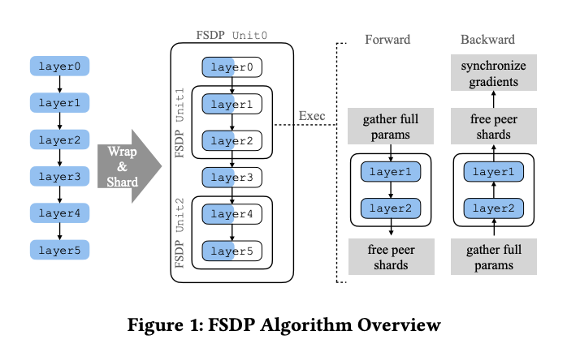
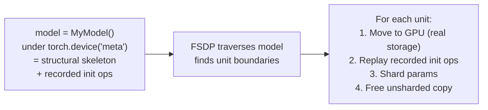
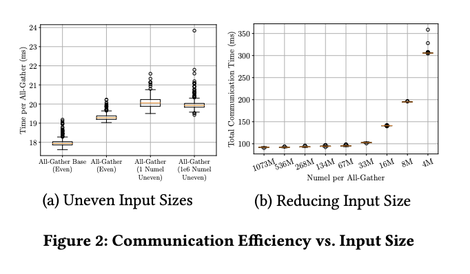
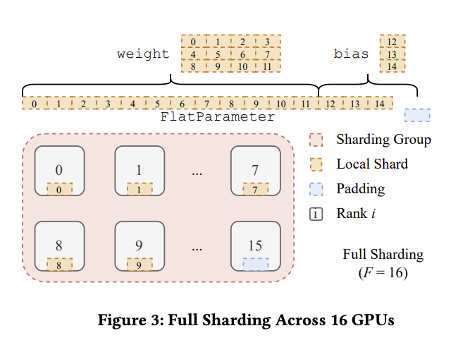
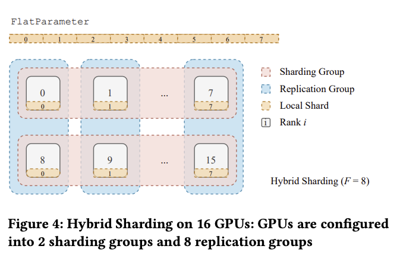
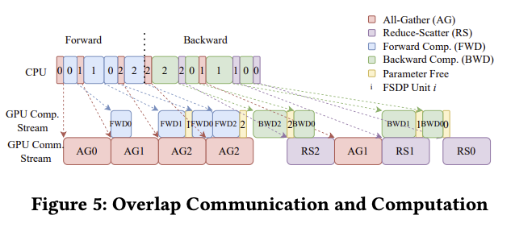

# Section 3: System Design

> **Paper reference:** Section 3, pages 3–7

## What this section covers

This is the conceptual core of the paper. The four challenges previewed in §1 each get a subsection here:

| Challenge | Subsection | Core idea |
|---|---|---|
| User experience (large models don't fit on one GPU even to *initialize*) | §3.1 | **Deferred initialization** -- record ops on a fake device, replay one unit at a time on real GPU |
| Hardware heterogeneity (intra-node vs cross-node bandwidth) | §3.2 | **Sharding factor F** -- full, hybrid, or replicated; map F to cluster topology |
| Resource utilization (extra collectives can serialize the timeline) | §3.3 | **Comm/compute overlap** via separate CUDA streams + backward/forward prefetching |
| Memory planning (CUDA caching allocator misbehaves under fast CPU threads) | §3.4 | **Rate limiter** -- cap inflight AllGathers at 2 |

We'll also build up two prerequisites you flagged as new:
- **CUDA streams** (built up in §3.3.1, where they actually do work)
- **CUDA caching allocator** (built up in §3.4, same)

But first: the algorithm overview.

---

## The FSDP algorithm in one diagram

Before drilling into subsections, the paper gives a single picture (Figure 1) showing FSDP's runtime behavior. Worth pinning down:

> 📌 Figure 1 in the paper (page 4) -- "FSDP Algorithm Overview". Clip into `artifacts/figure_1_algorithm_overview.png` when you get a chance.
>
> 

In words: take a 6-layer model. Decompose into 3 "FSDP units" -- `[layer0, layer3]`, `[layer1, layer2]`, `[layer4, layer5]`. Note this decomposition does **not** have to be contiguous; it's controlled by user-defined wrap policies. For each unit, FSDP:

1. Shards its parameters evenly across ranks.
2. **In forward pass**, for each unit in order:
   - AllGather the shards → reconstruct full parameters.
   - Compute the forward of that unit's layers locally.
   - Free the AllGathered copy → back to sharded.
3. **In backward pass**, in *reverse* order:
   - AllGather the shards (we freed them after forward).
   - Compute the backward of that unit.
   - ReduceScatter the gradients → each rank keeps its 1/N shard.
   - Free the AllGathered parameters.

```
Peak memory per rank:

  sharded model       full unsharded copy of
       +              the LARGEST single unit
   (always live)      (live only during that unit's compute)
```

That's the fundamental memory equation. Reducing peak comes down to either making the sharded portion smaller (more ranks) or making the largest unit smaller (finer-grained wrapping). The rest of §3 is about implementing this loop efficiently.

> **Paper ref:** "FSDP only materializes unsharded parameters and gradients of one unit at a time, and otherwise, it keeps parameters and gradients sharded. Throughout the training loop, the optimizer states are kept sharded. The memory requirements for FSDP are proportional to the size of the sharded model plus the size of the largest fully-materialized FSDP unit." (page 4)

---

## 3.1 Model Initialization (the "fake device" trick)

### The chicken-and-egg problem

Before FSDP exists, PyTorch wants you to do this:

```python
model = MyHuge175BModel()          # ← needs 350GB BF16 just for params
model = model.to('cuda')            # ← won't fit on one A100
model = FSDP(model)                 # ← too late, OOM already
```

The standard pattern assumes the model can be constructed on a single device first. For a 175B model, just the **parameter tensors at construction time** are 350 GB -- nowhere near a single GPU. So FSDP has to intervene *before* full materialization.

There are two challenges:

1. **How do you build a model instance without ever allocating its tensors?** You can't run the user's `__init__` code without *something* tensor-shaped to operate on.
2. **How do you preserve the user's custom initialization logic** (e.g. Xavier init, specific weight initialization for a layer) -- even though the model is too big to actually run that init on one GPU?

### Deferred initialization

The solution: a "fake device" (PyTorch term: meta device). When you create a tensor on the meta device:

```python
x = torch.empty(1000, 1000, device='meta')
# ← no actual memory allocated.
#   x has the right shape and dtype but no storage.
```

You can call any operation on a meta tensor -- the result is another meta tensor with the right shape/dtype but again no actual storage. The system **records the operations** as it goes (think: a trace).

Now consider:

```python
with torch.device('meta'):
    model = MyHuge175BModel()    # ← runs __init__ in fake mode
                                 #   every operation (nn.init.xavier_,
                                 #   randn_, etc.) is recorded.
# Now `model` exists structurally but has zero GPU memory.
```

When FSDP later wants to actually use a parameter, it:
1. Moves that parameter (or unit of parameters) from meta to a real GPU.
2. **Replays** the recorded ops to compute the correct initial values.
3. Immediately shards the result.
4. Frees the unsharded copy.



So peak memory during init becomes **sharded model + one unsharded unit** -- same as during training. The 175B model that can never be constructed on one GPU can be initialized this way on any cluster where 1/N of it (plus one transformer block) fits.

### Why this works (and when it doesn't)

The clever bit is that **each unit's initialization is usually self-contained.** A typical transformer block's `__init__` only references its own parameters -- it Xavier-inits its own Q/K/V matrices, etc. It doesn't reach into other blocks. So replaying its ops in isolation gives the correct result.

But there are edge cases: if block 5's init depends on a parameter from block 2 (rare but possible, e.g. tied weights), the recorded op might reference a tensor that's currently sharded and thus not fully available. The paper acknowledges this in §4.1 and offers two fallback options:
- **Initialize unsharded on GPU** (if the whole model happens to fit during init even though it won't during full training -- training adds grads/optimizer states/activations).
- **Initialize unsharded on CPU**, then stream to GPU unit by unit (CPU is slower but has more memory).

> **Paper ref:** "FSDP traverses the fake device model instance to decompose it into FSDP units, moves one unit to a GPU device at a time, and replays the recorded initialization operations for tensors in that FSDP unit." (page 4)

---

## 3.2 Sharding Strategies

### 3.2.1 Full Sharding: the FlatParameter design

This is the strategy that gives FSDP its name. Sharding factor `F = W` (the global world size) -- every parameter is split across every GPU.

The naive way to shard a parameter would be: take each `nn.Parameter` and split its tensor across ranks. The problem: most modules have *many* small parameters (weight, bias, LayerNorm scale/shift, ...), so you'd issue *one collective per parameter*. From the comm-efficiency data in Figure 2b, lots of small collectives is exactly what kills throughput -- below ~33M elements, launch overhead dominates.

> 📌 Figure 2 in the paper (page 4) -- "Communication Efficiency vs. Input Size" (subfigures a/b). Clip into `artifacts/figure_2_comm_efficiency.png`.
>
> 

#### The FlatParameter idea

FSDP coalesces all parameters within a unit into one **FlatParameter** -- a single 1D tensor that holds the concatenation of all the unit's parameters (with each one flattened to 1D first), padded to a multiple of the sharding factor:

```
Unit has 3 parameters, sharded across F=4 ranks:
  W1: shape (4, 3) → 12 elements
  W2: shape (5,)   → 5 elements
  W3: shape (2, 2) → 4 elements

Step 1 - flatten each:
  W1_flat = [w1_0 .. w1_11]   (12 elements)
  W2_flat = [w2_0 .. w2_4]    (5 elements)
  W3_flat = [w3_0 .. w3_3]    (4 elements)

Step 2 - concat:
  FlatParam = [w1_0..w1_11, w2_0..w2_4, w3_0..w3_3]   (21 elements)

Step 3 - pad right to multiple of F=4:
  21 mod 4 = 1, need 3 padding elements
  FlatParam = [...21 real..., pad, pad, pad]          (24 elements)

Step 4 - chunk evenly into F pieces:
  rank 0: elements 0..5     ← original W1 partial
  rank 1: elements 6..11    ← W1 partial + W2 start
  rank 2: elements 12..17   ← W2 + W3 start
  rank 3: elements 18..23   ← W3 tail + 3 pads
```

> 📌 Figure 3 in the paper (page 5) -- "Full Sharding Across 16 GPUs". Clip into `artifacts/figure_3_full_sharding.png`.
>
> 

This **flatten-concat-pad-chunk** algorithm has several nice properties:

| Property | Why it matters |
|---|---|
| **Original tensor shapes are arbitrary** | The same algorithm works for any model |
| **Padding is at most F-1 elements** | Negligible overhead |
| **Each shard has identical size** | NCCL's fast even-input AllGather Base path can be used |
| **Sharded and unsharded data layouts match what AllGather/ReduceScatter natively produce** | No extra copies before or after the collective |
| **Many small params become one big collective** | Avoids the small-collective overhead from Figure 2b |

#### The memory-throughput trade-off

Formally: for a model with `Ψ` total elements, split into N FlatParameters with sizes `ψ_1, ..., ψ_N` (so `Σ ψ_i = Ψ`), and sharding factor `F`:

```
Peak parameter memory per rank:
    Σ_i (ψ_i / F)        +        max_i ψ_i
    ─────────────                ──────────
    sharded model        unsharded copy of the
    (always present)     CURRENT live unit

    = Ψ/F + max_i ψ_i
```

Number of collectives per iteration: `O(N)` (one AllGather per unit in forward, one AllGather + one ReduceScatter per unit in backward).

So **smaller units → smaller max_i ψ_i → smaller peak memory**, but also more collectives, more launch overhead, and worse comm efficiency. **Larger units → fewer, more efficient collectives**, but higher peak memory. The user controls this knob by deciding how to wrap modules into FSDP units -- typically one unit per transformer block is the sweet spot.

> **Paper ref:** "Finer-grained FlatParameter construction decreases peak memory but may decrease throughput by requiring more collectives." (page 5)

### 3.2.2 Hybrid Sharding: matching the cluster topology

This subsection answers one question: **if GPUs inside a server are fast but GPUs across servers are slow, how should we shard?**

#### The problem in one sentence

Full sharding (`F = W`, from §3.2.1) splits every parameter across *all* GPUs. That is great for memory, but it forces large AllGather/ReduceScatter collectives to cross slow inter-host links on every layer. Hybrid sharding keeps the big collectives **inside each host** and only uses the slow network for a much smaller sync step.

#### Cluster topology (why this matters)

```
Within one host (8 GPUs):     NVLink / NVSwitch, ~600 GB/s GPU↔GPU, low latency
Across hosts:                 InfiniBand / RoCE, ~50–200 GB/s per node, higher latency
```

Intra-host bandwidth is often **10–30×** faster than cross-host. Any collective that spans all `W` ranks pays that penalty on every FSDP unit, every forward and backward pass.

#### Three points on the sharding spectrum

Recall **`F`** = number of ranks that jointly hold one sharded copy of the model (each rank stores `1/F` of each parameter).

| Setting | Name | What each GPU stores | Cross-host traffic |
|---|---|---|---|
| `F = 1` | Full replication (DDP) | Full copy of all params | High (grad AllReduce every step) |
| `F = G` (GPUs per host) | **Hybrid sharding** | `1/G` of params; full model replicated across hosts | Low |
| `F = W` | Full sharding | `1/W` of params; no replication | High (AllGather + ReduceScatter every step) |

Hybrid is the middle option: **shard within the fast island (one host), replicate across slow islands (hosts).**

> 📌 Figure 4 in the paper (page 5) -- "Hybrid Sharding on 16 GPUs". Clip into `artifacts/figure_4_hybrid_sharding.png`.
>
> 

#### Concrete example: 16 GPUs, 2 hosts, 8 GPUs each

Take the paper's Figure 4 setup:

```
W = 16 total GPUs
G = 8 GPUs per host
F = G = 8          ← shard within host, replicate across hosts

Host 0:  GPU 0  GPU 1  GPU 2  GPU 3  GPU 4  GPU 5  GPU 6  GPU 7
         └──────────────── one sharding group ────────────────────┘
         Together these 8 GPUs hold ONE full copy of the model,
         split 8 ways (each GPU owns 1/8 of every parameter).

Host 1:  GPU 8  GPU 9  GPU 10 GPU 11 GPU 12 GPU 13 GPU 14 GPU 15
         └──────────────── second sharding group ─────────────────┘
         Together these 8 GPUs hold a SECOND full copy of the model,
         also split 8 ways.
```

**What lives on each GPU?** Pick one weight matrix `W` with 800 elements:

```
Full sharding (F=16):  each of 16 GPUs stores 50 elements   (800/16)
Hybrid (F=8):          each of 16 GPUs stores 100 elements  (800/8)
Full replication:      each of 16 GPUs stores 800 elements
```

In hybrid mode, **GPU 0 and GPU 8 store the same 100-element shard** (same slice of `W`). GPU 0 and GPU 1 store *different* shards that complement each other on Host 0.

#### Two groupings of the same 16 GPUs

The same ranks participate in two different process groups, for two different jobs:

```
SHARDING GROUPS (size F=8)          REPLICATION GROUPS (size W/F=2)
"build one full model copy"         "sync the same shard across hosts"

  Host 0: [0,1,2,3,4,5,6,7]            [0, 8]   ← both hold shard 0
  Host 1: [8,9,10,11,12,13,14,15]      [1, 9]   ← both hold shard 1
                                         [2,10]
                                         ...
                                         [7,15]
```

| Group type | Size | Members | Used for |
|---|---|---|---|
| **Sharding group** | `F` | All GPUs on one host | AllGather params; ReduceScatter grads — stays on NVLink |
| **Replication group** | `W/F` | Same local GPU index on each host | AllReduce grads for one shard — crosses hosts, but small |

**Rule of thumb:** set `F = G` so sharding groups = hosts. Replication groups = "GPU *k* on every host."

General formulas (for any valid `F` that divides `W`):

```
# of sharding groups   = W / F        (each has F ranks)
# of replication groups = F           (each has W / F ranks)
```

#### What happens each training step (one FSDP unit)

Trace one transformer block on Host 0, GPUs 0–7:

**Forward**

```
1. AllGather within sharding group [0..7]     ← NVLink only
   Each GPU had 1/8 of the params → now all 8 have the full unsharded copy.

2. Run forward locally on each GPU's microbatch.

3. Free the unsharded copy → back to 1/8 shards.
```

No cross-host traffic in forward. Host 1 does the same independently on GPUs 8–15.

**Backward**

```
1. AllGather within sharding group [0..7]     ← NVLink only (reconstruct params)

2. Run backward → each GPU computes gradients for its microbatch.

3. ReduceScatter within sharding group [0..7] ← NVLink only
   Sum gradients across the 8 GPUs on this host; each GPU keeps 1/8 of the result.

4. AllReduce within replication group [0, 8]  ← cross-host (small)
   GPU 0 and GPU 8 both own shard 0 — sum their partial gradients so both
   replicas stay in sync. Repeat for [1,9], [2,10], … [7,15].
```

Step 3 handles **data-parallel reduction within a host** (different shards, different microbatches). Step 4 handles **replica sync across hosts** (same shard index, same logical parameter slice).

Compare to full sharding, which would do one **global** AllGather and one **global** ReduceScatter over all 16 GPUs — both crossing the slow link twice per unit.

#### Why the gradient math works (Eq. 1 in the paper)

Full sharding ends backward with one global ReduceScatter: sum all `W` per-GPU gradients, then keep each rank's shard.

Hybrid splits that sum into two stages that match the two groupings above. Name the two sharding groups `H₀` (Host 0) and `H₁` (Host 1):

```
global gradient  =  (sum of grads on H₀)  +  (sum of grads on H₁)
                   ─────────────────────     ─────────────────────
                   ReduceScatter on H₀        already done in step 3
                   ReduceScatter on H₁

                 =  replica₀_shard + replica₁_shard
                   ───────────────────────────────
                   AllReduce on replication groups (step 4)
```

So one slow global ReduceScatter becomes:

```
fast ReduceScatter within each host   (step 3)
  +
smaller AllReduce across hosts        (step 4, one shard at a time)
```

Same correct result; most bytes move on NVLink.

#### Cross-host traffic (why hybrid wins on bandwidth)

For a model with `M` total parameter elements, `W` GPUs, `G` GPUs per host, hybrid with `F = G`:

| Strategy | Cross-host bytes per GPU per iteration (order of magnitude) |
|---|---|
| Full replication (DDP) | `≈ 2M` — full gradient vectors cross the wire |
| Full sharding (`F=W`) | `≈ 3M` — full params gathered *and* grads reduced globally |
| Hybrid (`F=G`) | `≈ 2M/G` — only shard-sized gradient pieces cross the wire |

Exact formulas from the paper (page 6):

```
DDP:    2M(W−1)/W  ≈ 2M
Full:   3M(W−1)/W  ≈ 3M
Hybrid: 2M(W−1)/(GW) ≈ 2M/G
```

With `G = 8`, hybrid moves **~8× less** cross-host traffic than DDP and **~12× less** than full sharding. The win comes from:

1. **Forward/backward AllGathers never leave the host** — they are the largest messages.
2. **Cross-host AllReduce sends only `1/F` of a gradient tensor** — already reduced within each host.

#### Memory vs bandwidth trade-off

Hybrid stores **`W/F` times more parameters per GPU** than full sharding:

```
Full sharding (F=16):  Ψ/16  per rank
Hybrid (F=8):          Ψ/8   per rank   ← 2× more param memory
Full replication:      Ψ     per rank
```

You pay extra memory to buy back cross-host bandwidth. `F` is a **tunable knob** on the Pareto curve between "fit the biggest model" and "keep the network busy with compute, not collectives."

#### When to choose hybrid

1. **The model fits with `F = G` but not with full replication** — you need some sharding for memory, but not the maximum `F = W`.
2. **Cross-host network is the bottleneck** — common in multi-node commodity clusters; hybrid keeps heavy collectives on NVLink.

If the model is so large that even `Ψ/G` per GPU is too much, you need full sharding (`F = W`) and accept the cross-host cost — or add more nodes/GPUs.

> **Paper ref:** "we can then compute the total cross-host traffic per GPU in the hybrid setup to be `2M(W-1)/(GW)`, a drastic reduction compared to full replication's `2M(W-1)/W` and full sharding's `3M(W-1)/W`." (page 6)

### 3.2.3 Autograd integration

You marked autograd hooks as "familiar" -- this subsection is short, but worth nailing because it's where the FlatParameter design has to interoperate with PyTorch's gradient engine.

#### The setup

Recall: FSDP coalesces all original parameters into a single FlatParameter per unit. But user code, hooks, optimizer code, etc. still expect to see the *original* parameters (`self.weight`, `self.bias`, ...). And the autograd engine computes gradients with respect to whatever tensors appear in the forward graph.

So FSDP needs to:
1. Make the original parameters appear as **views** into the FlatParameter.
2. Make the gradients flow back into the FlatParameter's gradient.
3. Trigger ReduceScatter when the FlatParameter's gradient is fully computed.

#### Step 1: views

Before the forward pass of a unit, FSDP does roughly:

```python
# Unsharded FlatParameter is now available (just AllGathered)
flat = self.flat_param         # shape (total_numel,)

# Slice into pieces, then reshape each to its original shape
view_w1, view_w2, view_w3 = torch.split(flat, [12, 5, 4])
self.W1 = view_w1.view(4, 3)
self.W2 = view_w2.view(5,)
self.W3 = view_w3.view(2, 2)
# ← these are autograd-visible views (split() and view() preserve grad fn).
```

Critically, `torch.split()` and `torch.view()` register backward functions in the autograd graph. When the autograd engine flows gradients backward through `W1`, it knows (via `split()`'s backward) to write into the appropriate slice of the FlatParameter's gradient.

#### Step 2: gradients flow into FlatParameter's grad

The autograd engine, seeing that `W1` is a view of `flat`, will allocate `flat.grad` and write gradients to the correct offsets. When backward completes for the unit, `flat.grad` has the concatenated gradient tensor in the same layout as `flat` itself.

This is why FlatParameter's data layout matters: the sharded/unsharded shape we computed for *parameters* is also exactly the sharded/unsharded shape we get for *gradients*, for free.

#### Step 3: hook for ReduceScatter

FSDP attaches a **post-accumulate-grad hook** to the FlatParameter. This hook fires when the FlatParameter's gradient is fully accumulated -- at which point FSDP can issue the ReduceScatter to reduce + shard the gradients across ranks.

The paper notes two niceties:
- "Not all parameters used in forward" -- e.g. some adapter layers might be skipped this iteration. PyTorch's autograd handles this naturally; the hook only fires for FlatParameters that actually received gradient.
- "Multiple forwards before a backward" -- e.g. activation checkpointing or some RL setups. Again, autograd handles it naturally.

The big-picture point the paper makes: **FSDP builds on top of autograd, not around it.** Compared to approaches that monkey-patch the dispatcher or hack around autograd internals, FSDP gets correctness for all these edge cases for free.

> **Paper ref:** "FSDP's approach builds on top of PyTorch's autograd engine instead of hacking around it. As a result, FSDP automatically handles unconventional cases such as when not all parameters are used in the forward or when there are multiple forwards before a backward." (page 6)

---

## 3.3 Communication Optimizations

The naive FSDP loop (AllGather → compute → free → ... → ReduceScatter) puts every collective on the critical path. For a 175B model, that's tens of GB of comm per iteration. If we don't overlap, GPUs sit idle waiting for the network.

This subsection is where the engineering really matters. Four techniques:

1. **Overlap comm with compute** (§3.3.1) -- using separate CUDA streams.
2. **Backward prefetching** (§3.3.2) -- issue next AllGather before current ReduceScatter.
3. **Forward prefetching** (§3.3.3) -- for static graphs, look one step ahead in forward too.
4. **Gradient accumulation** (§3.3.4) -- a comm-skipping mode.

Since you flagged CUDA streams as "new", we'll build them up properly in §3.3.1.

### 3.3.1 Overlapping communication and computation

#### Background: CUDA streams

A **CUDA stream** is a FIFO queue of GPU work (kernels, memory copies, collectives). The GPU consumes work from a stream in order.

```
Stream A:  [kernel_1] → [kernel_2] → [kernel_3] → ...    (executes in order)
Stream B:  [kernel_X] → [kernel_Y]                       (executes in order)

Kernels in different streams CAN execute concurrently
(if the hardware has spare resources).
```

CPU kernel launches are **asynchronous** -- the CPU schedules a kernel into a stream and returns immediately. The GPU executes the kernel later. The CPU can race far ahead of the GPU.

PyTorch's default behavior:

```
Default stream: all kernels go here, executed sequentially.
                Each rank has its own default stream.
```

For collective communications, the PyTorch wrapper (`ProcessGroupNCCL`) uses **a separate internal NCCL stream**, so collectives can in principle run concurrently with default-stream compute. To preserve ordering correctness, `ProcessGroupNCCL` **synchronizes the NCCL stream with the current (default) stream** before launching the collective. This synchronization is "wait for any in-flight default-stream work to finish before starting the collective."

#### How DDP overlaps (the easy case)

DDP's AllReduce happens in *backward*, **after** the gradient computation it's reducing. So the sequence is:

```
Time →

default stream:  [bwd of layer L] [bwd of layer L-1] ...
NCCL stream:                      [AllReduce of L's grad] ──┐
                                                            │ overlaps with
default stream:                                             ▼ subsequent compute
                                          [bwd of layer L-2] ...
```

DDP issues AllReduce *after* the dependent compute. The sync from NCCL stream to default stream waits only for `bwd of layer L`, which is already done -- so AllReduce starts immediately and overlaps with later layers' backward.

#### Why FSDP can't use the same trick

FSDP's AllGather happens in *forward*, **before** the compute it enables. We want to overlap layer L+1's AllGather with layer L's compute. But:

- When we want to launch the AllGather for L+1, we don't know yet which FlatParameter to launch on (in eager execution we only find out as we step through).
- So we launch the AllGather *after* layer L's compute has already been queued.
- `ProcessGroupNCCL`'s default synchronization waits for the current stream's pending work -- which now includes layer L's compute kernels. So the AllGather waits until L finishes. No overlap.

```
default stream:  [fwd L]
NCCL stream:             [AG L+1]   ← waits for fwd L because of stream sync.
                                       No overlap. Sad.
```

#### FSDP's solution: a separate stream + manual synchronization

FSDP allocates its **own dedicated CUDA stream** for AllGathers. It manually manages synchronization at the stream-event level rather than relying on `ProcessGroupNCCL`'s automatic sync.

```
default stream (compute):  [fwd L]              [fwd L+1]              [fwd L+2]
fsdp stream    (comm):              [AG L+1]               [AG L+2]
                                     ─────── overlaps with fwd L
                                     ↑
                                     issued during fwd L,
                                     no false dep on fwd L's compute
```

Concretely:
- The AllGather for unit `i+1` is scheduled to start as soon as the AllGather for unit `i` finishes (FIFO in the FSDP stream).
- Before computing unit `i+1`, FSDP inserts a CUDA event that makes the *default stream* wait for the AllGather of unit `i+1` to finish.
- Result: the AllGather of unit `i+1` runs concurrently with the computation of unit `i`, and is ready exactly when unit `i+1` starts.

> 📌 Figure 5 in the paper (page 6) -- "Overlap Communication and Computation". Clip into `artifacts/figure_5_overlap.png`.
>
> 

The paper notes one detail worth understanding: in **backward**, the outermost FSDP unit's parameters are intentionally **kept in memory after forward** (not freed). Why? Because if we freed them at the end of forward, we'd have to immediately re-AllGather them to start backward -- a redundant collective with no overlap opportunity. So Figure 5 shows AG0 happening only once (in forward), with backward of the outermost unit skipping it.

> **Paper ref:** "FSDP uses a separate CUDA stream to issue the AllGathers, bypassing the false dependency on preceding computation in the default stream and allowing each AllGather to overlap." (page 6)

### 3.3.2 Backward prefetching

In backward, FSDP has two collectives per unit:

1. ReduceScatter of the current unit's gradients (when its backward is done).
2. AllGather of the *next* unit's parameters (so its backward can start).

Both go through the same NCCL stream. NCCL streams are FIFO, so:

```
Naive:
  NCCL stream:    [RS_i] [AG_{i+1}]
  default stream:                   [bwd_{i+1}]
                                    ↑ waits for AG_{i+1} which waited for RS_i
                                      → 2 collectives now on critical path
```

If `RS_i` and `AG_{i+1}` are both exposed (i.e. not overlapped with compute), we've got *two* serialized collectives blocking the next backward.

**Backward prefetching**: issue `AG_{i+1}` *before* `RS_i`:

```
Prefetched:
  NCCL stream:    [AG_{i+1}] [RS_i]
  default stream:                   [bwd_{i+1}]
                                    ↑ waits only for AG_{i+1}.
                                      RS_i runs after but doesn't block.
```

Now `RS_i` overlaps with `bwd_{i+1}`. Only `AG_{i+1}` is potentially exposed on the critical path.

#### How does FSDP know which AllGather is next?

In eager mode, the backward pass doesn't tell us in advance which unit will be backward'd next -- autograd just walks the recorded graph. FSDP solves this by **recording the forward execution order each iteration** and using its *reverse* as the backward order proxy.

This is recorded fresh per iteration, so dynamic graphs (different control flow per iteration) work too -- as long as a single iteration's backward roughly follows the reverse of its forward.

The paper reports this gives ~18% TFLOPS speedup on GPT-175B (Figure 6b), and it's worth it across cluster sizes -- they enable backward prefetching in all subsequent experiments.

> **Paper ref:** "FSDP resolved this challenge by recording the reverse forward execution order of modules as the proxy of their backward execution order." (page 7)

### 3.3.3 Forward prefetching

For workloads where the CPU thread is slow (rare for big models, but happens for small ones with lots of Python overhead), the CPU might not issue the next AllGather quickly enough to fill the NCCL stream.

If the model has a **static** computation graph (same forward order every iteration), FSDP can use the previous iteration's order to issue the next AllGather *ahead of time* in the current iteration. This is **forward prefetching**.

Only applicable for static graphs. Backward prefetching uses *current-iteration* forward order (which is always available), so it works for dynamic graphs too. The two are independent flags.

### 3.3.4 Gradient accumulation

Gradient accumulation (running multiple forward+backward passes before each optimizer step) is the standard way to get a large effective batch size without OOMing. FSDP offers two modes:

| Mode | What happens | Trade-off |
|---|---|---|
| **With comm** (default) | Each iteration still ReduceScatters gradients. Each rank stores sharded grads, accumulating across iterations. | Lower memory, higher comm. |
| **Without comm** | Skip ReduceScatter. Each rank stores *unsharded* grads (which are partial -- only this rank's contribution). On the final iteration before optimizer step, do the ReduceScatter. | Higher memory (grads unsharded), lower comm (skip K-1 collectives per K-iteration accumulation). |

The "without comm" mode trades memory for throughput. For setups where you do many accumulation steps and comm is the bottleneck, it's a clean win. For setups where memory is tight, stick with the default.

---

## 3.4 Memory Management

### Background: PyTorch's CUDA caching allocator

You flagged this as new. Here's the story.

#### Why caching is needed

`cudaMalloc` and `cudaFree` are **expensive** -- each one synchronizes the device. Calling them on every tensor allocation would tank performance.

PyTorch's solution: a **caching allocator** that grabs large chunks of GPU memory upfront (calling `cudaMalloc` rarely) and parcels them out to PyTorch tensors as needed. When a tensor is freed, its memory goes back into the allocator's pool instead of returning to CUDA. Next allocation tries to reuse a pooled block.

```
PyTorch code:                       Caching allocator:               CUDA:
─────────────                       ──────────────────               ─────
torch.empty(1000)            →      block found? use it.             (no call)
                                    no block? cudaMalloc 1MB,
                                              split, give 1000 floats.
tensor.delete()              →      mark block as free in pool.      (no call)
torch.empty(500)             →      block found in pool? use it.     (no call)
```

In steady state, the allocator's pool is the right size and there are zero `cudaMalloc`/`cudaFree` calls. Good.

#### Why single-stream is easy and multi-stream is hard

The caching allocator runs **from the CPU thread**. When the CPU thread calls `torch.empty(...)`, the allocator immediately decides which block to use -- it can't wait until the GPU actually needs the memory (the GPU might be way behind, processing kernels queued minutes ago).

For a single CUDA stream, this is fine. Streams are FIFO, so the order the CPU sees is the order the GPU executes. If the CPU sees "allocate, use, free, allocate, use", the GPU will see exactly the same order, and the second allocation can safely reuse the first one's block.

For **multi-stream** scenarios, it's harder. Suppose the CPU does:

```python
# Producer stream P:
buf_A = empty_on_stream(P, size=N)
launch_kernel_writing_to(buf_A, stream=P)
# Producer says "buf_A is freed" here, from the CPU's POV.

# Consumer stream C:
launch_kernel_reading_from(buf_A, stream=C)
# The kernel hasn't started yet -- it's still queued.

# Producer stream P:
buf_B = empty_on_stream(P, size=N)
```

When the CPU asks for `buf_B`, can the allocator reuse `buf_A`'s block? *Not yet*: the consumer kernel on stream C hasn't run, and reusing that memory in stream P could trample on it.

The caching allocator solves this by **tagging blocks with the stream that allocated them.** A block can only be reused on the same stream until all consumer streams have synchronized through it. In the example, the allocator can't reuse `buf_A` for `buf_B` until stream C has caught up to the kernel that read from `buf_A`.

#### The failure mode: caching allocator over-allocates

Here's the problem in FSDP's context. The AllGather destination buffer (the full unsharded FlatParameter) is allocated on the **FSDP communication stream**. The compute that uses the AllGathered parameter runs on the **default stream**.

If the CPU thread is fast (which is normal for FSDP because the FSDP logic is mostly Python orchestration, not heavy compute), the CPU can issue:

```
Iter t:    AG_0 alloc on fsdp_stream → AG fires → compute on default_stream uses it → free
Iter t+1:  AG_1 alloc on fsdp_stream → ...
Iter t+2:  AG_2 alloc on fsdp_stream → ...
```

…all from the CPU side, even while the GPU is still on iter `t`. The allocator sees the CPU asking for new memory on `fsdp_stream` but can't reuse the old AllGather buffers from `fsdp_stream` because the *default stream* hasn't caught up yet -- it's still consuming them.

So the caching allocator's `fsdp_stream` pool keeps growing. Worse: blocks reserved for `fsdp_stream` **can't be loaned out** for default-stream allocations like activations. The GPU might have plenty of free physical memory, but the caching allocator's per-stream bookkeeping says "no room", and triggers a **cudaMalloc retry** -- a fallback that essentially does `cudaFree` on everything to reset the pool, then `cudaMalloc`. The synchronizations involved are painfully slow.

> **Paper ref:** "caching allocator blocks are allocated per stream and cannot be reused for a different stream... This forces a blocking sequence of `cudaFree`s to reset the caching allocator memory state called a `cudaMalloc` retry that greatly degrades training throughput." (page 7)

### 3.4.2 Rate limiter

The fix is anticlimactic: **slow down the CPU thread.** Specifically, FSDP's rate limiter caps the number of **inflight AllGathers** at **2**. Why 2? Because 2 is the minimum needed to overlap one AllGather with the previous unit's compute (we need at least the *next* AllGather queued while the *current* one is being consumed). Three or more inflight AllGathers gives the CPU room to race ahead unproductively.

Implementation: before launching the next AllGather, FSDP checks how many are still inflight. If 2, it blocks the CPU thread until one completes.

```python
# Pseudo-code:
def launch_next_allgather(unit):
    while inflight_count >= 2:
        cuda_synchronize()       # wait for one to finish
    issue_allgather(unit)
    inflight_count += 1
```

#### When the rate limiter helps vs hurts (preview of §5.3 results)

Counter-intuitively, the rate limiter **isn't always a win**. The paper's Figure 6c benchmarks it on three model families:

- **T5-11B**: up to 5× speedup. (Defragmentation was happening; the rate limiter prevents it.)
- **RegNet 9B**: no speedup. (CPU thread is naturally slow enough; no defragmentation.)
- **DeepViT 8B**: 5% **regression**. (Communication is dominant; throttling it slows things down.)

The lesson is operational: turn on the rate limiter only if you observe `cudaMalloc` retries (visible in `torch.cuda.memory_stats()['num_alloc_retries']`). If retries are zero, the rate limiter is just extra blocking with no benefit.

> **Paper ref:** "Throttling the communications can only boost training if the fast CPU thread aggressively allocates GPU memory blocks and causes defragmentations." (page 9, §5.3)

---

## Key takeaways from Section 3

1. **The four engineering challenges map to four mechanisms.** Deferred init handles UX, sharding factor F handles hardware heterogeneity, comm/compute overlap + prefetching handles resource utilization, and the rate limiter handles caching-allocator pathology.

2. **Deferred initialization** uses PyTorch's meta device to construct a model without GPU memory, recording init ops to replay one unit at a time.

3. **The FlatParameter** is the workhorse data structure. Flatten + concat + pad + chunk into F equal pieces. Maximally cooperates with NCCL's fast paths, minimizes per-collective overhead, and gives free gradient-layout consistency.

4. **Memory equation:** peak param memory per rank = `Ψ/F + max_i ψ_i` (sharded model + one unsharded unit). Tuned by wrapping granularity and sharding factor.

5. **Hybrid sharding** (`F = G`): shard within each host (fast NVLink AllGather/ReduceScatter), replicate full model copies across hosts, sync with a smaller cross-host AllReduce on matching shard indices. Cross-host traffic ≈ `2M/G` vs ≈ `2M` (DDP) or ≈ `3M` (full sharding).

6. **CUDA streams** are FIFO queues of GPU work. FSDP uses a separate stream for AllGathers to avoid the "false dependency on default-stream compute" that `ProcessGroupNCCL`'s default sync would otherwise create.

7. **Backward prefetching** swaps the order of `RS_i` and `AG_{i+1}` so that only one collective is exposed on the critical path instead of two. ~18% speedup on GPT-175B.

8. **The caching allocator** can over-allocate to the FSDP communication stream when the CPU thread races ahead, triggering `cudaMalloc` retries that wreck throughput.

9. **The rate limiter** is a "slow the CPU down" fix: cap inflight AllGathers at 2. Helps when defragmentation is happening, can hurt otherwise. Use with measurement.

---

*Previous: [Section 2 -- Background](section_2_background.md)*
*Next: [Section 4 -- Implementation](section_4_implementation.md)* -- the implementation details below the algorithm. Two FSDP APIs (`FullyShardedDataParallel` wrapper vs `fully_shard` annotator), the actual `FlatParameter` class structure, the specific autograd hooks FSDP attaches and where, and how native mixed precision interacts with sharded storage.
