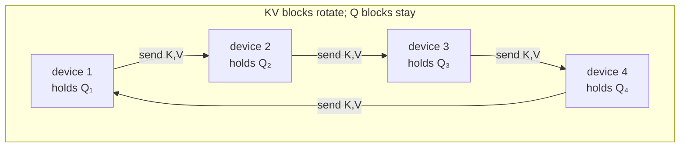
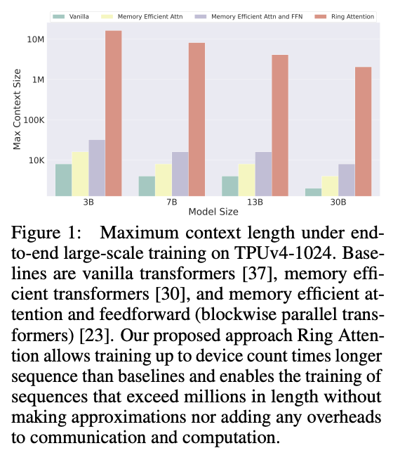

# §1 Introduction

**What this section covers:** the problem (a single device's memory caps the context
length, even with FlashAttention-style tricks), the one-sentence idea of Ring Attention
(shard the *sequence* across devices and rotate KV blocks around a ring while computing),
and why this is exact with zero communication overhead. Also a quick map of where this
sits relative to data parallelism (FSDP) and earlier sequence parallelism.

## The problem: memory, not compute

Attention's score matrix is $s \times s$ for sequence length $s$ — naively that's quadratic
memory. Blockwise computation (FlashAttention, covered properly in [§2](section_2_memory_constraint.md))
already fixes *that*: attention can be computed tile-by-tile without ever materializing the
full matrix. But a harder floor remains — every layer must still **store its output** for
the next layer, and that output has the same shape as the input:

```python
x = embed(tokens)            # (b, s, h)   <- lives on ONE device
for layer in layers:
    x = layer(x)             # (b, s, h)   <- every layer's output: also (b, s, h)
logits = head(x)             # (b, s, V)
```

That `(b, s, h)` activation per layer is unavoidable as long as one device holds the whole
sequence: self-attention is all-to-all over positions, so layer $\ell+1$ needs *all* of
layer $\ell$'s outputs. The paper's example: 100M tokens at hidden size 1024 needs
**>1000 GB** of activations — versus ~80 GB of HBM on an A100. No kernel trick fixes this;
the sequence itself has to be split across devices.

## The idea: shard the sequence, rotate the KVs

Ring Attention partitions the sequence dimension across $N$ devices — this is what later
literature calls **context parallelism (CP)**. Each device keeps one *query block* of the
sequence permanently, and the key/value blocks travel:

```python
# N devices, each starts with its own shard of the sequence
q   = qkv_proj(x_local)      # (b, s/N, h)  query block: STAYS on this device
k, v = ...                   # (b, s/N, h)  kv block: will visit every device

for step in range(N):        # N-1 rotations complete the full attention
    # compute attention of local q against the kv block currently here,
    # WHILE simultaneously sending this kv to the next device in the ring
    send(k, v, to=next_rank)         # async p2p, overlapped ↓
    partial = block_attn(q, k, v)    # (b, s/N, h)  accumulated via online softmax
    k, v = recv(from=prev_rank)      # arrives by the time compute finishes
```

After $N-1$ rotations every query block has attended to every KV block — the result is
**bit-for-bit standard attention**, no approximation. Two properties make this work:

1. **Exactness** comes from the *permutation invariance* of blockwise attention: partial
   results over KV blocks can be combined in any order, as long as the online-softmax
   statistics are rescaled correctly (the §2 background derives this).
2. **Zero overhead** comes from overlap: each KV transfer happens *during* the attention
   compute on the previous block. If compute time per block ≥ transfer time per block, the
   communication is completely hidden. §3 derives the condition (block size ≥ FLOPS/bandwidth).



Note the communication pattern: **p2p send/recv between ring neighbors**, not the
all-gather / reduce-scatter collectives FSDP uses. Each device only ever talks to its two
neighbors, each step moves only one KV block (`2 · (s/N) · h` elements), and the pattern
maps onto any interconnect topology.

The payoff: max context length scales **linearly with device count**, and per-device
activation memory becomes independent of total sequence length $s$ (it depends only on the
block size — Table 1 in §2/§3). Figure 1 of the paper shows this: Ring Attention trains
512× longer sequences than the best single-device baseline on a TPUv4-1024 pod.



## How this differs from what came before

Two contrasts the introduction draws (both "new to me" level — deeper treatment in §6):

- **Earlier sequence parallelism (Ring Self-Attention, Li et al. 2023).** Also used a ring
  to shard the sequence, but computed full (non-blockwise) attention per step, so
  communication was *not* hidden behind compute and memory still scaled with $s$. Ring
  Attention's contribution is precisely the marriage with blockwise compute that makes the
  overlap and the memory bound work.
- **Memory-efficient kernels alone (FlashAttention, BPT).** Reduce attention's *internal*
  memory but keep the whole sequence on one device — they hit the layer-output wall above.
  Ring Attention builds *on top of* these (each device runs a memory-efficient kernel
  locally) rather than replacing them.

Relation to FSDP (our stack's frame of reference): FSDP shards **parameters** and gives
every rank *different data*; CP shards **the sequence of the same batch** and gives every
rank in a CP group the *same sample, different token range*. They compose — devices form a
2D mesh (dp × cp), which is exactly how torchtitan wires it and what we'll need to
replicate in the Lightning strategy.

## Key takeaways

- The binding constraint at long context is **per-layer activation storage** `(b, s, h)` on
  a single device — not attention's quadratic score matrix (kernels already solved that).
- Ring Attention = blockwise attention + sequence sharding + ring p2p rotation of KV blocks.
- It is **exact** (online-softmax rescaling makes KV-block order irrelevant) and
  **zero-overhead** when block compute time covers block transfer time.
- Context length then scales linearly with device count: "near-infinite" = add more devices.
- CP is orthogonal to FSDP: shard sequence vs. shard parameters; same-sample vs.
  different-sample per rank.

---

Next: [§2 Large Context Memory Constraint](section_2_memory_constraint.md) *(not yet written)*
